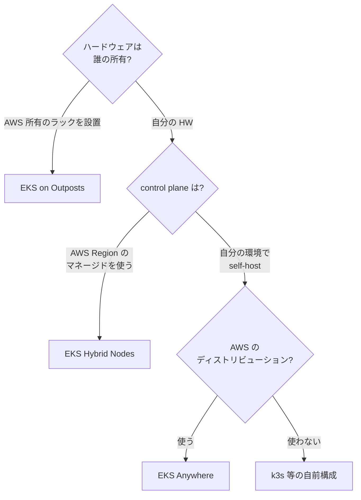
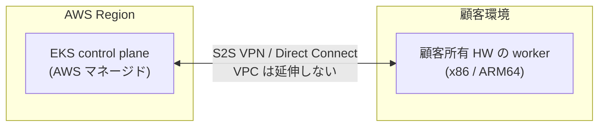
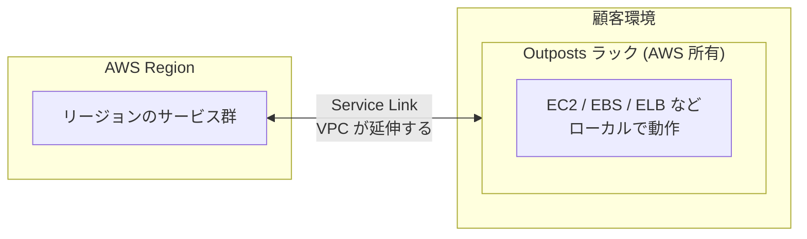
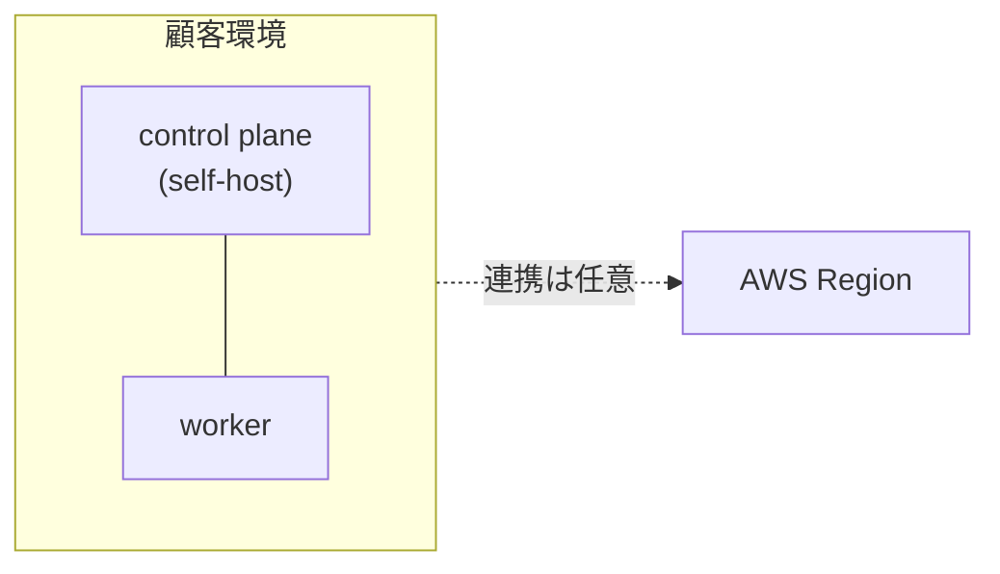

## はじめに

AWS が提供する「オンプレで動く EKS」の選択肢は 3 つあります。**EKS Hybrid Nodes**（2024-11 GA）、**EKS on Outposts**、**EKS Anywhere** です。さらに、マネージドを使わず自分で組む k3s のような構成もあります。名前が似ていて境界線が紛らわしいので、本記事で整理します。

想定読者は、オンプレや手元のハードウェアを Kubernetes でクラウドに繋ぎたいと考えていて、AWS の選択肢を比較したい方です。

:::message
本記事の文章生成・編集には AI (Anthropic Claude) を活用しています。技術的事実については、筆者が公式ドキュメントを引用して検証しています。誤りや改善点があれば、コメント等でご指摘ください。
:::

## 一行サマリ

- **EKS Hybrid Nodes**: 顧客所有の HW を、AWS の EKS クラスタに worker として参加させる
- **EKS on Outposts**: AWS 所有のラックを顧客環境に設置する
- **EKS Anywhere**: EKS のディストリビューションを顧客環境で self-host する
- **k3s 等の自前構成**: control plane も含めて全部自分で運用する

決定的な軸は「ハードウェアは誰の所有か」と「control plane はどこで動くか」の 2 つです。

## 構成図で比べる

混同しやすい Hybrid Nodes と Outposts は、「何がどちら側に置かれるか」が正反対です。

**EKS Hybrid Nodes** — control plane は AWS 側にあり、worker だけが手元にあります。VPC は延伸しません。

**EKS on Outposts** — AWS のハードウェアごと顧客環境に持ち込み、VPC を延伸します。

**EKS Anywhere / 自前 k3s** — control plane も顧客環境にあります。AWS Region との接続は必須ではありません。

## 比較表

| 観点 | EKS Hybrid Nodes | EKS on Outposts | EKS Anywhere | 自前 k3s |
|---|---|---|---|---|
| 物理 HW | 顧客所有の任意 HW | AWS 所有ラック | 顧客所有 (vSphere / bare metal) | 顧客所有 |
| Control plane | AWS Region (マネージド) | Outposts 内 or Region | 顧客環境 (self-hosted) | 顧客環境 (self-hosted) |
| Network | 顧客 NW + S2S VPN/DX | AWS Service Link | 顧客 NW のみ | 顧客 NW（+ 任意で VPN/mesh） |
| CNI | Cilium / Calico（VPC CNI 不可） | VPC CNI 可 | Cilium 等 | flannel 既定 |
| VPC | 延伸しない | 延伸する | 関係なし | 関係なし |
| 物理要件 | 小型 SBC からサーバまで | ラック設置（電源・スペース要件あり） | vSphere host or bare metal | 小型 SBC からサーバまで |
| 課金 | control plane 時間課金 + vCPU 時間課金 + 回線 | 構成に応じた期間契約 | サブスクリプション | HW と電気代のみ |
| AWS サービス連携 | IRSA / VPC エンドポイント経由 | ローカルで AWS サービスが動く | 基本独立（連携は任意） | 自前実装 |
| ARM64 | 対応 | 機種限定 | 対応 | 対応 |

出典: [EKS Hybrid Nodes overview](https://docs.aws.amazon.com/eks/latest/userguide/hybrid-nodes-overview.html) / [EKS on Outposts](https://docs.aws.amazon.com/eks/latest/userguide/eks-on-outposts.html) / [EKS Anywhere](https://anywhere.eks.amazonaws.com/)（いずれも 2026-08 時点で取得）。課金の詳細は各 pricing ページを参照してください（[EKS pricing](https://aws.amazon.com/eks/pricing/) では control plane $0.10/クラスタ/時、Hybrid Nodes は vCPU 時間課金。2026-08 時点）。

## 詳細

### EKS Hybrid Nodes

設計思想は「顧客の自前 HW を、AWS マネージドな EKS クラスタの一員として参加させる」です。

- VPC は延伸しません。Pod CIDR は remote network config で別管理します
- ノード認証は SSM Hybrid Activation または IAM Roles Anywhere です
- CNI は VPC CNI が使えず、AWS がサポートするのは Cilium です（[hybrid-nodes-cni](https://docs.aws.amazon.com/eks/latest/userguide/hybrid-nodes-cni.html)）
- GovCloud / China リージョンでは利用できません（[overview](https://docs.aws.amazon.com/eks/latest/userguide/hybrid-nodes-overview.html)）

向く用途: 小〜中規模の自前 HW を AWS マネージドな control plane に繋ぎたい場合や、オンプレと AWS の混在ワークロード、エッジです。

### EKS on Outposts

設計思想は「AWS のラックを顧客環境に置く」です。

- VPC が顧客環境まで延伸します（Service Link）
- Outposts 内で EC2 / EBS / ELB などが動きます
- VPC CNI も使えます（Outposts は AWS の物理に属するため）

向く用途: データセンター統合、データ所在地の規制、低レイテンシ要件です。

小規模に向かない理由: ラックの物理要件（設置スペース・電源）と、期間契約が前提の調達形態です。個別見積もりのため、詳細は [Outposts pricing](https://aws.amazon.com/outposts/rack/pricing/) を参照してください。

### EKS Anywhere

設計思想は「EKS のディストリビューション（k8s + curated packages）を顧客環境で動かす」です。

- 顧客環境の vSphere / bare metal / Snow / CloudStack 上で動きます
- control plane も顧客環境内で self-host します
- AWS Region との連携はオプションで、基本は独立して動きます

向く用途: AWS のツールチェーンをオンプレで再現したい場合や、完全閉域が要件の場合です。

### 自前 k3s

設計思想は「軽量 k8s で、control plane も含めて自分で持つ」です。

- k3s は control plane 込みの 1 バイナリで起動します
- ノード間接続やクラウド連携は自前で設計します（Tailscale 等の mesh VPN を使う構成もこれに含まれます）
- AWS マネージドサービスの恩恵はなく、バックアップ等の運用も自前です

向く用途: 検証・学習、エッジ、構成を完全に自分で制御したい場合です。

## どれを選ぶか

| ケース | 候補 |
|---|---|
| 小規模の自前 HW で、control plane は AWS に任せたい | EKS Hybrid Nodes |
| 小規模の自前 HW で、AWS は使わない | 自前 k3s |
| 中規模のオフィス・拠点 | EKS Hybrid Nodes or EKS Anywhere |
| データセンター、規制・低レイテンシ要件 | EKS on Outposts or EKS Anywhere |
| オンプレ要件がない | EKS（クラウドのみ） |

## 筆者の検証での位置づけ

筆者は小型 ARM64 ハードウェア（Raspberry Pi）と k3s + Tailscale の構成を検証してきました。その観点で各選択肢を見ると、次のようになります。

- Outposts はラックの物理要件・調達形態から、小規模検証の対象外です
- EKS Anywhere は規模に対して過大です
- k3s + Tailscale は検証済みです
- EKS Hybrid Nodes は「自前 HW + マネージド control plane」という組み合わせが検証対象として残ります

なお本記事は各方式の公式ドキュメントに基づく比較で、EKS Hybrid Nodes の実機検証は行っていません。

## まとめ

- 判断軸は「HW は誰の所有か」「control plane はどこか」の 2 つです
- Hybrid Nodes は顧客 HW + AWS マネージド control plane、VPC は延伸しません
- Outposts は AWS HW を顧客環境に置き、VPC が延伸します
- Anywhere と自前 k3s は control plane ごと顧客環境で、前者は AWS ディストリビューション、後者は完全自前です

## 参考

- [EKS Hybrid Nodes overview](https://docs.aws.amazon.com/eks/latest/userguide/hybrid-nodes-overview.html)
- [Configure CNI for hybrid nodes](https://docs.aws.amazon.com/eks/latest/userguide/hybrid-nodes-cni.html)
- [EKS on Outposts](https://docs.aws.amazon.com/eks/latest/userguide/eks-on-outposts.html)
- [EKS Anywhere](https://anywhere.eks.amazonaws.com/)
- [EKS pricing](https://aws.amazon.com/eks/pricing/) / [Outposts rack pricing](https://aws.amazon.com/outposts/rack/pricing/)
