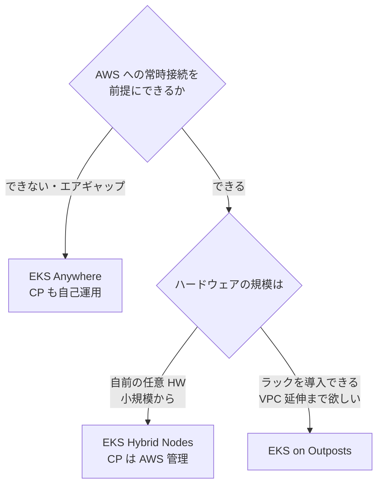

## はじめに

AWS が提供する「オンプレで Kubernetes」の選択肢は、EKS Hybrid Nodes / EKS on Outposts / EKS Anywhere の 3 つがあります。名前が似ているうえに守備範囲が重なって見えるため、本記事ではそれぞれの境界線を公式ドキュメントに基づいて整理します。自宅の Raspberry Pi クラスタを AWS に寄せたい、という筆者の観点(シリーズ第 2 回)での評価も添えます。

:::message
本記事の文章生成・編集には AI (Anthropic Claude) を活用しています。技術的事実については、筆者が公式ドキュメントを引用して検証しています。誤りや改善点があれば、コメント等でご指摘ください。
:::

## 一行サマリ

- **EKS Hybrid Nodes**: 顧客所有のハードウェアを、AWS がホストする EKS クラスタのノードとして参加させる
- **EKS on Outposts**: AWS 所有のラックを顧客拠点に設置し、その上で EKS を動かす
- **EKS Anywhere**: EKS と同じ Kubernetes ディストリビューション(EKS Distro)を顧客環境で自己運用する

## 比較表

表中の CNI は Container Network Interface(Pod のネットワーク接続を提供するプラグイン機構)、DDIL は Disconnected, Denied, Intermittent, Limited(切断・拒否・断続・制限帯域といった通信環境)の略です。

| 観点 | EKS Hybrid Nodes | EKS on Outposts | EKS Anywhere |
|---|---|---|---|
| ハードウェア | 顧客所有の任意の物理/仮想マシン(x86 / ARM) | AWS 所有の Outposts ラックを顧客拠点に設置 | 顧客所有(vSphere / ベアメタル / Nutanix / Snow) |
| コントロールプレーン | AWS リージョン(AWS 管理) | extended はリージョン、local は Outpost 上(いずれも AWS 管理) | 顧客環境内(自己運用) |
| CNI | Cilium(AWS サポート)。**VPC CNI は非対応** | VPC CNI が既定 | 顧客が選択 |
| AWS への接続 | 必須(VPN / Direct Connect 等で VPC へ)。切断が常態の環境(DDIL)は対象外 | 前提(local クラスタは一時切断に耐える設計) | 不要。エアギャップ環境でも動作 |
| 費用の考え方 | 前払い・最低額なし。ノードの vCPU 時間課金 | Outposts ラックの導入が前提 | 本体は OSS・無償。企業サポート等は有償サブスクリプション |
| 個人の Pi クラスタ適性 | 高い(任意 HW・従量課金) | 対象外(ラック導入前提) | 可能だがコントロールプレーンも自前運用になる |

出典(2026-08 時点で取得): [EKS Hybrid Nodes overview](https://docs.aws.amazon.com/eks/latest/userguide/hybrid-nodes-overview.html) / [Configure CNI for hybrid nodes](https://docs.aws.amazon.com/eks/latest/userguide/hybrid-nodes-cni.html) / [EKS Pricing](https://aws.amazon.com/eks/pricing/) / [Deploy EKS on-premises with AWS Outposts](https://docs.aws.amazon.com/eks/latest/userguide/eks-outposts.html) / [EKS Anywhere docs](https://anywhere.eks.amazonaws.com/docs/overview/)

補足を 3 点だけ。

- Hybrid Nodes の課金は「ノードがクラスタに参加している間の vCPU 時間」です([公式 overview](https://docs.aws.amazon.com/eks/latest/userguide/hybrid-nodes-overview.html)に、使わないノードはクラスタから外すよう明記があります)
- Hybrid Nodes では VPC CNI が非対応で、AWS がサポートする CNI は Cilium です(AWS が ECR Public に Cilium のビルドを配布しています。[公式 CNI ページ](https://docs.aws.amazon.com/eks/latest/userguide/hybrid-nodes-cni.html))
- EKS Anywhere は現在 OSS・無償で利用できます([公式 docs](https://anywhere.eks.amazonaws.com/docs/overview/))。有償なのはエンタープライズサポート等のサブスクリプションです

## 決め手

判断軸は 3 つに絞れます。

1. **接続性**: AWS への安定した常時接続を前提にできるか。できない(切断が常態・エアギャップ)なら、[公式が明言しているとおり](https://docs.aws.amazon.com/eks/latest/userguide/hybrid-nodes-overview.html) Hybrid Nodes は対象外で、EKS Anywhere が候補になります
2. **物理規模**: 自前の小さなハードウェア(Pi 1 台〜)で始めたいのか、ラックを導入できる規模なのか
3. **AWS 統合の深さ**: VPC の延伸やローカルの AWS サービス(EBS 等)まで欲しいなら Outposts、マネージドなコントロールプレーンと IAM 統合で足りるなら Hybrid Nodes、AWS から独立して運用したいなら Anywhere

## まとめ

- 3 つは競合ではなく、「誰のハードウェアで、コントロールプレーンをどこに置き、AWS にどれだけ繋がるか」の役割分担です
- Raspberry Pi の自宅クラスタを AWS に寄せる用途では、任意 HW・従量課金・マネージドコントロールプレーンの **EKS Hybrid Nodes が唯一の現実解**でした(Outposts は物理規模で対象外、Anywhere はコントロールプレーン自己運用となり現状の k3s と負担が変わらないため)
- Hybrid Nodes を選ぶ場合、CNI は VPC CNI ではなく Cilium になります。この制約は次回以降の検証の前提になります

## 参考

- [Amazon EKS Hybrid Nodes overview — AWS Docs](https://docs.aws.amazon.com/eks/latest/userguide/hybrid-nodes-overview.html)
- [Configure CNI for hybrid nodes — AWS Docs](https://docs.aws.amazon.com/eks/latest/userguide/hybrid-nodes-cni.html)
- [Deploy Amazon EKS on-premises with AWS Outposts — AWS Docs](https://docs.aws.amazon.com/eks/latest/userguide/eks-outposts.html)
- [EKS Anywhere — 公式ドキュメント](https://anywhere.eks.amazonaws.com/docs/overview/)
- [Amazon EKS Pricing](https://aws.amazon.com/eks/pricing/)
