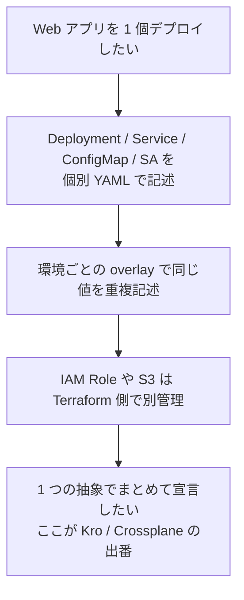
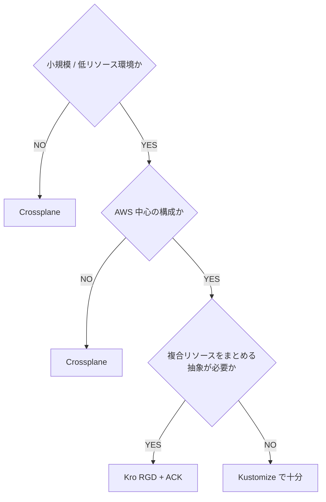

## はじめに

Kubernetes マニフェストを宣言的に管理していると、「複合リソースの取り扱い」と「クラウドリソースの宣言的管理」で詰まる場面があります。これらを解決する OSS として Kro (Kube Resource Orchestrator) と Crossplane があります。両者は重なる領域があるが思想が異なります。本記事では両者の仕組みと選び方を整理します。

想定読者は、Kustomize / Helm での複合リソース管理に限界を感じ、上位の抽象化レイヤを検討している中級者。

:::message
本記事の文章生成・編集には AI (Anthropic Claude) を活用しています。技術的事実については、筆者が公式ドキュメントを引用して検証しています。誤りや改善点があれば、コメント等でご指摘ください。
:::

## 複合リソース・クラウドリソース管理で直面する問題

Kustomize + ArgoCD で多数のアプリを deploy していると、以下の問題に直面します。

1. **複合リソースの煩雑さ**: Web app 1 個を deploy するのに Deployment + Service + ConfigMap + ServiceAccount + (将来 IRSA(IAM Roles for Service Accounts)の Role + S3 Bucket) を別々の YAML で書き、ApplicationSet で展開する手間
2. **values の重複**: Helm chart の overlay で同じ値を environment 毎に書き直す
3. **AWS リソースの管理**: EKS Hybrid Nodes 移行後、IAM Role や S3 Bucket を Kubernetes API で管理したくなる (Terraform から離れたい)。なお EKS Hybrid Nodes への移行は本シリーズ共通の前提で、詳細は別記事(`002-hybrid-vs-outposts-vs-anywhere`)で扱っています



## Kro (Kube Resource Orchestrator)

[Kro](https://kro.run/) は 2024 年後半に公開された比較的新しい OSS。最新 v0.9.3 (2026-08 時点)。リポジトリは [kubernetes-sigs/kro](https://github.com/kubernetes-sigs/kro) へ移管され、Kubernetes SIG 配下のプロジェクトになっています(README が「Kube Resource Orchestrator (kro) is a subproject of Kubernetes SIG Cloud Provider」と明記。2026-09 取得)。なおプロジェクトの公式表記は小文字の "kro" ですが、本記事では文頭・文中での読みやすさのため "Kro" と表記します。

### 仕組み

`ResourceGraphDefinition` (RGD) という CRD(Custom Resource Definition。Kubernetes API に独自リソース型を追加する仕組み)で「高レベル API」を定義し、内部で Kubernetes リソース (or ACK(AWS Controllers for Kubernetes) Controller 経由で AWS リソース) を生成する:

```yaml
apiVersion: kro.run/v1alpha1
kind: ResourceGraphDefinition
metadata:
  name: simple-webapp
spec:
  schema:
    apiVersion: v1alpha1
    kind: SimpleWebApp
    spec:
      name: string
      image: string | default="nginx:1.27-alpine"
      replicas: integer | default=1
  resources:
    - id: deployment
      template:
        apiVersion: apps/v1
        kind: Deployment
        metadata:
          name: ${schema.spec.name}
        spec:
          replicas: ${schema.spec.replicas}
          # ...
    - id: service
      template:
        # ...
```

これを apply すると `SimpleWebApp` という新しい CRD が生まれ、ユーザは以下のように 1 つの spec で複合リソースを deploy できる:

```yaml
apiVersion: kro.run/v1alpha1
kind: SimpleWebApp
metadata:
  name: hello
spec:
  name: hello
  image: nginx:1.27-alpine
  replicas: 1
```

Kro controller が裏で Deployment + Service + ConfigMap を生成します。

### 特徴

- **Kubernetes ネイティブ** (CRD ベース、verifier/JIT 不要)
- 軽量 (Helm chart 既定の requests は 256m CPU / 128Mi RAM([values.yaml](https://github.com/kubernetes-sigs/kro/blob/main/helm/values.yaml))。筆者環境ではアイドル時 2m CPU / 50Mi RAM で稼働(2026-08 実測))
- ACK Controllers と組合せで AWS リソースも RGD で管理可能
- v0.9.x、alpha API なので破壊的変更の可能性あり

### Install

```bash
# 出典: https://kro.run/docs/getting-started/Installation
helm install kro oci://registry.k8s.io/kro/charts/kro \
  --namespace kro-system \
  --create-namespace \
  --version=0.9.3
```

## Crossplane

[Crossplane](https://docs.crossplane.io/) は 2018 年から発展してきた OSS で、エコシステムも成熟しています。CNCF では [2025-11-06 に Graduated](https://www.cncf.io/announcements/2025/11/06/cloud-native-computing-foundation-announces-graduation-of-crossplane/) となりました（2026-08 時点の最新は v2.3）。

### 仕組み

- **Provider** が各クラウド (AWS / GCP / Azure / GitHub / etc.) の API を CRD として Kubernetes に橋渡しします
- **Composition** で「複数 Provider リソースを束ねた抽象」を定義します
- **Composite Resource (XR)** をユーザが apply します

:::message
v1 では `CompositeResourceClaim` (XRC) を apply する形でしたが、v2 で Claim は廃止されました。公式は「The new namespaced and cluster scoped XRs in Crossplane v2 don't support claims.」と明記しており、あわせて「Crossplane v2 makes composite resources (XRs) namespaced by default.」と、XR が既定で namespaced になっています（[What's New in v2](https://docs.crossplane.io/latest/whats-new/)、2026-08 時点で取得）。XRD の API は `apiextensions.crossplane.io/v2` で、`scope` の既定が `Namespaced` です。v1 の XRD は `LegacyCluster` scope として後方互換が保たれます。
:::

```yaml
# Crossplane v2: Claim ではなく namespaced な XR を直接 apply します
apiVersion: example.org/v1alpha1
kind: WebApp
metadata:
  name: my-app
  namespace: default
spec:
  bucketName: my-app-bucket
  region: ap-northeast-1
```

これが裏で AWS S3 Bucket + IAM Role + Kubernetes Deployment を全部作ります。

### 特徴

- **全クラウド対応** (AWS / GCP / Azure / Kubernetes / GitHub / etc.)
- Composition で深い抽象化が可能
- Pod が重い (目安 1GB RAM+。※筆者未検証の概算)、低リソース環境では負荷大
- Provider のバージョン管理 (Crossplane core + Provider) が複雑

## 比較表

| 観点 | Kro | Crossplane |
|---|---|---|
| 思想 | Kubernetes ネイティブ RGD で複合リソースをバンドル | クラウド全体を Kubernetes API 化 |
| 対象 | Kubernetes リソース + (ACK 経由で) AWS リソース | AWS / GCP / Azure / その他全部 |
| 重さ | 軽量 (requests 256m CPU / 128Mi RAM、アイドル実測 2m CPU / 50Mi RAM) | 重 (RAM 1GB+ ※筆者未検証の概算) |
| API 成熟度 | alpha (v0.9.x) | 安定 (v2.3、CNCF Graduated) |
| 低リソース環境での運用 | ◎ | △ |
| 学習コスト | 中 (RGD 設計) | 高 (Composition + Provider) |
| Provider エコシステム | ACK 連携 (まだ少) | 豊富 (公式 + コミュニティ) |
| 規模 | 小〜中小 | 中小〜大規模 |

## 選定の指針

上の比較表が両者の性質を並べたものであるのに対し、この節の表は「自分の条件ではどちらが向くか」を条件別に整理したものです。判断基準: 軽量さ重視なら Kro、マルチクラウド/エコシステム重視なら Crossplane。

| 条件 | Kro | Crossplane |
|---|---|---|
| RAM の限られた環境(エッジ / SBC) | ○ 軽量 | △ core + Provider で 1GB+(※未検証の概算) |
| AWS 中心(ACK と併用) | ○ | 過剰になりやすい |
| 複数クラウドの統合管理 | 対象外 | ○ 本領 |
| 学習コスト | Kubernetes YAML の延長(RGD) | Composition の設計が必要 |
| クラウド以外のリソース(GitHub / Slack 等) | 対象外 | Provider があれば ○ |

Kro を選ぶ理由になりやすい点:

1. **リソース制約**: Crossplane core + Provider AWS で 1GB+ 消費するとされます(※筆者未検証の概算)。RAM の限られた環境 (エッジ/SBC 等) では他 Pod の余裕が無くなる
2. **AWS 中心の構成**: GCP/Azure を使う予定がないなら、Crossplane の multi-cloud は overkill
3. **学習コスト**: Composition の設計は時間がかかる。RGD は Kubernetes YAML の延長で書ける
4. **ACK との相性**: AWS リソース管理は ACK Controllers (IAM, S3) + Kro RGD でカバー可能

逆に以下の場合は Crossplane が向く:

- 複数クラウド (AWS + GCP) を統合管理
- 既に Crossplane に投資している
- Provider 経由で GitHub Repo / Slack Channel 等も管理したい

## Kro RGD の実装例: IRSA Role

EKS Hybrid Nodes 移行後、IRSA + ACK で IAM Role を Kubernetes API で作る:

```yaml
apiVersion: kro.run/v1alpha1
kind: ResourceGraphDefinition
metadata:
  name: irsa-role
spec:
  schema:
    apiVersion: v1alpha1
    kind: IRSARole
    spec:
      roleName: string
      namespace: string
      serviceAccountName: string
      policies: "[]string"
  resources:
    - id: role
      template:
        apiVersion: iam.services.k8s.aws/v1alpha1
        kind: Role
        metadata:
          name: ${schema.spec.roleName}
        spec:
          name: ${schema.spec.roleName}
          assumeRolePolicyDocument: |
            { ... OIDC trust ... }
          policies: ${schema.spec.policies}
    - id: serviceaccount
      template:
        apiVersion: v1
        kind: ServiceAccount
        metadata:
          name: ${schema.spec.serviceAccountName}
          namespace: ${schema.spec.namespace}
          annotations:
            eks.amazonaws.com/role-arn: ${role.status.ackResourceMetadata.arn}
```

これを 1 つ書いておけば、各 Pod の IAM 構成は以下で済む:

```yaml
apiVersion: kro.run/v1alpha1
kind: IRSARole
metadata:
  name: prefect-s3-access
spec:
  roleName: prefect-s3-access
  namespace: prefect
  serviceAccountName: prefect
  policies:
    - arn:aws:iam::aws:policy/AmazonS3ReadOnlyAccess
```

ACK IAM Controller が IAM Role を作り、ServiceAccount に annotation を付ける。Pod が IRSA で AWS API を叩ける。

## 採用判断フロー



## まとめ

- **Kro**: 軽量、Kubernetes ネイティブ、低リソース 〜 中小規模に最適
- **Crossplane**: マルチクラウド、大規模、エコシステム成熟
- **AWS 中心 + EKS Hybrid Nodes** の構成では Kro が有力

両者は競合だが共存も可能。Kro が alpha のうちは破壊的変更に注意して使う。

## 次回予告

シリーズの続編では eBPF まわりを扱います。NetObserv eBPF Agent によるネットワーク flow の観測(別記事 `007-netobserv-ebpf-agent`)と、Raspberry Pi で Cilium を動かす際の OS / CPU 制約(別記事 `009-raspberry-pi-cilium-os-vs-cpu`)です。

## 参考

- [Kro 公式](https://kro.run/)
- [Kro GitHub](https://github.com/kubernetes-sigs/kro)
- [Crossplane docs](https://docs.crossplane.io/)
- [ACK Controllers](https://aws-controllers-k8s.github.io/community/)
