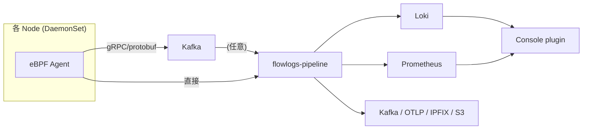

## はじめに

EKS Hybrid Nodes シリーズで Cilium の eBPF datapath を掘ったが、ネットワーク観測の選択肢は Cilium Hubble だけではない。Red Hat 主導の **NetObserv eBPF Agent** は **CNI 非依存** で kernel 5.8+ の Linux なら何でも動くフロー観測エージェントである[^netobserv-readme]。本記事はこのプロジェクトを公式 doc を辿りながら整理し、最後に手元で動作検証を試みた結果を記録する。

本記事は 2026-05 時点の調査に基づく。

[^netobserv-readme]: https://github.com/netobserv/netobserv-ebpf-agent

## プロジェクトの位置づけ

NetObserv は Red Hat が主導する Kubernetes / OpenShift 向けネットワーク可観測性スイートで、`netobserv-ebpf-agent` はその「センサー」コンポーネント[^netobserv-readme]。エコシステム全体は複数リポジトリに分かれている。

| リポジトリ | 役割 |
|---|---|
| [netobserv-ebpf-agent](https://github.com/netobserv/netobserv-ebpf-agent) | eBPF センサー本体 (DaemonSet) |
| [flowlogs-pipeline](https://github.com/netobserv/flowlogs-pipeline) | フロー集約・変換・エクスポート |
| [network-observability-operator](https://github.com/netobserv/network-observability-operator) | 全体を統括する Operator |
| network-observability-console-plugin | OpenShift Console UI |

最新リリースは 2026-04-03 時点の `v1.11.3-community`[^netobserv-release][^operator-release]。`netobserv-ebpf-agent` のライセンスは README 末尾で明示されており、`./bpf` 配下の eBPF コードは **GPL v2**、それ以外は **Apache v2** という二重ライセンス[^netobserv-readme]。

[^netobserv-release]: https://github.com/netobserv/netobserv-ebpf-agent/releases/tag/v1.11.3-community
[^operator-release]: https://github.com/netobserv/network-observability-operator/releases

## アーキテクチャ全体像



データフロー:

1. **eBPF Agent** が各ノードの ingress / egress フローをカーネルから収集
2. (任意) **Kafka** を ingestion 層として挟む。大規模クラスタで推奨
3. **flowlogs-pipeline (FLP)** がフローをエンリッチ、メトリクスを生成、複数バックエンドへ出力
4. **Loki** / **Prometheus** / 他 (Kafka / OTLP / IPFIX) に保存
5. **Console plugin** が Loki / Prometheus を参照して可視化

FLP は単体で柔軟性が高い。受け入れ可能な input は **NetFlow v5/v9、IPFIX、eBPF Agent flow (protobuf+gRPC)、Kafka エントリ (JSON)、ファイル入力**[^flp-readme]、対応する output は **Prometheus, Loki, S3 互換オブジェクトストア, stdout**[^flp-readme]。

[^flp-readme]: https://github.com/netobserv/flowlogs-pipeline

## 動作要件

`netobserv-ebpf-agent` の動作要件は README に明示されている[^netobserv-readme]:

- **Linux kernel 5.8+ with eBPF enabled**
- 最小権限モード: capability `BPF` + `PERFMON` + `NET_ADMIN`
- フォールバック: `privileged: true`

最小権限モードの SecurityContext は以下:

```yaml
securityContext:
  runAsUser: 0
  capabilities:
    add:
      - BPF
      - PERFMON
      - NET_ADMIN
```

BPF / PERFMON capability を認識しない古い Kubernetes ディストリビューションでは privileged mode が必要[^netobserv-readme]。

サポートアーキテクチャは Operator の README で明示されており、**amd64 / arm64 / ppc64le / s390x**[^operator-arch]。ARM64 サポートがあるので Raspberry Pi (Cortex-A72/A76) でも動く想定。

[^operator-arch]: https://github.com/netobserv/network-observability-operator

## デプロイモード

3 つのモードが README に列挙されている[^netobserv-readme]:

### (a) Operator 経由 (推奨)

Operator を Helm でインストール:

```bash
# cert-manager と trust-manager が依存として必要
helm repo add cert-manager https://charts.jetstack.io
helm install cert-manager -n cert-manager --create-namespace \
  cert-manager/cert-manager --set crds.enabled=true

helm upgrade trust-manager oci://quay.io/jetstack/charts/trust-manager \
  --install --namespace cert-manager --wait

# NetObserv Operator 本体
helm repo add netobserv https://netobserv.io/static/helm/ --force-update
helm install netobserv -n netobserv --create-namespace \
  --set install.loki=true --set install.prom-stack=true \
  netobserv/netobserv-operator
```

出典: [Operator README](https://github.com/netobserv/network-observability-operator)

その後 `FlowCollector` CR を作成すれば全コンポーネントが自動デプロイされる。同 README が明示しているとおり、`FlowCollector` は cluster-wide なので **「単一の `FlowCollector` のみ許可、名前は必ず `cluster`」** という制約がある[^operator-arch]。

### (b) standalone モード

Operator なしで agent バイナリを直接動かす[^netobserv-readme]:

```bash
export TARGET_HOST=...
export TARGET_PORT=...
sudo -E bin/netobserv-ebpf-agent
```

flow を gRPC で外部の collector (FLP など) に送る形。

### (c) direct-flp モード

最もシンプル。FLP のロジックを agent 内に embed して stdout に直接出力する[^netobserv-readme]:

```bash
export FLP_CONFIG=$(cat flp-config.json)
export EXPORT="direct-flp"
sudo -E bin/netobserv-ebpf-agent
```

`flp-config.json` の最小サンプル:

```json
{
  "pipeline": [
    {"name": "writer", "follows": "preset-ingester"}
  ],
  "parameters": [
    {"name": "writer", "write": {"type": "stdout"}}
  ]
}
```

「`tcpdump` 的に試す」用途に最適。

## EKS で動かす落とし穴

README の Deployment test 節に重要な記述がある[^netobserv-readme]:

> Despite Amazon Linux 2 enables eBPF by default in EC2, the EKS images are shipped with disabled eBPF

つまり **Amazon EKS の AMI は eBPF が無効化されて出荷される**。そのため AL2 / AL2023 ベースのノードグループでは追加設定が必要。

README が示している選択肢:

1. 自前 AMI を作って eBPF を有効化する
2. **Bottlerocket** を使う (追加設定なしで動作確認済み)

README のテスト結果表でも `Amazon EKS (Bottlerocket AMI) 1.22.6` で capability 方式 / privileged 方式の両方 ✅ になっている[^netobserv-readme]。

## Loki 依存からの脱却 (v1.4 以降)

公式ブログによれば、NetObserv v1.4 から Loki は **必須ではなくなった**[^no-loki-blog]。原文:

> we 'just' added an enable knob for Loki

Loki を disable にすると:

- `flowlogs-pipeline` が Loki への送信を試みなくなる
- Console plugin は **Loki に完全依存**しているので無効化される
- **Prometheus メトリクスの生成は継続**、Kafka / IPFIX exporter も使える[^no-loki-blog]

ClickHouse に流す例として、同ブログは Kafka exporter + 自前 Go consumer (Kafka メッセージを deserialize して INSERT) を紹介している[^no-loki-blog]。

[^no-loki-blog]: https://netobserv.io/posts/deploying-network-observability-without-loki-an-example-with-clickhouse/ (Joël Takvorian, 2023-10-02)

これにより BigQuery / ClickHouse / Snowflake などの分析基盤に流す経路が成立する。

## NetObserv vs Cilium Hubble

[シリーズ 006 回](#) で Cilium Hubble に触れたので、選択軸を整理する。

| 観点 | NetObserv eBPF Agent | Cilium Hubble |
|---|---|---|
| CNI 依存 | **非依存** (eBPF が動けば何でも)[^netobserv-readme] | Cilium CNI 必須 |
| 出自 | Red Hat (OpenShift 文脈) | Isovalent (Cisco 買収)、CNCF Graduated |
| データバックエンド | Loki / Prometheus / Kafka / OTLP / IPFIX[^flp-readme] | Hubble Relay → Prometheus / Grafana |
| L7 プロトコル可視化 | DNS, TCP RTT, packet drops | HTTP, gRPC, Kafka, DNS, TLS handshake |
| ストレージ要件 | Loki 不要にできる (v1.4+)[^no-loki-blog] | Hubble 自体は短期保存、export 別途 |
| ARM64 対応 | 公式サポート[^operator-arch] | 公式サポート |

### 選択基準 (私の判断)

- 既に **Cilium 採用 or 採用予定** → Hubble で十分。NetObserv を別途入れる理由は薄い
- **CNI を変えず観測だけ追加したい** (例: VPC CNI on EKS の通常ノードグループ) → NetObserv が有力
- **L7 プロトコル分析が重要** (HTTP レイテンシ、gRPC 観測) → Hubble の方が強い
- **OpenShift 環境** → NetObserv 一択 (Red Hat 公式バックエンド)

EKS Hybrid Nodes の文脈では Cilium を入れるので **Hubble で完結**。ただし AWS EKS の通常 nodegroup (VPC CNI 利用) でも観測したい場合は、NetObserv を VPC CNI と並走させる手がある。

## 実機での動作検証 (WSL2 で direct-flp)

ここからは手元で実際に動かしてみた記録。

### 環境

```
$ uname -a
Linux ... 6.6.114.1-microsoft-standard-WSL2 #1 SMP PREEMPT_DYNAMIC ...
```

kernel config:

```
CONFIG_BPF=y
CONFIG_BPF_SYSCALL=y
CONFIG_BPF_JIT=y
CONFIG_BPF_LSM=y
CONFIG_CGROUP_BPF=y
CONFIG_DEBUG_INFO_BTF=y
CONFIG_KPROBES=y
CONFIG_TRACEPOINTS=y
```

cgroup v2 (`cgroup2fs`)、BTF (`/sys/kernel/btf/vmlinux`) 共に存在。要件は満たしている (kernel 5.8+, BPF 有効, BTF 有効)。

### 試行

`flp-config.json` を準備して docker で起動:

```bash
mkdir -p /tmp/netobserv-test
cat > /tmp/netobserv-test/flp-config.json <<'EOF'
{
  "pipeline": [
    {"name": "writer", "follows": "preset-ingester"}
  ],
  "parameters": [
    {"name": "writer", "write": {"type": "stdout"}}
  ]
}
EOF

FLP_CONFIG=$(cat /tmp/netobserv-test/flp-config.json | tr -d '\n')

docker run --rm --privileged --network host \
  --ulimit memlock=-1:-1 \
  -e EXPORT=direct-flp \
  -e FLP_CONFIG="$FLP_CONFIG" \
  -e LOG_LEVEL=info \
  quay.io/netobserv/netobserv-ebpf-agent:main
```

### 結果

agent の起動シーケンスは途中まで成功する:

```
level=info msg="starting NetObserv eBPF Agent [build version: main-6fc580a, build date: 2026-05-21 09:08]"
level=info msg="configuration loaded ..."
level=info msg="initializing Flows agent"
level=info msg="StartServerAsync: addr = :9090" component=prometheus
level=info msg="connecting stages: preset-ingester --> writer"
level=fatal msg="can't instantiate NetObserv eBPF Agent" 
  error="loading and assigning BPF objects: field KfreeSkb: program kfree_skb: map .bss: 
         map create: operation not permitted (MEMLOCK may be too low, ...)"
```

config 読み込み、Prometheus server 起動 (:9090)、pipeline 接続まで OK。最後の **BPF object のロードで `operation not permitted`** で fatal 終了。

`--ulimit memlock=-1:-1` を設定済みなので、エラーメッセージにある "MEMLOCK may be too low" は誤導的。実際は **WSL2 の kernel が `kfree_skb` tracepoint への BPF program attach を許可していない** と判断するのが妥当 (確証はないので推測扱い)。

### WSL2 の制約 (推測)

WSL2 はカスタム Linux kernel であり、`/sys/kernel/tracing/` への non-root アクセスが拒否される、tracepoint への BPF attach に制限がある等の挙動が報告されている。今回の `kfree_skb` 失敗もこの制約による可能性が高い。

公式 README が明示している動作確認環境は **Bottlerocket on EKS、Rancher Desktop の K3s (privileged のみ ✅)、kind (privileged のみ ✅)、OpenShift**[^netobserv-readme]。WSL2 は記載なし。

### この検証から言えること

- agent のバイナリ自体は WSL2 上の Docker で起動を試みるところまで進む
- BPF program のロードフェーズで WSL2 kernel が要件を満たさず失敗
- **完全な動作検証には Linux VM (EC2 / Bottlerocket) か kind cluster (privileged 必須) を使う必要がある**

ローカル PC で軽く試したい場合は、kind か minikube を `--privileged` で立てて DaemonSet として deploy するルートを推奨。

## EKS Hybrid Nodes との関係

シリーズ本筋に戻して、NetObserv が Hybrid Nodes 検証でどこに収まるかを考える:

1. **Hybrid Nodes に Cilium を入れる前提** なら、Hubble で観測完結。NetObserv は不要
2. **AWS 側 EKS のマネージドノードグループ (VPC CNI 利用) を mix する** 場合、そちらだけ NetObserv を入れて観測する手がある
3. **Bottlerocket でしか eBPF 有効化が保証されない** ことを考慮し、自前 AMI を作る予算がなければ NetObserv 投入ノードを Bottlerocket に限定

個人 Pi + EKS Hybrid Nodes の文脈では、Cilium が主であり Hubble で十分。NetObserv は「OpenShift / AWS マネージドノード混在 / VPC CNI を残したい」要件が出てきた時の選択肢として記憶しておく。

## まとめ

- NetObserv eBPF Agent は **CNI 非依存** の eBPF フロー観測 sensor[^netobserv-readme]
- アーキテクチャ: Agent (DaemonSet) → Kafka (任意) → FLP → Loki / Prometheus / etc.
- v1.4 以降は **Loki 必須ではない**、Kafka 経由で任意の分析基盤に流せる[^no-loki-blog]
- EKS では **Bottlerocket なら動く**、AL 系は要 eBPF 有効化[^netobserv-readme]
- Cilium Hubble との使い分け: Cilium 採用なら Hubble、CNI 変えたくないなら NetObserv
- WSL2 では BPF tracepoint 制約により完全動作未確認 (kind cluster や Linux VM で再検証推奨)

## 参考リンク

公式リソース:

- [netobserv-ebpf-agent README](https://github.com/netobserv/netobserv-ebpf-agent)
- [network-observability-operator README](https://github.com/netobserv/network-observability-operator)
- [flowlogs-pipeline README](https://github.com/netobserv/flowlogs-pipeline)
- [Loki 切り離し + ClickHouse 連携ブログ (2023-10-02)](https://netobserv.io/posts/deploying-network-observability-without-loki-an-example-with-clickhouse/)
- [NetObserv 公式サイト](https://netobserv.io/)

Cilium 側との比較参考:

- [Cilium docs (本体)](https://docs.cilium.io/)
- [Hubble overview](https://docs.cilium.io/en/stable/observability/hubble/)

eBPF 基礎:

- [eBPF.io](https://ebpf.io/)
- [BPF and XDP Reference Guide](https://docs.cilium.io/en/stable/bpf/)
