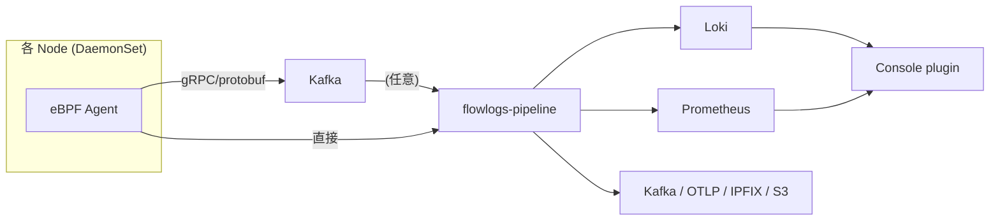

## はじめに

EKS Hybrid Nodes シリーズで Cilium の eBPF datapath を掘ったが、ネットワーク観測の選択肢は Cilium Hubble だけではありません。Red Hat 主導の **NetObserv eBPF Agent** は **CNI 非依存** で kernel 5.8+ の Linux なら何でも動くフロー観測エージェントである[^netobserv-readme]。本記事はこのプロジェクトを公式 doc を辿りながら整理し、最後に手元の 2 環境 (WSL2 上の docker k3s と Raspberry Pi 5 上の k3s) で実際に動作検証した結果を記録します。

本記事は 2026-05 時点の調査・検証に基づく。

[^netobserv-readme]: https://github.com/netobserv/netobserv-ebpf-agent

## プロジェクトの位置づけ

NetObserv は Red Hat が主導する Kubernetes / OpenShift 向けネットワーク可観測性スイートで、`netobserv-ebpf-agent` はその「センサー」コンポーネント[^netobserv-readme]。エコシステム全体は複数リポジトリに分かれています。

| リポジトリ | 役割 |
|---|---|
| [netobserv-ebpf-agent](https://github.com/netobserv/netobserv-ebpf-agent) | eBPF センサー本体 (DaemonSet) |
| [flowlogs-pipeline](https://github.com/netobserv/flowlogs-pipeline) | フロー集約・変換・エクスポート |
| [network-observability-operator](https://github.com/netobserv/network-observability-operator) | 全体を統括する Operator |
| network-observability-console-plugin | OpenShift Console UI |

最新リリースは 2026-04-03 時点の `v1.11.3-community`[^netobserv-release][^operator-release]。`netobserv-ebpf-agent` のライセンスは README 末尾で明示されており、`./bpf` 配下の eBPF コードは **GPL v2**、それ以外は **Apache v2** という二重ライセンス[^netobserv-readme]。

[^netobserv-release]: https://github.com/netobserv/netobserv-ebpf-agent/releases/tag/v1.11.3-community
[^operator-release]: https://github.com/netobserv/network-observability-operator/releases

## アーキテクチャ全体像



データフロー:

1. **eBPF Agent** が各ノードの ingress / egress フローをカーネルから収集
2. (任意) **Kafka** を ingestion 層として挟む。大規模クラスタで推奨
3. **flowlogs-pipeline (FLP)** がフローをエンリッチ、メトリクスを生成、複数バックエンドへ出力
4. **Loki** / **Prometheus** / 他 (Kafka / OTLP / IPFIX) に保存
5. **Console plugin** が Loki / Prometheus を参照して可視化

FLP は単体で柔軟性が高い。受け入れ可能な input は **NetFlow v5/v9、IPFIX、eBPF Agent flow (protobuf+gRPC)、Kafka エントリ (JSON)、ファイル入力**[^flp-readme]、対応する output は **Prometheus, Loki, S3 互換オブジェクトストア, stdout**[^flp-readme]。

[^flp-readme]: https://github.com/netobserv/flowlogs-pipeline

## 動作要件

`netobserv-ebpf-agent` の動作要件は README に明示されている[^netobserv-readme]:

- **Linux kernel 5.8+ with eBPF enabled**
- 最小権限モード: capability `BPF` + `PERFMON` + `NET_ADMIN`
- フォールバック: `privileged: true`

最小権限モードの SecurityContext は以下:

```yaml
securityContext:
  runAsUser: 0
  capabilities:
    add:
      - BPF
      - PERFMON
      - NET_ADMIN
```

BPF / PERFMON capability を認識しない古い Kubernetes ディストリビューションでは privileged mode が必要[^netobserv-readme]。

サポートアーキテクチャは Operator の README で明示されており、**amd64 / arm64 / ppc64le / s390x**[^operator-arch]。ARM64 サポートがあるので Raspberry Pi (Cortex-A72/A76) でも動く想定ですが、kernel に **BTF (BPF Type Format)** が出力されている必要がある — これは後の検証セクションで重要になります。

[^operator-arch]: https://github.com/netobserv/network-observability-operator

## デプロイモード

3 つのモードが README に列挙されている[^netobserv-readme]:

### (a) Operator 経由 (推奨)

Operator を Helm でインストール:

```bash
# cert-manager と trust-manager が依存として必要
helm repo add cert-manager https://charts.jetstack.io
helm install cert-manager -n cert-manager --create-namespace \
  cert-manager/cert-manager --set crds.enabled=true

helm upgrade trust-manager oci://quay.io/jetstack/charts/trust-manager \
  --install --namespace cert-manager --wait

# NetObserv Operator 本体
helm repo add netobserv https://netobserv.io/static/helm/ --force-update
helm install netobserv -n netobserv --create-namespace \
  --set install.loki=true --set install.prom-stack=true \
  netobserv/netobserv-operator
```

出典: [Operator README](https://github.com/netobserv/network-observability-operator)

その後 `FlowCollector` CR を作成すれば全コンポーネントが自動デプロイされます。同 README が明示しているとおり、`FlowCollector` は cluster-wide なので **「単一の `FlowCollector` のみ許可、名前は必ず `cluster`」** という制約がある[^operator-arch]。

### (b) standalone モード

Operator なしで agent バイナリを直接動かす[^netobserv-readme]:

```bash
export TARGET_HOST=...
export TARGET_PORT=...
sudo -E bin/netobserv-ebpf-agent
```

flow を gRPC で外部の collector (FLP など) に送る形。

### (c) direct-flp モード

最もシンプル。FLP のロジックを agent 内に embed して stdout に直接出力する[^netobserv-readme]:

```bash
export FLP_CONFIG=$(cat flp-config.json)
export EXPORT="direct-flp"
sudo -E bin/netobserv-ebpf-agent
```

`flp-config.json` の最小サンプル:

```json
{
  "pipeline": [
    {"name": "writer", "follows": "preset-ingester"}
  ],
  "parameters": [
    {"name": "writer", "write": {"type": "stdout"}}
  ]
}
```

「`tcpdump` 的に試す」用途に最適。本記事の検証もこのモードで行う。

## EKS で動かす落とし穴

README の Deployment test 節に重要な記述がある[^netobserv-readme]:

> Despite Amazon Linux 2 enables eBPF by default in EC2, the EKS images are shipped with disabled eBPF

つまり **Amazon EKS の AMI は eBPF が無効化されて出荷される**。そのため AL2 / AL2023 ベースのノードグループでは追加設定が必要。

README が示している選択肢:

1. 自前 AMI を作って eBPF を有効化する
2. **Bottlerocket** を使う (追加設定なしで動作確認済み)

README のテスト結果表でも `Amazon EKS (Bottlerocket AMI) 1.22.6` で capability 方式 / privileged 方式の両方 ✅ になっている[^netobserv-readme]。

## Loki 依存からの脱却 (v1.4 以降)

公式ブログによれば、NetObserv v1.4 から Loki は **必須ではなくなった**[^no-loki-blog]。原文:

> we 'just' added an enable knob for Loki

Loki を disable にすると:

- `flowlogs-pipeline` が Loki への送信を試みなくなる
- Console plugin は **Loki に完全依存**しているので無効化される
- **Prometheus メトリクスの生成は継続**、Kafka / IPFIX exporter も使える[^no-loki-blog]

ClickHouse に流す例として、同ブログは Kafka exporter + 自前 Go consumer (Kafka メッセージを deserialize して INSERT) を紹介している[^no-loki-blog]。

[^no-loki-blog]: https://netobserv.io/posts/deploying-network-observability-without-loki-an-example-with-clickhouse/ (Joël Takvorian, 2023-10-02)

これにより外部分析基盤 (BigQuery / ClickHouse / Snowflake 等) に流す経路が成立します。

## NetObserv vs Cilium Hubble

シリーズ 006 で Cilium Hubble に触れたので、選択軸を整理します。

| 観点 | NetObserv eBPF Agent | Cilium Hubble |
|---|---|---|
| CNI 依存 | **非依存** (eBPF が動けば何でも)[^netobserv-readme] | Cilium CNI 必須 |
| 出自 | Red Hat (OpenShift 文脈) | Isovalent (Cisco 買収)、CNCF Graduated |
| データバックエンド | Loki / Prometheus / Kafka / OTLP / IPFIX[^flp-readme] | Hubble Relay → Prometheus / Grafana |
| L7 プロトコル可視化 | DNS, TCP RTT, packet drops | HTTP, gRPC, Kafka, DNS, TLS handshake |
| ストレージ要件 | Loki 不要にできる (v1.4+)[^no-loki-blog] | Hubble 自体は短期保存、export 別途 |
| ARM64 対応 | 公式サポート[^operator-arch] | 公式サポート |

### 選択基準

- 既に **Cilium 採用 or 採用予定** → Hubble で十分。NetObserv を別途入れる理由は薄い
- **CNI を変えず観測だけ追加したい** (例: VPC CNI on EKS の通常ノードグループ) → NetObserv が有力
- **L7 プロトコル分析が重要** (HTTP レイテンシ、gRPC 観測) → Hubble の方が強い
- **OpenShift 環境** → NetObserv 一択 (Red Hat 公式バックエンド)

## 実機検証

ここからは手元で実際に動かしてみた記録。**2 つの環境で対比** することで、agent の動作要件 (特に **BTF 出力**) の意味を明らかにします。

### 環境 A: WSL2 + docker k3s (x86_64, BTF あり)

検証ホストは Ubuntu on WSL2、kernel 6.6.114.1-microsoft-standard。Docker で `rancher/k3s:v1.31.0-k3s1` を `--privileged` で立て、本記事用に作った kustomize manifest を apply します。

kustomize 構成:

```text
netobserv/
├── base/
│   ├── namespace.yaml
│   ├── configmap.yaml      # flp-config.json (stdout writer)
│   ├── daemonset.yaml      # privileged, hostNetwork, hostPID
│   └── kustomization.yaml
└── overlays/
    ├── rasp/               # arm64 nodeSelector + control-plane toleration
    └── local/
```

`daemonset.yaml` の要点:

```yaml
spec:
  template:
    spec:
      hostNetwork: true
      hostPID: true
      containers:
        - name: agent
          image: quay.io/netobserv/netobserv-ebpf-agent:main
          securityContext:
            privileged: true
            runAsUser: 0
          env:
            - {name: EXPORT, value: "direct-flp"}
            - {name: FLP_CONFIG, valueFrom: {configMapKeyRef: {name: flp-config, key: flp-config.json}}}
```

apply:

```bash
kubectl apply -k netobserv/overlays/local
```

数分後、Pod が Running になり、ログに **フローイベントが JSON 形式で流れ始めた**:

```text
map[AgentIP:172.17.0.5 Bytes:1709 DstAddr:172.23.210.65 DstMac:02:42:b2:d9:d9:73 
    DstPort:54812 Etype:2048 IfDirections:[1] Interfaces:[eth0] Packets:5 Proto:6 
    SrcAddr:172.17.0.5 SrcMac:02:42:ac:11:00:05 SrcPort:6443 
    TimeFlowEndMs:1779599387354 TimeFlowStartMs:1779599387352 TimeReceived:1779599388]
```

- `SrcAddr:172.17.0.5 SrcPort:6443` → k3s apiserver からの送信フロー
- `DstAddr:10.42.0.x` → k3s の Pod CIDR
- `Interfaces:[veth6947b921 cni0]` → k3s 内部 (flannel CNI 経由) のフロー

Etype 2048 = IPv4、Proto 6 = TCP。フロー観測が **完全に機能** していることを確認。

ここまでで「READMEの主張通り、kernel 5.8+ + BTF + privileged で direct-flp モードが動く」を実証しましました。

### 環境 B: Raspberry Pi 5 上の k3s (aarch64, BTF なし)

次に、本物の Raspberry Pi 上の k3s で同じ kustomize を apply します。

| 項目 | 値 |
|---|---|
| ノード | raspberrypi-1 (control-plane, Ready) |
| OS | Debian GNU/Linux 12 (bookworm) |
| Kernel | 6.6.62+rpt-rpi-2712 aarch64 |
| k3s | v1.31.4+k3s1 |
| Container runtime | containerd 1.7.23-k3s2 |

apply:

```bash
kubectl apply -k netobserv/overlays/rasp
```

`overlays/rasp/` には arm64 nodeSelector と control-plane の toleration を追加してあります。control-plane に schedule されないと意味がないので。

Pod は約 60 秒で Running 状態になった (Pi 上での arm64 image pull に時間がかかる)。しかし agent の起動シーケンスを進めるとログの最終行で **fatal exit**:

```text
level=info  msg="starting NetObserv eBPF Agent [build version: main-6fc580a]"
level=info  msg="initializing Flows agent"
level=info  msg="StartServerAsync: addr = :9090" component=prometheus
level=info  msg="connecting stages: preset-ingester --> writer"
level=fatal msg="can't instantiate NetObserv eBPF Agent" 
  error="loading and assigning BPF objects: field KfreeSkb: program kfree_skb: 
         apply CO-RE relocations: load kernel spec: 
         no BTF found for kernel version 6.6.62+rpt-rpi-2712: not supported"
```

**`no BTF found for kernel version 6.6.62+rpt-rpi-2712`** が決定的なエラー。

裏付けとして、busybox Pod を Pi-1 上に直接スケジュールして `/sys/kernel/btf/vmlinux` を確認:

```bash
$ kubectl run kernel-check --rm -it --image=busybox --overrides='{"spec":{"nodeName":"raspberrypi-1",...}}' \
    -- ls /sys/kernel/btf/vmlinux
ls: /sys/kernel/btf/vmlinux: No such file or directory
```

`/sys/kernel/btf/vmlinux` **不在**。これは Raspberry Pi OS の kernel が **`CONFIG_DEBUG_INFO_BTF=y` を有効化していない** ことを意味します。

CO-RE (Compile Once - Run Everywhere) は eBPF プログラムが kernel struct のレイアウト差を吸収する仕組みで、ロード時に kernel の BTF を参照します。BTF がなければ relocate できず、program ロード自体が拒否されます。これは Cilium も同じ依存を持つ。

### 結論

- **WSL2 + docker k3s (BTF あり)**: direct-flp モードでフロー JSON 取得 **成功**
- **Pi k3s (Raspberry Pi OS, BTF なし)**: BPF object ロードで **CO-RE relocation エラー → fatal**

これは公式 README が言う「Pi OS は BTF default 無効、Ubuntu 24.04 LTS arm64 推奨」の **実機実証** にあたる。Pi で本格運用したい場合は OS を Ubuntu Server 24.04 LTS arm64 に切り替えるか、Raspberry Pi OS の kernel を rebuild して BTF を有効化する必要があります。

## EKS Hybrid Nodes との関係

シリーズ本筋に戻して、NetObserv が Hybrid Nodes 検証でどこに収まるかを考える:

1. **Hybrid Nodes に Cilium を入れる前提** なら、Hubble で観測完結。NetObserv は不要
2. **AWS 側 EKS のマネージドノードグループ (VPC CNI 利用) を mix する** 場合、そちらだけ NetObserv を入れて観測する手がある
3. **Bottlerocket でしか eBPF 有効化が保証されない** ことを考慮し、自前 AMI を作る予算がなければ NetObserv 投入ノードを Bottlerocket に限定[^netobserv-readme]
4. **Pi 上で動かしたい場合**、上記検証通り Raspberry Pi OS では BTF 不在で動かません。Ubuntu 24.04 LTS arm64 への切り替えが前提

個人 Pi + EKS Hybrid Nodes の文脈では、Cilium が主であり Hubble で十分。NetObserv は「OpenShift / AWS マネージドノード混在 / VPC CNI を残したい」要件が出てきた時の選択肢として記憶しておく。

## まとめ

- NetObserv eBPF Agent は **CNI 非依存** の eBPF フロー観測 sensor[^netobserv-readme]
- アーキテクチャ: Agent (DaemonSet) → Kafka (任意) → FLP → Loki / Prometheus / 任意の sink
- v1.4 以降は **Loki 必須ではない**、Kafka 経由で任意の分析基盤に流せる[^no-loki-blog]
- EKS では **Bottlerocket なら動く**、AL 系は要 eBPF 有効化[^netobserv-readme]
- Cilium Hubble との使い分け: Cilium 採用なら Hubble、CNI 変えたくないなら NetObserv
- **実機検証**: WSL2 上の docker k3s で flow 取得成功、Raspberry Pi OS では **BTF 不在で fatal**。Pi で使うなら Ubuntu 24.04 LTS への OS 切替が必須

## 参考リンク

公式リソース:

- [netobserv-ebpf-agent README](https://github.com/netobserv/netobserv-ebpf-agent)
- [network-observability-operator README](https://github.com/netobserv/network-observability-operator)
- [flowlogs-pipeline README](https://github.com/netobserv/flowlogs-pipeline)
- [Loki 切り離し + ClickHouse 連携ブログ (2023-10-02)](https://netobserv.io/posts/deploying-network-observability-without-loki-an-example-with-clickhouse/)
- [NetObserv 公式サイト](https://netobserv.io/)

CO-RE / BTF 関連:

- [BPF CO-RE reference (Andrii Nakryiko)](https://nakryiko.com/posts/bpf-portability-and-co-re/)
- [BPF Type Format (BTF) — kernel docs](https://www.kernel.org/doc/html/latest/bpf/btf.html)

Cilium 側との比較参考:

- [Cilium docs (本体)](https://docs.cilium.io/)
- [Hubble overview](https://docs.cilium.io/en/stable/observability/hubble/)
