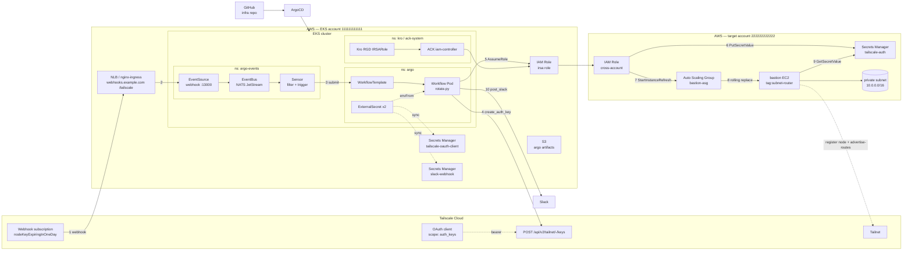

## はじめに

VPC への一方向接続用に Tailscale subnet router を bastion EC2 上で運用していると、key の expiry が運用の頭痛の種になります。Tailscale の auth key は[1 日から 90 日まで](https://tailscale.com/kb/1085/auth-keys)の範囲でしか発行できず、period を超えるとその key からの新規 device 登録は弾かれる。さらに、node key (device が tailnet に登録された後に持つ identity) も[admin が key expiry を有効化していれば](https://tailscale.com/kb/1028/key-expiry) 1〜180 日で expire し、その時点で device は再認証を強制されます。手動で運用すると「console で key を再発行 → Secrets Manager 書き換え → bastion 再起動」を定期的に回す必要があり、忘れた瞬間に内部通信が落ちる。

この記事では、その手動運用を **「Tailscale webhook → EKS 上の Argo Events → Argo Workflows → cross-account の Secrets Manager / ASG instance refresh」** で自動化した構成を紹介します。Argo Events / Workflows、Kro、External Secrets Operator、ACK の組み合わせで「期限切れ 1 日前に検知して 0 操作で更新」する仕組みになります。

想定読者は EKS と Argo Workflows を既に動かしていて、cross-account の secret 更新を CD パイプライン化したい人。Tailscale を VPN として使っている前提ですが、コア部分 (webhook → Argo Events → Workflow) は他の SaaS の expiring webhook にも応用が利く。

:::message alert
**前提**: 本構成は Tailscale の `nodeKeyExpiringInOneDay` webhook を trigger とします。[公式 doc](https://tailscale.com/kb/1028/key-expiry) によると「tagged device に最初に tag が付いたとき、その device の key expiry は default で disabled」となります。本記事の構成を動かすには、対象 device の key expiry を admin console から **明示的に有効化** しておく必要があります。device 単位で expiry を切ったままにしたい場合は、本記事の trigger 部分を CronWorkflow (例: 毎月 1 日) に差し替えれば auth key 期限ベースで同じ rotation が回せる。
:::

:::message
本記事中の AWS account ID (`111111111111` / `222222222222`)、ドメイン (`webhooks.example.com`)、リソース名 (`myapp-*`) はすべて架空。実構成の名前を読み替えてください。
:::

:::message
本記事の文章生成・編集には AI (Anthropic Claude) を活用しています。技術的事実は筆者が公式ドキュメントを引用して検証していますが、誤りや改善点があればコメント等でご指摘ください。
:::

## 全体アーキテクチャ

<!-- 高解像度の PNG 版 (drawio から export) を upload したらコメント解除:

-->

下記は構造を mermaid で表現したもの。アイコン入りの高解像度版が必要なら、同じ構造を drawio で書き起こして `File > Export as > PNG` (Border 10px, Zoom 200%) すれば差し替え可能。



矢印の番号は「実行時にトリガされる順序」を表す。

## 構成要素ごとの責務

| コンポーネント | 役割 |
|---|---|
| Tailscale webhook | `nodeKeyExpiringInOneDay` イベントを HMAC-SHA256 で署名し HTTPS POST します。配列形式で複数 event が乗ることがある[^1] |
| nginx-ingress (NLB) | `webhooks.example.com/tailscale` を EventSource Service に転送 |
| Argo Events `EventSource` | generic webhook で受信。本構成では HMAC 検証を Sensor の data filter で代替 |
| Argo Events `EventBus` (NATS JetStream) | EventSource → Sensor のメッセージング |
| Argo Events `Sensor` | event type と device 名で filter し、Argo Workflow を `argo` namespace に submit |
| Argo `WorkflowTemplate` | `rotate.py` を実行する Pod を生成。public image `python:3.12-slim` + ConfigMap mount |
| ServiceAccount + IRSA | OIDC trust で cross-account role を assume できる demo 側 IAM Role |
| Kro `IRSARole` instance | IAM Role 定義を高レベル CRD で記述、ACK iam-controller が AWS API を叩く |
| External Secrets Operator | AWS Secrets Manager から OAuth credentials / Slack webhook を k8s Secret に sync[^2] |
| Cross-account IAM Role | target account 側で Put/Get on Secrets Manager + StartInstanceRefresh on ASG を許可 |
| ASG instance refresh | bastion を rolling 入れ替えして新 key を userdata 経由で適用[^3] |

[^1]: [Tailscale Webhooks doc](https://tailscale.com/kb/1213/webhooks): "Events are sent as JSON arrays" / signature header は `Tailscale-Webhook-Signature: t=<epoch>,v1=<hex-hmac-sha256>` 形式
[^2]: [External Secrets Operator: ClusterSecretStore](https://external-secrets.io/latest/introduction/overview/) — ClusterSecretStore が認証情報、ExternalSecret が個別の取得指示
[^3]: [Amazon EC2 Auto Scaling: Use an instance refresh](https://docs.aws.amazon.com/autoscaling/ec2/userguide/asg-instance-refresh.html)

## 実装: Argo Events EventSource

Tailscale console から webhook URL を発行すると、payload は `Tailscale-Webhook-Signature` header 付きで HTTPS POST されます。Body は **常に配列**で、1 POST に複数 event が乗ることがある (公式 doc に明示あり)[^1]。

```yaml:eventsource-tailscale-webhook.yaml
apiVersion: argoproj.io/v1alpha1
kind: EventSource
metadata:
  name: tailscale
  namespace: argo-events
spec:
  service:
    ports:
      - port: 13000
        targetPort: 13000
  webhook:
    nodekey-expiring:
      endpoint: /tailscale
      port: "13000"
      method: POST
      url: https://webhooks.example.com
```

HMAC 検証を EventSource ではなく Sensor の data filter に寄せています。理由は、Argo Events の generic webhook には Tailscale 形式の `t=<epoch>,v1=<hmac>` を verify する built-in がなく、自作 validator を前段に挟むほどの脅威モデルではないため。Sensor 側で event type と deviceName を厳格に絞る方が実装コストが低い。

## 技術の肝: NATS JetStream を EventBus に使う意味

ここまで「EventSource が webhook を受信し Sensor が filter する」と書いてきたが、両者を直接つないでいるわけではありません。間には **`EventBus` という CR** が介在し、その実体が NATS JetStream stream です。auth key rotation のような「失敗したら手動回復しないと bastion が落ちる」 critical path では、この backbone の保証セマンティクスが品質の天井を決めるため、ここを深掘りします。

### EventBus がなぜ必要か

Argo Events では[「EventSource と Sensor の間のすべての event 伝達は EventBus を経由する」](https://argoproj.github.io/argo-events/eventbus/eventbus/)と明示されています。EventSource と Sensor を CR として別 Pod に分離する以上、両者は **メッセージング層越しの非同期通信** で結ばれる。webhook を受信したタイミングと Sensor が filter 評価するタイミングは独立で、Sensor が一時的に落ちていても、EventBus が event を保持してくれていれば再起動後に処理を継続できる。

EventBus がサポートする実装は[公式ドキュメントによると](https://argoproj.github.io/argo-events/eventbus/eventbus/)、**NATS Streaming / NATS JetStream / Kafka** の 3 種類。このうち NATS Streaming は upstream の Synadia が **2023 年 6 月で support 終了**を宣言、`nats-streaming-server` repository は[2025 年 12 月にアーカイブ](https://github.com/nats-io/nats-streaming-server)済み (最終 release は v0.25.6)。新規構築では JetStream か Kafka を選ぶ。Kafka を別途立てる気がなければ、Kubernetes だけで完結する **JetStream native** が一択になります。

### Core NATS と JetStream の違い

NATS には[「Core NATS と JetStream」](https://docs.nats.io/nats-concepts/jetstream)の 2 層があります。

- **Core NATS**: subscribe している pod がその瞬間に居ないとメッセージは消える (fire-and-forget)
- **JetStream**: 公式が "JetStream allows the NATS server to capture messages and replay them to consumers as needed" と明言する通り、**broker 側にメッセージを永続化**してくれる。Consumer が落ちて再起動しても、未 ack のメッセージを再配送する

webhook 経由の low-volume event (1 device あたり 90 日に 1 回程度) で、しかも「絶対に取りこぼせない」 use case では、Core NATS の at-most-once は採用候補にすらならません。

### JetStream の実装上の正体

「JetStream は Core NATS の上の層」というのは概念図上の話で、実装としては **`nats-server` という 1 つの Go バイナリの中の subsystem** にすぎない[^js1]。別プロセスや別 daemon を立てるわけではなく、`nats-server -js -sd /data/jetstream` のように **`-js` フラグで有効化**すると、内部で disk store と Raft engine が起動します。

公式の表現は[「built-in persistence layer」](https://docs.nats.io/nats-concepts/jetstream)。「ラッパー」ではなく、Core NATS の subject 機構を transport として借りつつ、**broker としての中核機能 (persistence / Raft / consumer state) は独立して持っている**「上位層」と理解する方が実態に近い。

| 機能 | 実装元 |
|---|---|
| TCP 接続 (port 4222 共用) | Core NATS から借りる |
| NATS protocol (PUB / SUB / MSG) | Core NATS から借りる |
| Subject-based routing | Core NATS から借りる |
| 認証 / ACL | Core NATS から借りる |
| **disk への永続化** | **JetStream 独自** |
| **Raft consensus** | **JetStream 独自** |
| **Stream / Consumer の state machine** | **JetStream 独自** |
| **API endpoint group** (`$JS.API.*`) | **JetStream 独自** |

client から見れば「JetStream を使う」とは、**通常の NATS publish/subscribe を `$JS.API.>` という予約 subject に投げる**だけ。`$` は[NATS の system reserved prefix](https://docs.nats.io/nats-concepts/subjects) (ユーザー subject と区別)、`JS` は JetStream の略 (Node.js とは無関係)、`API` は JetStream の RPC 群、`.>` は NATS の wildcard で「ここから先の token すべてに match」。具体的には `$JS.API.STREAM.CREATE.<stream>` (Stream 作成)、`$JS.API.CONSUMER.MSG.NEXT.<stream>.<consumer>` (Pull モードで次の msg 取得) のような RPC subject 群が公開される[^js2]。Go / JavaScript / Python 等 48 言語の SDK ([nats.go / nats.js / nats.py ...](https://docs.nats.io/using-nats/developer)) は裏でこの API call をしているだけで、JetStream 専用のプロトコルや port が増えるわけではありません。

[^js1]: ソースは [github.com/nats-io/nats-server](https://github.com/nats-io/nats-server) の `server/jetstream*.go`。リポジトリは Go 99.7%、Apache 2.0、CNCF Incubating project。
[^js2]: JetStream API subject の完全な一覧は [JetStream API reference](https://docs.nats.io/reference/reference-protocols/nats_api_reference) を参照。

### Argo Events 公式の JetStream native deployment

`EventBus` CR を 1 個書くだけで、Argo Events controller が JetStream の StatefulSet を namespace 内に立ててくれる。[公式 doc の native deployment](https://argoproj.github.io/argo-events/eventbus/jetstream/) の例:

```yaml:eventbus-default.yaml
apiVersion: argoproj.io/v1alpha1
kind: EventBus
metadata:
  name: default
  namespace: argo-events
spec:
  jetstream:
    version: "2.10.10"     # 具体 version を指定、"latest" は非推奨
    replicas: 3            # default 3 (single-node ではない)
    persistence:
      storageClassName: gp3
      accessMode: ReadWriteOnce
      volumeSize: 10Gi
```

このとき JetStream は内部で:

- `default` という名前の Stream を作成
- subject のパターンは `default.<eventsourcename>.<eventname>` (公式 doc に明記)
- Sensor は **Durable Consumer** として subscribe する

「subject が階層構造で event source 名と event 名にマップされている」ことが Sensor の filter dependency と一対一対応する設計になっています。

### Stream の retention をどう選ぶか

JetStream の Stream は 3 種類の retention policy を持つ ([公式](https://docs.nats.io/nats-concepts/jetstream/streams)):

| Policy | 挙動 | 用途 |
|---|---|---|
| **Limits** (default) | MaxMsgs / MaxBytes / MaxAge の制限に達したら自動削除 | 汎用 |
| **WorkQueue** | consumer が ack したら削除、1 subject に 1 consumer のみ | キュー型 |
| **Interest** | consumer が ack するまで保持、consumer 不在なら不要 | pub-sub 風 |

Argo Events native deployment では各 Stream の default 値が controller の ConfigMap (`argo-events-controller-config`) に焼かれており、EventBus CR の [`spec.jetstream.streamConfig`](https://argoproj.github.io/argo-events/eventbus/jetstream/) で個別に override できる (`maxAge: 24h` 等)。retention policy のデフォルトは公式 doc 上で明示されておらず、上記 ConfigMap を `kubectl get configmap argo-events-controller-config -o yaml` で確認するのが正確 (※公式 doc の推奨方法)。auth key rotation のような「event を捨てても 1 日以内に再送される」性質の workload では Limits ベースで過不足ません。

storage は `File` がデフォルト (PVC 上にコミット)。bastion auth key のような低頻度低容量なら 10Gi で 90 日分どころか年単位で保持できる。

### Consumer の Ack semantics

JetStream Consumer の挙動は[公式 doc](https://docs.nats.io/nats-concepts/jetstream/consumers) によると:

- **AckPolicy: AckExplicit (デフォルト)** — メッセージごとに ack を返す必要がある
- **AckWait** — ack を待つタイムアウト、超過したら再配送
- **MaxDeliver** — 再配送試行回数の上限 (デフォルト -1 = 無限)

Argo Events Sensor は **durable consumer** として ack-explicit でメッセージを取り、trigger 実行が成功 (今回の場合: argoWorkflow submit が成功) したら ack します。ここでの **at-least-once 保証** が、auth key rotation の「webhook → Workflow submit が必ず一度は走る」要件と直接マッチします。

### at-least-once の含意 — べき等性が必須

公式の delivery semantics は [base が at-least-once、exactly-once は unique message ID + double ack で実現可能](https://docs.nats.io/nats-concepts/jetstream)と明示しています。Argo Events 標準の Sensor は exactly-once を使っていないため、**同一 webhook payload を起点に Workflow が 2 回 submit される可能性**があります。auth key の場合、

- 2 回 rotation が走っても結果は等価 (新 key を発行 → Secrets Manager 書き換え → instance refresh)
- ただし instance refresh は in-flight を 1 つしか許容しない (API が `InstanceRefreshInProgress` で 400 を返す)
- Workflow 側で `start_instance_refresh` 直後に既存 refresh が無いか check するか、`ttlStrategy` + retry policy で対処する

実装では「2 回目の Workflow が走った時に instance refresh が in-progress なら成功扱いで抜ける」分岐を入れている (rotate.py の例外 handling)。

### 運用上の注意点

| 項目 | 推奨 / 罠 |
|---|---|
| **replicas** | 3 (デフォルト)。1 にすると JetStream cluster が組めず persistence の意味が薄れる |
| **PVC size** | low-volume なら 10Gi で十分。logging 用途で event が多い namespace なら MaxBytes を計算して決める |
| **version pinning** | `version: "latest"` は[公式が非推奨](https://argoproj.github.io/argo-events/eventbus/jetstream/)。具体的な patch version を打つ |
| **multi-namespace** | namespace ごとに `EventBus` が必要 (1 つの JetStream cluster を namespace 越しに共有することはできない) |
| **monitor** | NATS server の[`/jsz` monitoring endpoint](https://docs.nats.io/running-a-nats-service/nats_admin/monitoring)で stream の `messages` / `first_seq` / `consumer_count`、consumer の `num_ack_pending` / `num_redelivered` を確認。Prometheus 連携は [`prometheus-nats-exporter`](https://github.com/nats-io/prometheus-nats-exporter) 経由 |
| **migration** | NATS Streaming (deprecated) からの移行は、EventBus を別 namespace に新規作成して EventSource / Sensor を順次ポイント変更する blue-green が安全 |

### 何が嬉しいか — 1 行で

> EventBus = JetStream native を採用することで、**「webhook を受けた事実」を broker に焼き付ける**。それ以降の Sensor 落ち、再起動、Workflow controller 落ちが起きても、ack 前の event は失われません。「期限切れの 1 日前に確実に 1 回 rotation を回す」要件が、自前で retry 機構を書かずに満たせる。

## 実装: Sensor の filter とトリガ

Argo Events の data filter は GJSON syntax で、配列要素は `body.#.field` で展開できる[^4]。

[^4]: [Argo Events: Data filter](https://argoproj.github.io/argo-events/sensors/filters/data/) — "Common patterns include: ... Array expansion: `body.labels.#(name=="Webhook").name`"

```yaml:sensor-tailscale-rotation.yaml
apiVersion: argoproj.io/v1alpha1
kind: Sensor
metadata:
  name: tailscale-key-rotation
  namespace: argo-events
spec:
  template:
    serviceAccountName: sensor-tailscale-rotation
  dependencies:
    - name: tailscale-dep
      eventSourceName: tailscale
      eventName: nodekey-expiring
      filters:
        dataLogicalOperator: and
        data:
          - path: body.#.type
            type: string
            comparator: "="
            value:
              - nodeKeyExpiringInOneDay
          - path: body.#.data.deviceName
            type: string
            comparator: "="
            value:
              - myapp-bastion        # 対象 device 名のみ
  triggers:
    - template:
        name: trigger-rotator
        argoWorkflow:
          operation: submit
          source:
            resource:
              apiVersion: argoproj.io/v1alpha1
              kind: Workflow
              metadata:
                generateName: tailscale-key-rotation-
                namespace: argo
              spec:
                workflowTemplateRef:
                  name: tailscale-key-rotator
                arguments:
                  parameters:
                    - name: triggered-by
                      value: "(placeholder)"
                ttlStrategy:
                  secondsAfterCompletion: 86400
          parameters:
            - src:
                dependencyName: tailscale-dep
                dataKey: body.0.data.deviceName
              dest: spec.arguments.parameters.0.value
```

ポイント:

- `dataLogicalOperator: and` で event type と deviceName の両方を満たす場合のみ発火。default が `and` なので明示しなくても良いが、意図を明文化する意味で書いている[^4]
- target は `argo` namespace の WorkflowTemplate。**cross-namespace submit になる**ため、Sensor ServiceAccount が `argo` ns に対して `workflowtemplates:get` + `workflows:create` の RBAC を持つ必要がある (後述)
- `body.0.data.deviceName` で配列先頭要素を triggered-by parameter に注入し、Workflow ログから「どの device 由来か」を追える

## cross-namespace RBAC の罠

Sensor (`argo-events` ns) → WorkflowTemplate (`argo` ns) の submit を成立させる cross-ns RBAC を、`argo-events` overlay の kustomization 配下に置くと事故る。kustomization に `namespace: argo-events` を設定していると、Role の `namespace: argo` 指定が**上書きされて `argo-events` に着地**するため、cross-ns 効果が消える。

対策は単純: RBAC を `argo` namespace 側の overlay に置く。

```yaml:sensor-tailscale-rotation-submit-rbac.yaml
apiVersion: rbac.authorization.k8s.io/v1
kind: Role
metadata:
  name: sensor-tailscale-rotation-submit
  namespace: argo
rules:
  - apiGroups: ["argoproj.io"]
    resources: ["workflowtemplates"]
    verbs: ["get"]
  - apiGroups: ["argoproj.io"]
    resources: ["workflows"]
    verbs: ["create"]
---
apiVersion: rbac.authorization.k8s.io/v1
kind: RoleBinding
metadata:
  name: sensor-tailscale-rotation-submit
  namespace: argo
subjects:
  - kind: ServiceAccount
    name: sensor-tailscale-rotation
    namespace: argo-events
roleRef:
  kind: Role
  name: sensor-tailscale-rotation-submit
  apiGroup: rbac.authorization.k8s.io
```

`subjects[].namespace` に `argo-events` を入れることで、Sensor 側 SA が `argo` ns の権限を引ける。

## WorkflowTemplate と rotate.py

WorkflowTemplate は public な `python:3.12-slim` に ConfigMap として `rotate.py` を mount するだけのシンプル構成。秘密情報はすべて ExternalSecret 経由で env に注入します。

```yaml:workflowtemplate-tailscale-rotation.yaml
apiVersion: argoproj.io/v1alpha1
kind: WorkflowTemplate
metadata:
  name: tailscale-key-rotator
  namespace: argo
spec:
  entrypoint: rotate
  serviceAccountName: tailscale-rotator-sa
  arguments:
    parameters:
      - name: triggered-by
        value: "(manual)"
      - name: cross-account-role-arn
        value: "arn:aws:iam::222222222222:role/myapp-tailscale-rotator-cross-account"
      - name: target-secret-id
        value: "myapp/tailscale-auth"
      - name: target-asg-name
        value: "myapp-bastion-asg"
      - name: tailscale-tags
        value: "tag:subnet-router"
  templates:
    - name: rotate
      container:
        image: python:3.12-slim
        command: ["/bin/sh", "-c"]
        args:
          - |
            set -e
            pip install --no-cache-dir --quiet boto3==1.35.49 requests==2.32.3
            exec python -u /script/rotate.py
        env:
          - name: CROSS_ACCOUNT_ROLE_ARN
            value: "{{workflow.parameters.cross-account-role-arn}}"
          - name: TARGET_SECRET_ID
            value: "{{workflow.parameters.target-secret-id}}"
          - name: TARGET_ASG_NAME
            value: "{{workflow.parameters.target-asg-name}}"
          - name: TAILSCALE_TAGS
            value: "{{workflow.parameters.tailscale-tags}}"
          - name: TAILSCALE_OAUTH_CLIENT_ID
            valueFrom:
              secretKeyRef:
                name: tailscale-oauth-credentials
                key: client_id
          - name: TAILSCALE_OAUTH_CLIENT_SECRET
            valueFrom:
              secretKeyRef:
                name: tailscale-oauth-credentials
                key: client_secret
          - name: SLACK_WEBHOOK_URL
            valueFrom:
              secretKeyRef:
                name: tailscale-rotator-slack
                key: webhook_url
        volumeMounts:
          - name: script
            mountPath: /script
            readOnly: true
      volumes:
        - name: script
          configMap:
            name: tailscale-rotator-script
            defaultMode: 0444
      retryStrategy:
        limit: "3"
        retryPolicy: "Always"
        backoff:
          duration: "30s"
          factor: "2"
          maxDuration: "10m"
```

rotate.py の中身は 6 ステップだけ:

```python:rotate.py
# 1. Tailscale OAuth client → bearer token
def fetch_oauth_token(client_id, client_secret):
    resp = requests.post(
        "https://api.tailscale.com/api/v2/oauth/token",
        data={"client_id": client_id, "client_secret": client_secret},
        timeout=15,
    )
    resp.raise_for_status()
    return resp.json()["access_token"]

# 2. 新しい auth key を発行 (reusable / preauth / 90d)
def create_auth_key(token, tailnet, tags):
    body = {
        "capabilities": {
            "devices": {
                "create": {
                    "reusable": True,
                    "ephemeral": False,
                    "preauthorized": True,
                    "tags": tags,
                }
            }
        },
        "expirySeconds": 90 * 24 * 60 * 60,
        # description は英数とハイフン・空白に限定。 ':' '.' '+' '(' ')' を入れると
        # 400 "keys: description had invalid characters" になる (実測)。
        "description": f"rotated at {datetime.now(timezone.utc).strftime('%Y%m%d-%H%M%S')}",
    }
    resp = requests.post(
        f"https://api.tailscale.com/api/v2/tailnet/{tailnet}/keys",
        headers={"Authorization": f"Bearer {token}",
                 "Content-Type": "application/json"},
        json=body, timeout=30,
    )
    resp.raise_for_status()
    return resp.json()["key"]

# 3. cross-account の credential を取得
def assume_role(role_arn, region):
    sts = boto3.client("sts", region_name=region)
    creds = sts.assume_role(
        RoleArn=role_arn,
        RoleSessionName=f"tailscale-rotator-{uuid.uuid4().hex[:12]}",
    )["Credentials"]
    return boto3.session.Session(
        aws_access_key_id=creds["AccessKeyId"],
        aws_secret_access_key=creds["SecretAccessKey"],
        aws_session_token=creds["SessionToken"],
        region_name=region,
    )

# 4. target account の Secrets Manager に上書き
# 5. ASG instance refresh で bastion を rolling 入れ替え
# 6. Slack 通知 (成否問わず)
```

90 日というのは Tailscale の auth key 最大有効期限から逆算した値。

:::message alert
`description` フィールドのバリデーションは公式 docs に明示なし。`:` `.` `+` `(` `)` を含めると HTTP 400 が返るのは実測。本記事執筆時点 (2026-06) でこの挙動。
:::

## IRSA 経路 (Kro + ACK iam-controller)

EKS 側 ServiceAccount → demo 側 IAM Role → target account IAM Role の 2 段。demo 側 IAM Role は Kro の RGD で定義した `IRSARole` という high-level CRD で記述します。Kro は[複数の Kubernetes リソースを 1 つの cohesive unit として扱う仕組み](https://kro.run/docs/getting-started/Installation)で、本構成では「IAM Role + trust policy + SA annotation のセット」を `IRSARole` という 1 種類の YAML に閉じ込める。

```yaml:tailscale-rotator-irsa.yaml
apiVersion: kro.run/v1alpha1
kind: IRSARole
metadata:
  name: tailscale-rotator-irsa
  namespace: kro
spec:
  roleName: myapp-tailscale-rotator-irsa
  namespace: argo
  serviceAccountName: tailscale-rotator-sa
  policyDocument: |
    {
      "Version": "2012-10-17",
      "Statement": [
        {
          "Sid": "AssumeCrossAccountRole",
          "Effect": "Allow",
          "Action": "sts:AssumeRole",
          "Resource": "arn:aws:iam::222222222222:role/myapp-tailscale-rotator-cross-account"
        },
        {
          "Sid": "ArgoArtifactRepository",
          "Effect": "Allow",
          "Action": ["s3:PutObject", "s3:GetObject"],
          "Resource": "arn:aws:s3:::myapp-argo-artifacts/*"
        }
      ]
    }
```

Kro RGD が裏で ACK iam-controller の `Role` CR を生成し、ACK が AWS API を叩いて実 IAM Role を作る、という構図。

注意: ACK iam-controller の IAM policy 側で `iam:CreateRole` の `Resource` を `arn:aws:iam::*:role/*-irsa` のように pattern 限定している場合、roleName が `-irsa` suffix で終わらないと controller が `AccessDenied` で create に失敗します。命名規約として `-irsa` を必ず付ける運用にしましました。

target account 側の cross-account Role は Terraform で別管理 (詳細は割愛)。trust policy で `ArnEquals aws:PrincipalArn` を demo 側 IRSA Role に絞り、policy は最小権限で `secretsmanager:Put/GetSecretValue` + `autoscaling:StartInstanceRefresh,DescribeInstanceRefreshes,DescribeAutoScalingGroups` のみ。

## ASG instance refresh の MinHealthyPercentage

bastion は single-AZ / single-instance 構成。default の `MinHealthyPercentage: 90` のままでも[公式 doc](https://docs.aws.amazon.com/autoscaling/ec2/userguide/start-instance-refresh.html) の "Violate min healthy percentage" fallback で実行はされるが、同 doc が「single instance の ASG では推奨しない、instance refresh の開始で outage を引き起こし得る」と明示している通り、意図しない瞬断が紛れ込む。`MinHealthyPercentage: 0` を Preferences に明示して「短時間の 0 instance 状態を許容する」運用契約を表に出すのが安全[^5]。

```python
session.client("autoscaling").start_instance_refresh(
    AutoScalingGroupName=asg_name,
    Strategy="Rolling",
    Preferences={
        "MinHealthyPercentage": 0,
        "InstanceWarmup": 60,
    },
)
```

複数台の冗長 ASG では当然 `MinHealthyPercentage=90` 等を使う。bastion のように「短時間の disconnection を許容できる single-node」だけが 0 で OK。

[^5]: [Amazon EC2 Auto Scaling: Start an instance refresh](https://docs.aws.amazon.com/autoscaling/ec2/userguide/start-instance-refresh.html) — `MinHealthyPercentage` / `InstanceWarmup` は Preferences の JSON フィールド

## ExternalSecret で OAuth / Slack credential を注入

OAuth client credential (Tailscale console で発行) と Slack incoming webhook は AWS Secrets Manager に置き、ExternalSecret で k8s Secret に sync します。Workflow Pod は `envFrom: secretRef` で参照します。

```yaml:externalsecret-tailscale-rotator.yaml
apiVersion: external-secrets.io/v1beta1
kind: ExternalSecret
metadata:
  name: tailscale-oauth-credentials
  namespace: argo
spec:
  refreshInterval: 1h
  secretStoreRef:
    name: aws-secrets-manager
    kind: ClusterSecretStore
  target:
    name: tailscale-oauth-credentials
  data:
    - secretKey: client_id
      remoteRef:
        key: myapp/tailscale-oauth-client
        property: client_id
    - secretKey: client_secret
      remoteRef:
        key: myapp/tailscale-oauth-client
        property: client_secret
```

これで Workflow Pod 自体は `secretsmanager:GetSecretValue` を直接持たません。ESO の IRSA がその責務を一手に引き受ける構造になる[^2]。

## 落とし穴 (実装で踏んだもの)

| 罠 | 症状 | 対策 |
|---|---|---|
| webhook payload が配列 | filter が常に false | `body.#.type` で配列要素を展開 |
| cross-ns RBAC が overlay に namespace 上書き | Sensor が WT を get できず submit 失敗 | RBAC を target ns の overlay に移動 |
| description に特殊文字 | Tailscale API 400 `description had invalid characters` | `[0-9A-Za-z -]` のみに限定 |
| IRSA role 名が `-irsa` suffix なし | ACK が `AccessDenied` で create 失敗 | naming convention に `-irsa` 強制 |
| single-instance ASG で `MinHealthyPercentage` default | default 90% のまま 1 台 ASG を refresh すると `Violate min healthy percentage` fallback が暗黙で発火し短い outage が生じる ([公式 doc](https://docs.aws.amazon.com/autoscaling/ec2/userguide/start-instance-refresh.html)が「single instance の ASG では推奨しない」と明記) | `MinHealthyPercentage: 0` を Preferences に明示して挙動を意図化 |
| OAuth client の scope 不足 / tag 未指定 | `403 Forbidden` で key 発行不可 | [OAuth client doc](https://tailscale.com/kb/1215/oauth-clients) 通り、scope `auth_keys` 付与時は **tag 指定が必須** (本構成では `tag:subnet-router`)。ACL の autoApprover で routes を同 tag に紐付けて整合させる |
| Kustomize の load restriction | `rotate.py` を base 配下に置くと overlay からロード不可 | スクリプトを overlay 配下に移動、configMapGenerator は overlay で生成 |

## 検証手順

最終的に「webhook → 60 秒以内に新 key が target Secret に書き込まれ、bastion が rolling 入れ替えされる」ことを確認したい。手動 trigger は次の通り。

```bash
kubectl -n argo create -f - <<'EOF'
apiVersion: argoproj.io/v1alpha1
kind: Workflow
metadata:
  generateName: tailscale-key-rotation-manual-
spec:
  workflowTemplateRef:
    name: tailscale-key-rotator
  arguments:
    parameters:
      - name: triggered-by
        value: "manual-verify"
EOF
```

Sensor 経由のテストは、過去の webhook payload をローカル保存し EventSource Service に curl で POST する形にすると便利:

```bash
kubectl -n argo-events port-forward svc/tailscale-eventsource-svc 13000:13000 &

curl -X POST http://localhost:13000/tailscale \
  -H "Content-Type: application/json" \
  -d '[{
    "timestamp": "2026-06-18T00:00:00Z",
    "version": 1,
    "type": "nodeKeyExpiringInOneDay",
    "tailnet": "example.com",
    "data": {"deviceName": "myapp-bastion", "nodeID": "nFJw3SRKTM59"}
  }]'
```

WorkflowTemplate が直接 submit されれば配線は OK、Sensor 経由で submit されれば filter まで含めて配線 OK。

## まとめ

- Tailscale auth key の手動更新を「webhook 検知 → cross-account でシークレット更新 → ASG instance refresh」で 0 操作化できる
- Argo Events の data filter は GJSON syntax で配列展開 (`body.#.type`) ができるため、Tailscale の配列 payload に直接対応可能
- Sensor → 他 namespace Workflow の cross-namespace submit は overlay の namespace 上書きに注意。RBAC は target ns 側に置く
- IRSA は Kro RGD + ACK iam-controller の組み合わせで「k8s YAML だけで IAM Role 作成」が成立します。pattern-based 命名 (`-irsa` suffix) を運用に含める
- bastion のような single-instance ASG では `MinHealthyPercentage: 0` を Preferences に明示する必要がある
- 同じパターンは「期限切れを webhook で通知してくれる任意の SaaS」全般に応用できる (証明書、API key、OAuth refresh token 等)

## 参考

- Tailscale Webhooks: https://tailscale.com/kb/1213/webhooks
- Tailscale OAuth clients: https://tailscale.com/kb/1215/oauth-clients
- Tailscale Auth keys: https://tailscale.com/kb/1085/auth-keys
- Tailscale Key expiry: https://tailscale.com/kb/1028/key-expiry
- Argo Events Sensor: https://argoproj.github.io/argo-events/concepts/sensor/
- Argo Events Data filter: https://argoproj.github.io/argo-events/sensors/filters/data/
- Argo Events EventBus: https://argoproj.github.io/argo-events/eventbus/eventbus/
- Argo Events JetStream EventBus: https://argoproj.github.io/argo-events/eventbus/jetstream/
- Argo Workflows WorkflowTemplate: https://argo-workflows.readthedocs.io/en/latest/workflow-templates/
- NATS JetStream: https://docs.nats.io/nats-concepts/jetstream
- NATS JetStream Streams: https://docs.nats.io/nats-concepts/jetstream/streams
- NATS JetStream Consumers: https://docs.nats.io/nats-concepts/jetstream/consumers
- NATS Subjects (wildcards / reserved prefix): https://docs.nats.io/nats-concepts/subjects
- NATS JetStream API reference (`$JS.API.*`): https://docs.nats.io/reference/reference-protocols/nats_api_reference
- NATS JetStream 有効化 (config / `-js` flag): https://docs.nats.io/running-a-nats-service/configuration/resource_management
- nats-server source (Go): https://github.com/nats-io/nats-server
- NATS Monitoring (`/jsz` endpoint): https://docs.nats.io/running-a-nats-service/nats_admin/monitoring
- prometheus-nats-exporter: https://github.com/nats-io/prometheus-nats-exporter
- NATS Streaming (archived): https://github.com/nats-io/nats-streaming-server
- Amazon EC2 Auto Scaling Instance Refresh: https://docs.aws.amazon.com/autoscaling/ec2/userguide/asg-instance-refresh.html
- Amazon EC2 Auto Scaling Start Instance Refresh: https://docs.aws.amazon.com/autoscaling/ec2/userguide/start-instance-refresh.html
- External Secrets Operator: https://external-secrets.io/latest/introduction/overview/
- Kro: https://kro.run/docs/getting-started/Installation
- AWS Controllers for Kubernetes (ACK): https://aws-controllers-k8s.github.io/community/
