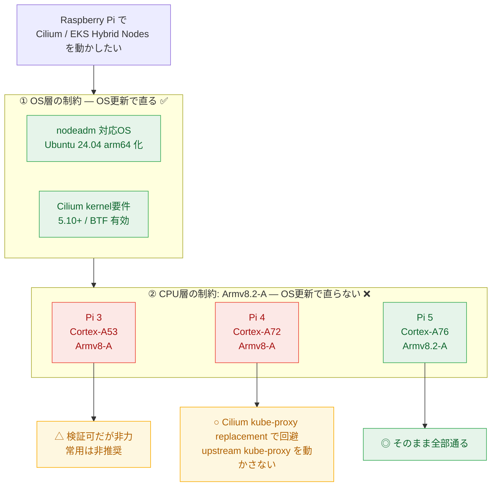

## はじめに

ローカルの Raspberry Pi で動かしている k3s クラスタを Cilium 化したい、あるいは将来 EKS Hybrid Nodes のノードとして使いたい——そう考えたときに必ずぶつかるのが「うちの Pi はそもそも対応しているのか？ ダメなら OS をアップデートすれば直るのか？」という問いです。

結論を先に言うと、制約は「OS 層で直るもの」と「CPU のシリコン世代でしか直らないもの」の 2 層に分かれます。この切り分けを間違えると「OS を新しくしたのに動かない」「Pi を買い替えたら一発だった」という遠回りをします。本記事はその境界線を、公式ドキュメントを引きながら引きます。

想定読者は、Raspberry Pi 上で k3s / Kubernetes を運用していて Cilium (eBPF CNI) や EKS Hybrid Nodes に踏み込もうとしている中級者です。Pi のモデル（3 / 4 / 5）ごとに結論が変わるので、自分の手元のモデルに読み替えてください。

:::message
本記事の文章生成・編集には AI (Anthropic Claude) を活用しています。技術的事実については、筆者が公式ドキュメントを引用して検証しています。誤りや改善点があれば、コメント等でご指摘ください。
:::

## 結論: 制約は 2 層に分かれる

| 制約 | 層 | OS 更新で直る? | 根拠 |
|---|---|---|---|
| k3s が Cilium に対応しているか | ソフト（設定） | — (元から対応) | k3s / Cilium 公式手順 |
| nodeadm の対応 OS（Ubuntu 版数） | OS | ✅ 直る | EKS 公式 OS マトリクス |
| Cilium の kernel 要件（5.10+ / BTF） | OS（kernel） | ✅ 直る | Cilium System Requirements |
| Armv8.2-A 命令を要求するバイナリ | CPU（シリコン） | ❌ 直らない | Arm Cortex TRM |

上 3 つは OS / kernel / 設定の話なので、適切な OS を入れれば解決します。最後の 1 つだけは CPU の世代に焼き付いた制約で、OS をいくら新しくしても命令セットは生えません。ここを混同しないことが本記事の主題です。

図にすると、制約は次の 2 層に分かれ、CPU 層だけが OS 更新で越えられない壁になります。


```mermaid
flowchart TD
  Q["Raspberry Pi で<br/>Cilium / EKS Hybrid Nodes を動かしたい"] --> L1

  subgraph L1["① OS層の制約 — OS更新で直る ✅"]
    direction LR
    A1["nodeadm 対応OS<br/>Ubuntu 24.04 arm64 化"]
    A2["Cilium kernel要件<br/>5.10+ / BTF 有効"]
  end

  L1 --> L2

  subgraph L2["② CPU層の制約: Armv8.2-A — OS更新で直らない ❌"]
    direction LR
    P3["Pi 3<br/>Cortex-A53<br/>Armv8-A"]
    P4["Pi 4<br/>Cortex-A72<br/>Armv8-A"]
    P5["Pi 5<br/>Cortex-A76<br/>Armv8.2-A"]
  end

  P3 --> V3["△ 検証可だが非力<br/>常用は非推奨"]
  P4 --> V4["○ Cilium kube-proxy replacement で回避<br/>upstream kube-proxy を動かさない"]
  P5 --> V5["◎ そのまま全部通る"]

  classDef ok fill:#e6f4ea,stroke:#34a853,color:#0d652d
  classDef ng fill:#fce8e6,stroke:#ea4335,color:#a50e0e
  classDef warn fill:#fef7e0,stroke:#f9ab00,color:#b06000
  class A1,A2,P5,V5 ok
  class P3,P4 ng
  class V3,V4 warn
```

## 前提: k3s は Cilium に対応している

まず誤解を解いておくと、k3s は Cilium に公式に対応しています。k3s は標準で Flannel + kube-proxy を同梱するが、それらを無効化して Cilium に差し替える構成が用意されています。

[k3s 公式の Custom CNI 手順](https://docs.k3s.io/networking/basic-network-options)によると、

> Start K3s with `--flannel-backend=none` and install your CNI of choice. Most CNI plugins come with their own network policy engine, so it is recommended to set `--disable-network-policy` as well to avoid conflicts.

つまり最低限 `--flannel-backend=none --disable-network-policy` で同梱 CNI を止めます。Cilium の kube-proxy replacement を使うなら、さらに `--disable-kube-proxy` を足す（[Cilium 公式の k3s インストールガイド](https://docs.cilium.io/en/stable/installation/k3s/)）。

```bash
# 出典: https://docs.cilium.io/en/stable/installation/k3s/
# kube-proxy replacement を使う場合は末尾に --disable-kube-proxy を追加
curl -sfL https://get.k3s.io | INSTALL_K3S_EXEC='--flannel-backend=none --disable-network-policy' sh -
```

Cilium 側は podCIDR を k3s の既定値に合わせてインストールします。[同ガイド](https://docs.cilium.io/en/stable/installation/k3s/)のコマンド例は次の通り（バージョンは 2026-06 時点でガイドに記載の `1.19.5`）。

```bash
# 出典: https://docs.cilium.io/en/stable/installation/k3s/
# k3s 既定 podCIDR 10.42.0.0/16 に合わせる
cilium install --version 1.19.5 \
  --set=ipam.operator.clusterPoolIPv4PodCIDRList="10.42.0.0/16"
```

[Cilium の k3s ガイド](https://docs.cilium.io/en/stable/installation/k3s/)は amd64 と arm64 の両アーキテクチャをサポートすると明記しており、arm64 の Raspberry Pi も対象に入ります。「k3s で Cilium が動くか？」の答えは Yes（公式手順あり）です。

問題はその先、「手元の Pi のハードと OS がその要件を満たすか」にあります。

## OS 更新で直る制約

### 1. EKS Hybrid Nodes の対応 OS

EKS Hybrid Nodes のノードは、nodeadm が対応する OS でなければサポートされません。[Prepare operating system for hybrid nodes](https://docs.aws.amazon.com/eks/latest/userguide/hybrid-nodes-os.html) の検証済み OS は Amazon Linux 2023 / Ubuntu 20.04・22.04・24.04 / RHEL 8・9 などです。

Raspberry Pi で素直に対応マトリクスに乗せるなら、Raspberry Pi OS ではなく Ubuntu Server 24.04 LTS の arm64 を入れるのが定石です。これは OS 層の話なので、OS を入れ替えれば解決します。

### 2. Cilium の kernel 要件

Cilium の eBPF データパスには新しめの kernel と BTF が要ります。[Cilium System Requirements](https://docs.cilium.io/en/stable/operations/system_requirements/) は最小要件を次のように定めています。

> Linux kernel >= 5.10 or equivalent (e.g., 4.18 on RHEL 8.10)

加えて、eBPF まわりの kernel config が必要だ（[同ページ](https://docs.cilium.io/en/stable/operations/system_requirements/)）。

```text
# 出典: https://docs.cilium.io/en/stable/operations/system_requirements/
CONFIG_DEBUG_INFO_BTF=y   # BTF（CO-RE に必須）
CONFIG_BPF=y
CONFIG_BPF_SYSCALL=y
CONFIG_CGROUP_BPF=y
```

Ubuntu 24.04 LTS は kernel 6.8 系で、これらを満たします。古い Raspberry Pi OS のままだと kernel が古かったり BTF 無効だったりするが、これも OS / kernel を更新すれば解決します。

実際にこの「BTF 無効」は、Raspberry Pi OS の現行カーネルで踏みます。手元の Pi（Raspberry Pi OS bookworm, `6.6.62+rpt-rpi-2712`）で確認すると、`CONFIG_BPF` 系は有効な一方で BTF が完全に欠けていることがわかります。

```console
$ grep -E 'CONFIG_BPF=|CONFIG_BPF_SYSCALL|CONFIG_CGROUP_BPF|CONFIG_DEBUG_INFO_BTF' \
    /boot/config-6.6.62+rpt-rpi-2712
CONFIG_BPF=y
CONFIG_BPF_SYSCALL=y
CONFIG_CGROUP_BPF=y
# CONFIG_DEBUG_INFO_BTF が無い（未設定）

$ ls /sys/kernel/btf/vmlinux
ls: cannot access '/sys/kernel/btf/vmlinux': No such file or directory
```

kernel バージョンは 6.6 で 5.10+ の要件を満たしているのに、BTF だけが欠けているため、[Cilium System Requirements](https://docs.cilium.io/en/stable/operations/system_requirements/) の必須項目 `CONFIG_DEBUG_INFO_BTF=y` を満たせません。この状態で k3s の flannel を外して Cilium を入れると、Cilium agent が CO-RE の eBPF プログラムをロードできず、ノードが Ready になりません。つまり CPU 世代（Armv8.2-A）以前に、OS 層の BTF 欠如で Cilium が動かないわけです。逆に言えば、これはまさに「OS 層の制約」であり、Ubuntu 24.04 arm64（BTF 有効）へ載せ替えれば解消します。

:::message
ここまでの 2 つは「OS を Ubuntu 24.04 arm64 にする」だけで両方クリアできます。OS 更新が効くのはこの層まで、というのが次節との境界になります。
:::

## OS 更新で「直らない」制約: Armv8.2-A 問題 ★本題

ここからが本記事の核心です。一部のコンテナイメージは、起動時に次のようなエラーで落ちることがあります。

```text
Fatal glibc error: This version of Amazon Linux requires a newer ARM64 processor compliant with at least ARM architecture 8.2-a with Cryptographic extensions. On EC2 this is Graviton 2 or later.
```

この要件は AWS 公式が明記しています。[Prepare operating system for hybrid nodes](https://docs.aws.amazon.com/eks/latest/userguide/hybrid-nodes-os.html)（2026-08 時点で取得）の ARM 節は、ARMv8.2 準拠かつ Cryptography Extension 付き（ARMv8.2+crypto）のプロセッサが EKS kube-proxy add-on の v1.31 以降で必要であり、Raspberry Pi 5 より前の全機種と Cortex-A72 ベースのプロセッサはこれを満たさないと述べています。回避策として kube-proxy add-on v1.30 を使い続ける方法が案内されていましたが、これは 2026 年 7 月に延長サポート終了しているため、現時点では upstream の custom kube-proxy image を使う選択肢が残ります。

これは CPU の命令セット世代の問題で、OS や kernel をいくら新しくしても直らません。なぜなら、無い命令はソフトウェアでは生やせないからです。

Raspberry Pi のメイン CPU は世代ごとに Arm アーキテクチャのバージョンが違います。

| Pi モデル | CPU コア | Arm アーキテクチャ | Armv8.2-A |
|---|---|---|---|
| Raspberry Pi 3 | Cortex-A53 | Armv8-A（v8.0） | ❌ 無い |
| Raspberry Pi 4 | Cortex-A72 | Armv8-A（v8.0） | ❌ 無い |
| Raspberry Pi 5 | Cortex-A76 | Armv8.2-A | ✅ ある |

各コアのアーキテクチャは Arm 公式の Technical Reference Manual に明記されています。

- Cortex-A76 は 「a full implementation of the Armv8.2-A A64, A32, and T32 instruction sets」（[Arm Cortex-A76 Core TRM (100798)](https://support.arm.com/documentation/100798/latest/)）
- Cortex-A72 は 「a full implementation of the ARMv8-A architecture profile」（[Arm Cortex-A72 MPCore TRM (100095)](https://support.arm.com/documentation/100095/latest)）
- Cortex-A53 は Armv8-A の実装（[Arm Cortex-A53 MPCore TRM (DDI0500)](https://support.arm.com/documentation/ddi0500/latest/)）

そして各 Pi がどの CPU を積むかは Raspberry Pi 公式仕様に載っています。

- Raspberry Pi 5 = Cortex-A76（[Raspberry Pi 5 product page](https://www.raspberrypi.com/products/raspberry-pi-5/)）
- Raspberry Pi 4 Model B = Cortex-A72（[Raspberry Pi 4 specifications](https://www.raspberrypi.com/products/raspberry-pi-4-model-b/specifications/)）
- Raspberry Pi 3 Model B+ = Cortex-A53（[Raspberry Pi 3 B+ product page](https://www.raspberrypi.com/products/raspberry-pi-3-model-b-plus/)）

整理すると、Armv8.2-A 命令を要求するバイナリは、Armv8-A 止まりの Pi 3 / Pi 4 では物理的に動きません。Pi 5（A76）だけが Armv8.2-A を持ちます。これは silicon に焼き付いた事実なので、OS 更新では絶対に超えられません。

:::message alert
`Fatal glibc error: This version of Amazon Linux requires a newer ARM64 processor compliant with at least ARM architecture 8.2-a with Cryptographic extensions. On EC2 this is Graviton 2 or later.` 自体は、コンテナイメージ内の glibc が「より新しい `-march` でビルドされていて Armv8.2-A 命令を含む」ときに出る症状で、具体的にどのイメージ・どのバージョンで踏むかはイメージのビルド条件依存。本記事はその個別マッピングまでは断定しません（イメージごとに要確認）。確実に言えるのは「根本原因は CPU 命令セット世代であり、ホスト OS の更新では解決しない」という一点（根拠は上記 Arm TRM）。
:::

## 回避策（ハード買い替え以外）

「Pi 3 / Pi 4 だから詰み」かというと、必ずしもそうではありません。Armv8.2-A を要求してくるのは多くの場合「特定イメージのビルド条件」なので、迂回路があります。

1. **Cilium の kube-proxy replacement を使い、upstream の `kube-proxy` を動かさない**
   そもそも `kube-proxy` DaemonSet を起動しなければ、そのイメージ起因の Armv8.2-A 要求は発生しません。Cilium 自身のイメージは baseline arm64（Armv8-A）向けに配布されており、Pi 4 でも動きます。kube-proxy free 化は[Cilium 公式の kube-proxy replacement](https://docs.cilium.io/en/stable/network/kubernetes/kubeproxy-free/)に従います。
2. **kube-proxy を使うなら、Armv8.2-A 要求が入る前のバージョンに固定する**
   イメージのビルド条件が変わる前のタグを使えば回避できる場合があります（要・対象イメージでの確認）。
3. **baseline 向けに自前で再ビルドしたイメージを使う**
   `-march=armv8-a` 相当でビルドし直せば A53 / A72 でも動きます。運用コストは上がります。

つまり「OS 更新」ではなく「動かすバイナリ側の選択」が Pi 3 / Pi 4 での正しい回避軸になります。

## Pi モデル別の結論

- **Raspberry Pi 5（Cortex-A76 / Armv8.2-A）**: 命令セットの壁がありません。Ubuntu 24.04 arm64 化すれば nodeadm 対応・Cilium kernel 要件・Armv8.2-A すべて素直に通ります。Hybrid Node 候補の本命です。
- **Raspberry Pi 4（Cortex-A72 / Armv8-A）**: OS を Ubuntu 24.04 arm64 にすれば nodeadm / eBPF 要件は満たせます。Armv8.2-A 要求イメージは踏みうるので、Cilium kube-proxy replacement でそもそも upstream kube-proxy を動かさない構成にするのが安全です。実用上はこれで回避できます。
- **Raspberry Pi 3（Cortex-A53 / Armv8-A）**: OS 更新で要件自体は満たせますが、CPU が非力でメモリも少ない個体が多く、Cilium + Hybrid Node の常駐には向きません。検証はできても、常用は Pi 4 / 5 を推奨します。

「OS をアップデートすれば対応可になりませんか？」への最終的な答えは、「nodeadm 対応・kernel 要件は OS 更新で直る。だが Armv8.2-A の壁は CPU 世代の問題で OS では直らません。Pi 4 以下では『動かすバイナリの選択』で回避する」となります。

## まとめ

1. k3s は Cilium に公式対応している（`--flannel-backend=none --disable-network-policy`、kube-proxy free なら `--disable-kube-proxy`）。
2. Pi の制約は OS 層（nodeadm 対応 OS・Cilium kernel 5.10+ / BTF）と CPU シリコン層（Armv8.2-A）に分かれます。
3. OS 層は Ubuntu 24.04 arm64 化で直ります。CPU 層は OS 更新では直らない（Arm TRM が示す通り A53 / A72 は Armv8-A）。
4. Pi 3 / Pi 4 で Armv8.2-A 要求イメージを踏んだら、Cilium kube-proxy replacement などで「動かすバイナリ」を変えて回避します。
5. 素直に全部通したいなら Pi 5（Cortex-A76 / Armv8.2-A）。

## 参考

- [k3s: Basic Network Options（Custom CNI）](https://docs.k3s.io/networking/basic-network-options)
- [Cilium: Installation on k3s](https://docs.cilium.io/en/stable/installation/k3s/)
- [Cilium: System Requirements](https://docs.cilium.io/en/stable/operations/system_requirements/)
- [Cilium: Kubernetes without kube-proxy](https://docs.cilium.io/en/stable/network/kubernetes/kubeproxy-free/)
- [Amazon EKS: Prepare operating system for hybrid nodes](https://docs.aws.amazon.com/eks/latest/userguide/hybrid-nodes-os.html)
- [Arm Cortex-A76 Core Technical Reference Manual (100798)](https://support.arm.com/documentation/100798/latest/)
- [Arm Cortex-A72 MPCore Technical Reference Manual (100095)](https://support.arm.com/documentation/100095/latest)
- [Arm Cortex-A53 MPCore Technical Reference Manual (DDI0500)](https://support.arm.com/documentation/ddi0500/latest/)
- [Raspberry Pi 5 product page](https://www.raspberrypi.com/products/raspberry-pi-5/)
- [Raspberry Pi 4 Model B specifications](https://www.raspberrypi.com/products/raspberry-pi-4-model-b/specifications/)
- [Raspberry Pi 3 Model B+ product page](https://www.raspberrypi.com/products/raspberry-pi-3-model-b-plus/)
