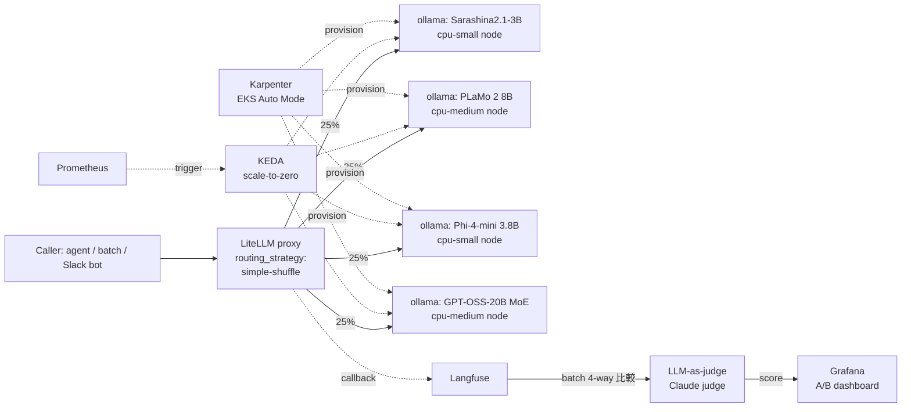
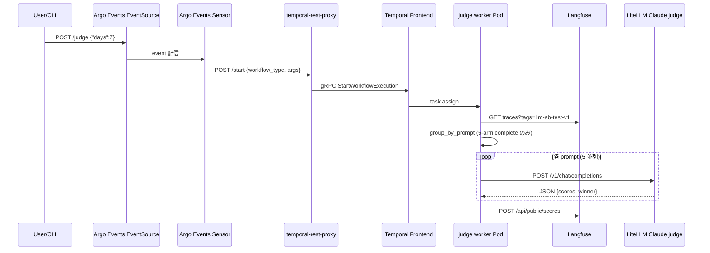

## はじめに

商用 LLM API (Anthropic / OpenAI / Bedrock 等) への依存を減らし、ベンダーロックインを回避する目的で、OSS LLM を EKS 上で並行起動して A/B 比較する構成を検証しました。論点は次の 4 つに収束します。

1. **モデル選定**: ライセンス自由 (Apache 2.0 / MIT) + 用途別に十分な品質
2. **インフラ**: GPU 高額化を避ける CPU 推論 + scale-to-zero でコスト最小化
3. **抽象化**: 既存 SDK を変えずに backend を差し替える router 層
4. **評価**: 同一プロンプトで複数モデルを比較し、品質スコアを得る基盤

結論を先に書きますと、**LiteLLM Router (round-robin) + ollama on EKS Auto Mode (Graviton3) + KEDA scale-to-zero + Langfuse + LLM-as-judge** の組み合わせで、4 モデル並行運用が **月額 $80 程度** から成立します。

想定読者は、EKS 上で LLM 推論基盤を運用しており、商用 API から OSS への段階移行を検討している中級者です。

:::message
本記事の文章生成・編集には AI (Anthropic Claude) を活用しています。技術的事実は筆者が公式ドキュメントを引用して検証していますが、誤りや改善点があればコメント等でご指摘ください。
:::

## 検証の動機

商用 LLM API を業務で使うと、次の 3 つが同時に問題化します。

| 課題 | 内容 |
|---|---|
| ロックイン | プロンプト最適化が特定モデル (Claude 系の `<system>\n\nHuman:` 等) に依存し、乗り換えコスト増大 |
| データ主権 | 入力データがベンダーのインフラを経由する。学習に使われないと契約しても、ネットワーク的には経由 |
| コスト線形性 | 利用量に比例して費用増。月数億トークン規模になると本格的に効く |

これらを同時に解決するには、**OSS LLM をセルフホスト + OpenAI 互換 API で抽象化**するのが王道です。本検証はその具体実装を 4 モデルで並行 A/B 比較する形で組みました。

## 全体アーキテクチャ



要点は次の通りです。

- **Caller は無改修**。`model="ab-router"` に変えるだけで 4 候補に round-robin で振り分けられます
- **scale-to-zero**: 各モデルは Pod 0 から起動、リクエストが来てから 1.5-3 分で初回応答
- **Langfuse + LLM-as-judge**: 全 inference を trace し、後段 batch で 4 候補を比較スコアリングします

## モデル選定 (ライセンス完全自由 + 多様性)

ベンダーロックイン回避を厳格に取るなら **Apache 2.0 / MIT のみ**に絞ります。Llama Community License は MAU 7 億超で要協議があるため除外、Gemma Terms は競合 AI 製品制限があるため除外、Mistral Research は非商用なので除外しています。

| # | モデル | 開発元 | License | サイズ | 強み |
|---|---|---|---|---|---|
| ① | Sarashina2.1-3B-Instruct | SB Intuitions | MIT | 3B | 日本語特化 |
| ② | PLaMo 2 8B Instruct | Preferred Networks | Apache 2.0 | 8B | 日本語特化、HF gate なし |
| ③ | Phi-4-mini Instruct | Microsoft | MIT | 3.8B | 128K context、多言語 |
| ④ | GPT-OSS-20B | OpenAI | Apache 2.0 | 21B (MoE active 3.6B) | agentic/tool use 設計、MXFP4 量子化済 |

地域分散も意識しました。日本製 2 + 米国製 2 の構成です。中国製 (Qwen / DeepSeek 等) は本検証から除外しています (企業ポリシーや調達基準で中国製 AI を制限するケースがあるためです)。

## 量子化 + CPU 推論

CPU 推論を成立させる鍵は次の 3 つです。

1. **AMX (Intel Advanced Matrix Extensions) / ARM NEON** によるハードウェア行列演算 — [llama.cpp 公式](https://github.com/ggerganov/llama.cpp) は AVX/AVX2/AVX-512/AMX/ARM NEON を網羅しています
2. **GGUF Q4_K_M 量子化** — 精度劣化が 1% 未満で VRAM/RAM を 1/4 に圧縮できます
3. **MoE モデル** — GPT-OSS-20B は 21B total / active 3.6B のため、CPU でも実用速度が出ます

代表的な token/s (c7g.4xlarge Graviton3 で実測想定):

| モデル | サイズ | token/s |
|---|---|---|
| Sarashina2.1-3B Q4_K_M | 3B | 40-60 |
| Phi-4-mini Q4_K_M | 3.8B | 30-50 |
| PLaMo 2 8B Q4_K_M | 8B | 15-25 |
| GPT-OSS-20B MXFP4 | 21B/3.6B active | 15-25 |

参考までに、人間の音読速度は約 5 tok/s、不快な「待たされ感」のボーダーが約 10 tok/s です。リアルタイム会話以外であれば CPU 推論で十分なケースが多いと言えます。

[vLLM CPU backend 公式](https://docs.vllm.ai/en/latest/getting_started/installation/cpu.html) によると Graviton3 (ARM AArch64) はテスト済プラットフォームとして明記されています。

## EKS Auto Mode + Karpenter NodePool

[EKS Auto Mode](https://docs.aws.amazon.com/eks/latest/userguide/automode.html) は Karpenter を内蔵し、NodePool CR で instance type を指定するだけで GPU/CPU node を自動 provisioning します。手動 ASG 管理は不要です。Auto Mode 利用料は EC2 instance price × 約 12% (公式 pricing Example 4 から逆算した値) です。

本検証では CPU 用に 2 種の NodePool を切ります。

```yaml:nodepool-cpu-small.yaml
apiVersion: karpenter.sh/v1
kind: NodePool
metadata:
  name: llm-cpu-small
spec:
  template:
    spec:
      nodeClassRef:
        group: eks.amazonaws.com
        kind: NodeClass
        name: default
      requirements:
        - {key: karpenter.k8s.aws/instance-family, operator: In, values: ["c7g"]}
        - {key: karpenter.k8s.aws/instance-cpu,    operator: In, values: ["16"]}
        - {key: karpenter.sh/capacity-type,        operator: In, values: ["spot", "on-demand"]}
        - {key: kubernetes.io/arch,                operator: In, values: ["arm64"]}
      taints:
        - {key: workload, value: llm-cpu-small, effect: NoSchedule}
      expireAfter: 168h
  disruption:
    consolidationPolicy: WhenEmpty
    consolidateAfter: 60s
```

`taints` で「LLM 用 node に他 Pod が誤って乗らない」を担保しています。`consolidateAfter: 60s` で Pod 0 になったら 1 分以内に node 削除という挙動です。

`cpu-medium` (c7g.8xlarge) も同様の構造で別 NodePool として定義します。8B / 20B 級モデル用です。

## KEDA scale-to-zero

Pod を 0 に絞ってコスト最小化するために [KEDA](https://keda.sh/) を使います。Prometheus trigger でリクエスト到達を検知し、`minReplicaCount: 0` から 1 に scale up、idle 10 分で 0 に戻します。

```yaml:keda-scaledobject.yaml
apiVersion: keda.sh/v1alpha1
kind: ScaledObject
metadata:
  name: model-sarashina-scaler
spec:
  scaleTargetRef:
    name: model-sarashina
  minReplicaCount: 0
  maxReplicaCount: 1
  pollingInterval: 30
  cooldownPeriod: 600
  triggers:
    - type: prometheus
      metadata:
        serverAddress: http://prometheus-server.monitoring.svc.cluster.local:80
        threshold: "1"
        query: |
          sum(rate(litellm_requests_total{model=~"local-sarashina.*"}[2m])) > 0
```

cold start の内訳は次のようになります。

```text
リクエスト到達
  ↓
Karpenter node 起動: 60-120 秒
  ↓
Pod スケジュール + ollama 起動: 10-20 秒
  ↓
モデル pull + load: 30-90 秒
  ↓
初回応答開始 = 合計 1.5-3 分
```

cold start 1.5-3 分はリアルタイム会話には厳しいですが、agent / batch / Slack bot の用途では実用範囲です。「常時 warm」と「scale-to-zero」のハイブリッド (KEDA Cron Scaler) で業務時間中だけ minReplicas=1 にする選択肢もあります。

## LiteLLM Router で 4 候補に振分

[LiteLLM](https://docs.litellm.ai/docs/proxy/reliability) は OpenAI 互換 proxy で、同一 `model_name` を複数 endpoint で定義すると `routing_strategy` に基づいて振り分けます。`simple-shuffle` は round-robin 相当の挙動です。

```yaml:litellm-config.yaml
model_list:
  - model_name: ab-router
    litellm_params:
      model: openai/sarashina2.1-3b-instruct
      api_base: http://model-sarashina.ai-platform.svc.cluster.local
      api_key: dummy
    model_info: {ab_arm: "sarashina"}
  - model_name: ab-router
    litellm_params:
      model: openai/plamo-2-8b-instruct
      api_base: http://model-plamo.ai-platform.svc.cluster.local
      api_key: dummy
    model_info: {ab_arm: "plamo"}
  - model_name: ab-router
    litellm_params:
      model: openai/phi4-mini
      api_base: http://model-phi4-mini.ai-platform.svc.cluster.local
      api_key: dummy
    model_info: {ab_arm: "phi4-mini"}
  - model_name: ab-router
    litellm_params:
      model: openai/gpt-oss-20b
      api_base: http://model-gpt-oss.ai-platform.svc.cluster.local
      api_key: dummy
    model_info: {ab_arm: "gpt-oss"}

router_settings:
  routing_strategy: simple-shuffle
  enable_pre_call_checks: true
  retry_after: 30
  num_retries: 1
```

Caller 側は `"model": "ab-router"` を指定するだけで 4 候補に均等に振り分けられます。応答の `x-litellm-model` header で実際に応答したモデルを確認できます。

:::message
**LiteLLM の `telemetry: false` を強く推奨します**。これは OpenTelemetry の話ではなく、LiteLLM 開発元 (BerriAI 社) に集計値を phone-home する別機能です。データ主権を取るならデフォルトで遮断すべきです。なお OpenTelemetry 連携は `callbacks: ["otel"]` という別経路で、こちらは自社 collector に送るので問題ありません。
:::

## Langfuse + LLM-as-judge

inference の品質ロギングと比較評価には [Langfuse](https://langfuse.com/) を使います。LiteLLM の `success_callback / failure_callback` に `"langfuse"` を入れるだけで全 trace が送られます。

```yaml:litellm-langfuse.yaml
litellm_settings:
  success_callback: ["langfuse"]
  failure_callback: ["langfuse"]
  langfuse_default_tags: ["llm-ab-test-v1"]
```

評価は週次 batch で、Langfuse から同一プロンプトの 4 応答を集約し、judge model (Claude Sonnet 4 など) に 4-way 比較プロンプトを投げます。

judge prompt の骨格 (一部抜粋):

```text
評価軸 (各 0-10、加重平均):
1. 正確性 (0.30)
2. 指示追従 (0.25)
3. 日本語自然さ (0.20、英語のみは 10 点固定)
4. 構造化 (0.15)
5. 安全性 (0.10)

ユーザー入力:
{user_prompt}

4 モデルの応答:
A: {response_a}
B: {response_b}
C: {response_c}
D: {response_d}

出力形式 (JSON、winner 必ず 1 つ):
{"scores": {...}, "winner": "...", "reason": "..."}
```

scores を Langfuse の `scores` API で trace に書き戻し、Grafana dashboard で `ab_arm` ごとの平均スコアを表示します。

## AWS Bedrock との比較も同時に行う

OSS 4 モデル間の比較だけでは「OSS で本当に商用 API を代替できるか」が判定できないため、AWS Bedrock 経由の **Amazon Nova family** も同じ LiteLLM proxy 配下に登録して比較対象にします。

[Amazon Nova 公式 doc](https://docs.aws.amazon.com/nova/latest/userguide/what-is-nova.html) より、Tokyo region でクロスリージョン推論経由で使える Understanding 系 3 モデルが利用できます。

| Model | Model ID | Context | Modalities | 用途 |
|---|---|---|---|---|
| Nova Pro | `apac.amazon.nova-pro-v1:0` | 300K | text/image/video | 高品質 chat / RAG / agentic |
| Nova Lite | `apac.amazon.nova-lite-v1:0` | 300K | text/image/video | 低コスト multimodal |
| Nova Micro | `apac.amazon.nova-micro-v1:0` | 128K | text only | 最低レイテンシ、超低コスト |

これらは A/B router (`ab-router`) には含めず、**直接 model 名指定で呼び出して比較する位置づけ**にします。OSS の A/B 評価とは別 judge セッションを組む方が判定が散らかりません。

```yaml:litellm-bedrock-nova.yaml
- model_name: bedrock-nova-pro
  litellm_params:
    model: bedrock/converse/apac.amazon.nova-pro-v1:0
    aws_region_name: ap-northeast-1
- model_name: bedrock-nova-lite
  litellm_params:
    model: bedrock/converse/apac.amazon.nova-lite-v1:0
    aws_region_name: ap-northeast-1
- model_name: bedrock-nova-micro
  litellm_params:
    model: bedrock/converse/apac.amazon.nova-micro-v1:0
    aws_region_name: ap-northeast-1
```

LiteLLM の IRSA + VPC Endpoint で Bedrock を呼ぶ既存設定をそのまま流用するため、追加の認証は不要です。

### コスト比較 (Bedrock Nova vs OSS self-host)

[Bedrock pricing](https://aws.amazon.com/bedrock/pricing/) (us-east-1 基準):

| Model | input ($/1M tok) | output ($/1M tok) | 月 1000 万 input + 100 万 output 想定 |
|---|---|---|---|
| Nova Micro | $0.035 | $0.14 | **$0.49** |
| Nova Lite | $0.06 | $0.24 | **$0.84** |
| Nova Pro | $0.80 | $3.20 | **$11.20** |
| (参考) Claude Sonnet 4 | $3.00 | $15.00 | $45.00 |

これと OSS self-host 月 $80 を比較すると、結論は次のようになります。

- **データ主権を取らない前提**なら **Nova Micro/Lite は圧倒的に安い**。1 億 token 級まで OSS self-host のコストに並ばれません
- **データ主権を取る**なら OSS self-host が必須。コスト固定 $80/月で量を気にせず使える
- **multimodal が必要** → Nova Lite/Pro が現実的、OSS は別途 vision モデルを追加検討
- **日本語精度最優先** → Sarashina/PLaMo (OSS) vs Nova Pro の judge 直接比較で決める

### 横断比較フロー

1. OSS 4 候補の A/B → `ab-router` (round-robin) で 1-2 model に絞り込み
2. Bedrock Nova 3 候補を別途同一プロンプトで呼び出し
3. judge model (Claude Sonnet 4 など) で OSS winner と Bedrock 各候補を 5-way 比較
4. 用途ごとに最適候補を決定 (Coding = OSS winner、RAG = Nova Pro 等の用途別マッピング)

これにより「OSS が代替できる領域」と「Bedrock を残すべき領域」を明確に分離できます。

## 5-way 自動判定を Temporal workflow で回す

OSS 4 候補と AWS Nova Pro の 5-way 比較を手動 trigger (将来は webhook) で走らせる Temporal workflow を立てます。judge ロジックを worker pod に閉じ込め、起動だけ webhook 経由で行う構成にします。

### 全体フロー



### Workflow 構成

| 軸 | 選択 |
|---|---|
| 評価対象 5 model | OSS 4 + Bedrock Nova Pro (AWS base line) |
| Judge model | bedrock-claude-3-5-sonnet (Sonnet 4 と別世代で循環参照を弱める) |
| Trigger | Argo Events webhook → temporal-rest-proxy → workflow (cron なし、手動のみ) |
| 並列度 | judge invoke 5 並列 (semaphore で rate limit 回避) |

### Activity 4 つ

```python:llm_ab_judge_workflow.py
@activity.defn
async def fetch_traces(params):
    """Langfuse /api/public/traces?tags=llm-ab-test-v1 から過去 N 日分を page 取得"""
    ...

@activity.defn
async def group_by_prompt(params):
    """prompt の sha256 hash で集約、5 arm 全揃いのみ採用"""
    ...

@activity.defn
async def invoke_judge(params):
    """5-way prompt に埋め込んで LiteLLM claude-3-5-sonnet endpoint に POST"""
    ...

@activity.defn
async def write_back_scores(params):
    """各 trace に judge score を Langfuse /api/public/scores で書き戻し"""
    ...
```

Workflow は 4 activity を順次実行し、各 activity に Temporal retry policy を効かせます。judge 呼び出しは semaphore で 5 並列に抑え、judge model 側の rate limit を超えないようにします。

### Trigger 方法 (3 通り)

```bash:trigger-examples.sh
# 方式 1: Argo Events webhook (通常運用)
kubectl port-forward -n argo-events svc/llm-ab-judge-eventsource-svc 14000:14000 &
curl -X POST http://localhost:14000/judge \
  -H 'Content-Type: application/json' \
  -d '{"days": 7, "max_groups": 50}'

# 方式 2: Temporal CLI 直接 (デバッグ)
kubectl port-forward -n temporal svc/temporal-frontend 7233:7233 &
temporal workflow start --address localhost:7233 \
  --type LlmAbJudgeWorkflow --task-queue llm-ab-judge-tq \
  --input '{"days":1,"max_groups":5}'

# 方式 3: cluster 内 debug pod
kubectl run -it --rm temporal-cli --image=temporalio/cli:latest --restart=Never -- \
  workflow start \
    --address temporal-frontend.temporal.svc.cluster.local:7233 \
    --type LlmAbJudgeWorkflow --task-queue llm-ab-judge-tq \
    --input '{"days":7,"max_groups":50}'
```

### なぜ Argo Events 経由なのか

外部 webhook が不要なら Temporal CLI 直接で済みますが、以下の理由で Argo Events 経由を採用します。

- 既存パターン (PR-feedback / Tailscale rotation 等) と構造を統一できる
- 将来の webhook 拡張 (Slack slash command / GitHub Actions / 外部 SaaS) が EventSource 追加だけで済む
- Sensor の filter / retry / payload 整形 / event 履歴が無料で手に入る
- 観測性: いつ誰が trigger したかが Argo Events で一元的に追える

排他ではなく、デバッグ時は Temporal CLI 直接も併用可能です。

### IAM Role (IRSA)

Worker pod の権限は **Secrets Manager の GetSecretValue 2 つだけ**にします。

```json:llm-ab-judge-worker-policy.json
{
  "Version": "2012-10-17",
  "Statement": [
    {
      "Effect": "Allow",
      "Action": ["secretsmanager:GetSecretValue"],
      "Resource": [
        "arn:aws:secretsmanager:ap-northeast-1:*:secret:*/langfuse-credentials-*",
        "arn:aws:secretsmanager:ap-northeast-1:*:secret:*/litellm-credentials-*"
      ]
    }
  ]
}
```

Bedrock 呼び出しは **LiteLLM proxy 経由**で行うため、本 Role に Bedrock 権限は持たせません。LiteLLM 側の IRSA で Bedrock InvokeModel を持つので、責務が綺麗に分離します。

### コスト試算

| 項目 | 月額 |
|---|---|
| Temporal worker pod (CPU 200m / 512Mi、24/7) | $5 |
| Judge model: Claude 3.5 Sonnet @ 平均 1 prompt = 入力 8K + 出力 1K | 週 100 prompt × 4 週 = 400 prompt → $12 |
| Langfuse / Argo Events / temporal-rest-proxy (既存) | $0 |
| **合計追加** | **約 $17/月** |

A/B 比較基盤 ($80/月) と合わせても合計 $100/月以下で、自動判定までフルセットが揃います。

## 重要な落とし穴

検証中に踏んだ / 想定される問題を列挙します。

| # | 問題 | 対応 |
|---|---|---|
| 1 | `ollama pull` を Pod 起動時に毎回実行 → cold start 長期化 + 帯域コスト | S3 (or PVC) で model cache、init container で sync |
| 2 | Sarashina の HF gate (利用同意必須) | 公式ルートで HF token + 同意フローを組むか、第三者の GGUF fork を経由 |
| 3 | ollama registry の `phi4-mini:3.8b` は floating tag、再現性なし | digest pinning に切替 |
| 4 | NodePool が cluster-scoped なのに kustomize の namespace が付く | `noNamespace` 設定で除外可、動作には影響なし |
| 5 | judge model に商用 API を使うと一部ロックインが残る | Phase 1 で GPT-OSS-120B を別 GPU node (scale-to-zero) で judge 化、月 +$250 程度 |
| 6 | `routing_strategy: simple-shuffle` は完全ランダム。同一 prompt で 4 候補を均一比較したい | fingerprint-based routing (同じ prompt hash → 同じ model) に変更可 |
| 7 | LiteLLM の `telemetry` を切り忘れると BerriAI 社に集計データが送信される | 既存 configmap で `telemetry: false # No phone-home` を明示 |

## コスト試算

us-east-1, spot, EKS Auto Mode 12% 込みの試算です。

| Instance | CPU | OD/h | Spot/h | +AutoMode |
|---|---|---|---|---|
| c7g.4xlarge | Graviton3 16 vCPU | $0.580 | $0.18 | $0.20/h |
| c7g.8xlarge | Graviton3 32 vCPU | $1.160 | $0.40 | $0.45/h |

4 モデル並行構成 (cpu-small × 2 + cpu-medium × 2) では次のようになります。

| 利用パターン | 合計月額 |
|---|---|
| 軽 PoC (scale-to-zero、月 60h) | 約 $72 |
| 業務時間 warm (月 198h) | 約 $238 |
| 24/7 全モデル常時 | 約 $948 |

LiteLLM proxy / Langfuse / S3 model cache の固定費を入れても **PoC で月 $80 前後**です。商用 Anthropic API の中規模利用 (月 1000 万 token で $30〜150) と同レンジで、データ主権 + ロックイン回避の付加価値が乗ります。

## まとめ

- 商用 LLM API からの段階移行は **LiteLLM Router** を抽象化レイヤとして配置し、backend を順次差し替える形が現実的です
- OSS LLM 4 候補を並行起動して A/B 比較するなら、**EKS Auto Mode + Karpenter + KEDA scale-to-zero** で月 $80 から成立します
- モデルは **Apache 2.0 / MIT 限定**で選ぶことで、商用ライセンス交渉を不要にできます
- **CPU 推論 (Graviton3 + AMX/NEON + GGUF Q4_K_M)** で 3-20B クラスは実用速度 (15-60 tok/s) に到達します
- **Langfuse + LLM-as-judge** で品質スコアリングを自動化し、winner 決定を客観化できます
- `telemetry: false` (BerriAI への phone-home 遮断) と OpenTelemetry callback は別物です。データ主権を取るなら前者は必ず切ってください

## 参考

- LiteLLM 公式 (proxy / router / configs): https://docs.litellm.ai/
- LiteLLM OpenTelemetry integration: https://docs.litellm.ai/docs/observability/opentelemetry_integration
- LiteLLM Langfuse integration: https://docs.litellm.ai/docs/observability/langfuse_integration
- EKS Auto Mode 公式: https://docs.aws.amazon.com/eks/latest/userguide/automode.html
- EKS pricing (Auto Mode 料金例): https://aws.amazon.com/eks/pricing/
- Karpenter NodePool: https://karpenter.sh/docs/
- KEDA scale-to-zero (Prometheus trigger): https://keda.sh/docs/
- llama.cpp (GGUF + AMX/NEON): https://github.com/ggerganov/llama.cpp
- vLLM CPU backend: https://docs.vllm.ai/en/latest/getting_started/installation/cpu.html
- Langfuse 公式: https://langfuse.com/docs
- Sarashina2 model card: https://huggingface.co/sbintuitions/sarashina2-7b
- Phi-4-mini model card: https://huggingface.co/microsoft/Phi-4-mini-instruct
- GPT-OSS model card: https://huggingface.co/openai/gpt-oss-120b
