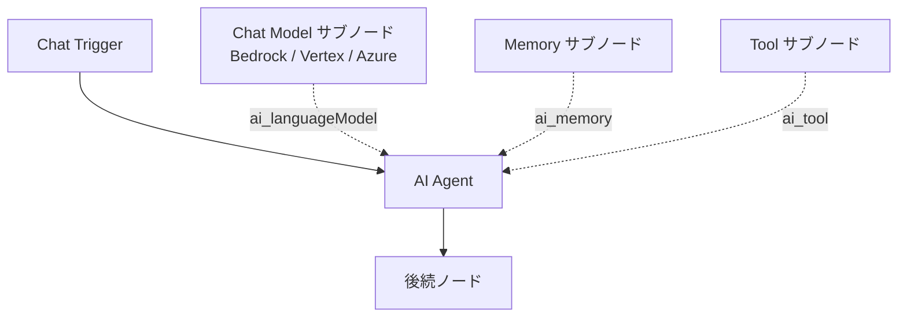
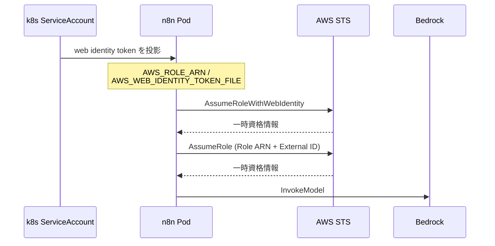

## はじめに

n8n の AI Agent は、Chat Model・Memory・Tool を「サブノード」として付け替える構造になっています。そのため、LLM プロバイダを変えたいときは Chat Model サブノードを差し替えるだけで済みそうに見えます。

しかし実際に自前 k3s 上の n8n で AWS Bedrock を使う構成を組んでみると、プロバイダごとに違うのはノードの種類だけではありませんでした。認証・モデルの指定方法・エンドポイントの決まり方という 3 つの層で設計が変わります。特に認証は、クラウド側の思想の違いがそのままノードの設定項目に出ています。

本記事では、n8n 公式ドキュメントと各クラウドの公式ドキュメント、および n8n の upstream ソースコードを一次資料として、AWS Bedrock / Google Vertex AI / Azure OpenAI の 3 つでフロー構築がどう変わるかを整理します。

- 想定読者: n8n で AI Agent を組んだことがあり、プロバイダ選定や移植を検討している中級者
- 検証環境: セルフホスト n8n 2.33.3(Kubernetes 上)
- 本記事の記述は、明記のない限りすべて公式ドキュメントまたは upstream ソースを出典としています。筆者の実測に基づく箇所は「※筆者環境での実測」と明示します

:::message
本記事の文章生成・編集には AI (Anthropic Claude) を活用しています。技術的事実については、筆者が公式ドキュメントを引用して検証しています。誤りや改善点があれば、コメント等でご指摘ください。
:::

## 共通部分: AI Agent の構造

まず共通する土台を確認します。n8n の AI Agent ノードは、[公式ドキュメント](https://docs.n8n.io/integrations/builtin/cluster-nodes/root-nodes/n8n-nodes-langchain.agent/)によると「チャットモデルと 1 つ以上のツールを接続する」構成です。



実際の画面では、AI Agent ノードの下に Chat Model / Memory / Tool がぶら下がる形になります。


*AI Agent に Chat Model・Memory・Tool を接続した状態(n8n 2.33.3)*

Memory と Tool はプロバイダに依存しないため、プロバイダを変えて影響を受けるのは Chat Model サブノードとその資格情報だけです。ここまでは想定どおりでした。問題はその 1 ノードの中身です。

## 違い 1: 認証 — 静的キーを消せるのは Bedrock だけ

最も設計に響くのがここです。

### AWS Bedrock

n8n の AWS 資格情報には [2 種類](https://docs.n8n.io/integrations/builtin/credentials/aws)あります。アクセスキーを使う AWS (IAM) と、AWS STS でロールを引き受ける AWS (Assume Role) です。後者のフィールドは Region / Role ARN / External ID / Role Session Name で、STS を呼ぶ側の資格情報として Use System Credentials(環境からの自動探索)を選べます。

実際の入力画面が次です。**Use System Credentials を有効にすると、アクセスキーの入力欄自体が現れません**。


*Role ARN はドキュメント用のダミー値。「Couldn't connect with these settings」は、この撮影用インスタンスに引き受け先のロールが存在しないため*


この「自動探索」の中身が重要です。同ドキュメントによると、n8n は以下の順で資格情報を探し、最初に取得できたものを使います。

1. 環境変数(`AWS_ACCESS_KEY_ID` / `AWS_SECRET_ACCESS_KEY`、任意で `AWS_SESSION_TOKEN`)
2. **EKS IRSA**(`AWS_ROLE_ARN` と `AWS_WEB_IDENTITY_TOKEN_FILE`)
3. EKS Pod Identity(`AWS_CONTAINER_CREDENTIALS_FULL_URI`)
4. ECS / Fargate(`AWS_CONTAINER_CREDENTIALS_RELATIVE_URI`)
5. EC2 インスタンスプロファイル(IMDSv2 経由)

2 番目の IRSA 経路があるため、n8n に静的キーを一切保存せずに Bedrock を呼べます。この探索を有効にするには環境変数 `N8N_AWS_SYSTEM_CREDENTIALS_ACCESS_ENABLED` が必要で、既定では無効です。公式は有効化の条件について、AWS (Assume Role) 資格情報を作れるユーザーがサーバー自身の AWS アイデンティティを起点にできてしまうため、資格情報を作れる全員を信頼できるシングルテナントのセルフホスト環境でのみ有効にするよう明記しています。

### Google Vertex AI

一方 Vertex AI は事情が異なります。n8n の [Google Vertex Chat Model ノード](https://docs.n8n.io/integrations/builtin/cluster-nodes/sub-nodes/n8n-nodes-langchain.lmchatgooglevertex/)は Google サービスアカウント資格情報を使いますが、その資格情報が要求するのは [公式ドキュメント](https://docs.n8n.io/integrations/builtin/credentials/google/service-account/)によると次の項目です。

- **Service Account Email**(JSON キーファイルの `client_email`)
- **Private Key**(JSON キーファイルの `private_key`)
- Impersonate a User(任意)、Scopes(任意)

つまり JSON 秘密鍵の中身を n8n に貼り付ける方式です。upstream のノード実装でも、資格情報から `privateKey` と `email` を読み出して認証クライアントを構築しています。

```typescript
// 出典: https://github.com/n8n-io/n8n/blob/master/packages/%40n8n/nodes-langchain/nodes/llms/LmChatGoogleVertex/LmChatGoogleVertex.node.ts
const credentials = await this.getCredentials('googleApi');
const privateKey = formatPemBlock(credentials.privateKey as string);
const email = (credentials.email as string).trim();
```

Google Cloud 自体には静的鍵を排除する仕組みがあります。[Workload Identity Federation](https://docs.cloud.google.com/iam/docs/workload-identity-federation) は、オンプレやマルチクラウドのワークロードがサービスアカウントキーの代わりにフェデレーション ID で Google Cloud リソースへアクセスするための機能で、公式は「サービスアカウントキーは強力な資格情報であり、適切に管理されないとセキュリティリスクになり得る」と述べ、その「維持管理とセキュリティの負担を排除できる」と説明しています。

しかし n8n のサービスアカウント資格情報にはその接続口がありません(2026-08 時点、上記公式ドキュメントに記載なし)。結果として、Bedrock では消せた静的な秘密情報が Vertex AI では残ります。ここが移植時に最も効いてくる差です。

### Azure OpenAI

Azure OpenAI は 3 者の中で唯一、認証方式を 2 つから選べます。ノードの型定義では `authentication` が `azureOpenAiApi`(API キー)と `azureEntraCognitiveServicesOAuth2Api`(Entra ID OAuth2)の 2 値です。

API キー方式が要求するのは [公式ドキュメント](https://docs.n8n.io/integrations/builtin/credentials/azureopenai/)によると Resource Name / API Key / API Version です。

もう一方の Entra ID 方式は upstream ソースを見ると OAuth2 の認可コードフローで、`login.microsoftonline.com` を認可・トークンエンドポイントに使い、Resource Name / API Version / Tenant ID を持ちます。

```typescript
// 出典: https://github.com/n8n-io/n8n/blob/master/packages/%40n8n/nodes-langchain/credentials/AzureEntraCognitiveServicesOAuth2Api.credentials.ts
export class AzureEntraCognitiveServicesOAuth2Api implements ICredentialType {
	name = 'azureEntraCognitiveServicesOAuth2Api';
	displayName = 'Azure Entra ID (Azure Active Directory) API';
	extends = ['oAuth2Api'];
```

ただし `extends = ['oAuth2Api']` が示すとおり、これは n8n 汎用の OAuth2 資格情報を継承したもので、Client ID と Client Secret を n8n に保存する方式です。API キーよりは筋が良いものの、Bedrock のように「n8n 側に何も置かない」形にはなりません。

### 認証の比較

| 観点 | AWS Bedrock | Google Vertex AI | Azure OpenAI |
| --- | --- | --- | --- |
| 選べる認証方式 | AWS (IAM) / AWS (Assume Role) | Google サービスアカウントのみ | API キー / Entra ID OAuth2 |
| n8n に保存する秘密情報 | 不要にできる(System Credentials) | 必須(`private_key`) | 必須(API Key または Client Secret) |
| 一時資格情報 | STS AssumeRole で取得 | — | OAuth2 のトークン更新あり |
| 追加の前提 | `N8N_AWS_SYSTEM_CREDENTIALS_ACCESS_ENABLED` | JSON キーの発行 | リソース作成とキー取得、または Entra アプリ登録 |

出典: [AWS credentials](https://docs.n8n.io/integrations/builtin/credentials/aws) / [Google Service Account credentials](https://docs.n8n.io/integrations/builtin/credentials/google/service-account/) / [Azure OpenAI credentials](https://docs.n8n.io/integrations/builtin/credentials/azureopenai/) / [AzureEntraCognitiveServicesOAuth2Api.credentials.ts](https://github.com/n8n-io/n8n/blob/master/packages/%40n8n/nodes-langchain/credentials/AzureEntraCognitiveServicesOAuth2Api.credentials.ts)

3 者とも「秘密情報をゼロにできる」わけではなく、n8n 側に何も置かずに済むのは Bedrock だけ、という整理になります。

## 違い 2: モデルの指定方法

「使いたいモデルをどう名指しするか」も 3 者で揃っていません。

### Bedrock — モデル ID か、推論プロファイル ID か

Bedrock ノードには Model Source という選択肢があり、オンデマンドの基盤モデルと推論プロファイルのどちらを使うかを選びます。upstream の実装では、推論プロファイル側の説明として「Claude Sonnet 4 などのモデルに必須のクロスリージョン推論プロファイル」と書かれており、さらにモデル選択の注記に「最新のモデルは推論プロファイル ID 経由でのみ動作し、その ID はリージョン接頭辞(例: `eu.anthropic.claude-sonnet-4-6...`)で始まる」と明記されています。

推論プロファイルそのものは AWS 側の概念です。[クロスリージョン推論の公式ドキュメント](https://docs.aws.amazon.com/bedrock/latest/userguide/cross-region-inference.html)によると、推論プロファイルは「基盤モデルと、リクエストのルーティング先となる AWS リージョン群を定義」するもので、US / EU / APAC といった地理単位に紐づくものと、グローバルなものがあります。地理単位を選べばその地理内のリージョンが自動選択されます。


*Model に入っているのは素のモデル名ではなく、リージョン接頭辞付きの推論プロファイル ID(`jp.` は日本国内)。資格情報を選ぶとドロップダウンから選択できるが、この撮影用インスタンスには資格情報がないため式として直接指定している*

つまり Bedrock では、モデル名を書くだけでは足りず「どの推論プロファイルを使うか」という判断が入ります。なお [推論プロファイルの利用方法](https://docs.aws.amazon.com/bedrock/latest/userguide/inference-profiles-use.html)によると、クロスリージョン(システム定義)の推論プロファイルであれば ARN と ID のどちらでも指定できます。この「どちらでも指定できる」点が、後述するリージョン解決の挙動に効いてきます。

### Vertex AI — プロジェクト ID + モデル名 + リージョン

Vertex Chat Model ノードのパラメータは [公式ドキュメント](https://docs.n8n.io/integrations/builtin/cluster-nodes/sub-nodes/n8n-nodes-langchain.lmchatgooglevertex/)によると Project ID と Model Name です。Project ID は Google Cloud アカウントから動的に読み込まれ、手入力もできます。

さらに upstream ソースには Region という選択肢があり、既定値は「資格情報側のリージョンを使う」です。選択肢は Global / EU (Multi-Region) / US (Multi-Region) で、説明にはこう書かれています。

> Where the model runs. Newer Gemini models (3.x) are only available on the Global or the EU/US multi-region locations.
>
> — [vertex-location.ts](https://github.com/n8n-io/n8n/blob/master/packages/%40n8n/nodes-langchain/nodes/llms/gemini-common/vertex-location.ts)


*Google Vertex Chat Model。Bedrock には無い Project ID と Region(ここでは Global)の欄がある*

モデル名の既定値はソース上 `gemini-2.5-flash` です。Bedrock と違い、AWS でいう「アカウント」に相当するプロジェクト ID をノード側で指定する点が構成上の違いになります。

### Azure OpenAI — モデル名ではなく「デプロイ名」

Azure が最も独特です。Azure OpenAI ではモデルを「デプロイ」してから使い、API 呼び出しではモデル名ではなくデプロイ名を指定します。Microsoft の公式ドキュメントは次のように明記しています。

> When you access the model via the API, you need to refer to the deployment name rather than the underlying model name in API calls, which is one of the key differences between OpenAI and Azure OpenAI. OpenAI only requires the model name. Azure OpenAI always requires deployment name, even when using the model parameter.
>
> — [How-to: Create and deploy an Azure OpenAI resource](https://learn.microsoft.com/en-us/azure/foundry-classic/openai/how-to/create-resource)

n8n 側もこれに追従しており、資格情報のドキュメントには「リソースをデプロイしたら、この資格情報を使う Azure OpenAI ノードでは Deployment name をモデル名として使う」と記載されています([Azure OpenAI credentials](https://docs.n8n.io/integrations/builtin/credentials/azureopenai/))。

この方針は UI にも表れており、入力欄のラベル自体が「Model (Deployment) Name」になっています(上のスクリーンショット)。Bedrock や Vertex が単に「Model」「Model Name」であるのと対照的で、n8n 側も「ここはモデル名ではない」と明示していることが分かります。


*Azure OpenAI Chat Model。項目名が「Model (Deployment) Name」であり、モデル名ではなくデプロイ名を入れることが UI 上も明示されている*

実際のノードでは、パラメータのラベル自体が `Model (Deployment) Name` になっています。型定義の説明も次のとおりで、UI を開いた時点で「モデル名ではない」と分かる作りです。

> The name of the model(deployment) to use (e.g., gpt-4, gpt-35-turbo)
>
> — Azure OpenAI Chat Model ノード(v1)の型定義より

つまり Azure では n8n を触る前に Azure 側でデプロイを作る作業が前提になり、しかもフロー中の「モデル名」は自分が付けた任意の名前になります。他プロバイダのフローを見比べたときに、ここだけ意味論が違う点は運用上の落とし穴になり得ます。

3 つの設定画面を並べると、同じ「Chat Model」でも入力を求められるものがまったく違うことが一目で分かります。Bedrock は認証方式とモデルの出自、Vertex はプロジェクトとリージョン、Azure はデプロイ名です。

型定義から各パネルの項目を書き出すと違いがさらに明確になります(いずれも n8n 2.33.3 のノード定義より。`options` 配下の詳細設定は省略)。なお上の Bedrock の画面で Model 欄が空欄なのは、資格情報が未設定だとモデル一覧を取得できないためで、Authentication と Model Source も資格情報を選んだ後に効いてきます。

```text
┌─ AWS Bedrock Chat Model ────────┐  ┌─ Google Vertex Chat Model ──────┐
│ Credential to connect with      │  │ Credential to connect with      │
│   └ AWS (IAM) / AWS (AssumeRole)│  │   └ Google Service Account      │
│ Authentication                  │  │ Project ID          [list / ID] │
│   └ iam | assumeRole            │  │ Model Name    gemini-2.5-flash  │
│ Model Source                    │  │ Region                          │
│   └ on-demand | inferenceProfile│  │   └ Default | Global | EU | US  │
│ Model                           │  │ Options                         │
│   └ 一覧から選択(接頭辞つき)  │  │   └ maxOutputTokens / topK …    │
│ Options                         │  │                                 │
│   └ maxTokens / guardrails …    │  │                                 │
└─────────────────────────────────┘  └─────────────────────────────────┘

┌─ Azure OpenAI Chat Model ───────┐
│ Credential                      │
│   └ Azure OpenAI API            │
│     | Azure Entra ID (OAuth2)   │
│ Model (Deployment) Name         │
│   └ ★デプロイ名を入れる★       │
│      (例: my-gpt4o-deployment)  │
│ Options                         │
│   └ maxTokens / responseFormat …│
└─────────────────────────────────┘
```

なお Bedrock の Authentication と Model Source は、資格情報を設定して初めて意味を持つ項目です。未設定のまま開くと Model 欄は「Set up credential to see options」のままで、モデル一覧も取得されません。

Azure のノード定義では `model` パラメータの説明が次のようになっており、UI 上も「モデル名ではなくデプロイ名」であることが明示されています。

> The name of the model(deployment) to use (e.g., gpt-4, gpt-35-turbo)
>
> — Azure OpenAI Chat Model ノード(v1)の型定義より

Project ID を持つのは Vertex だけ、Model Source という二段構えを持つのは Bedrock だけ、認証方式を 2 つから選べるのは Azure だけ、と項目の並びを見るだけで設計思想の差が出ています。

### モデル指定の比較

| 観点 | AWS Bedrock | Google Vertex AI | Azure OpenAI |
| --- | --- | --- | --- |
| 指定するもの | モデル ID または推論プロファイル ID | Project ID + モデル名 | デプロイ名 |
| 事前作業 | (新しいモデルは)推論プロファイルの利用 | プロジェクトと API 有効化 | モデルのデプロイ作成 |
| 名前の性質 | ベンダー定義 | ベンダー定義 | 利用者が命名 |
| リージョンの絡み方 | ID の接頭辞に含まれる | Region パラメータで選択 | リソースの所在に従う |

## 違い 3: エンドポイントとリージョンの決まり方

同じ「リージョン」でも解決のされ方が違います。

### Bedrock: 資格情報のリージョン、ただし ARN が優先

Bedrock ノードのベース URL は upstream ソース上、資格情報のリージョンから組み立てられます。

```typescript
// 出典: https://github.com/n8n-io/n8n/blob/master/packages/%40n8n/nodes-langchain/nodes/llms/LmChatAwsBedrock/LmChatAwsBedrock.node.ts
baseURL: '=https://bedrock.{{$credentials?.region ?? "eu-central-1"}}.amazonaws.com',
```

ただし例外があります。モデルを完全な ARN で指定した場合は、ARN に含まれるリージョンが資格情報のリージョンを上書きします。

```typescript
// 出典: https://github.com/n8n-io/n8n/blob/master/packages/%40n8n/nodes-langchain/utils/aws/resolveBedrockRegion.ts
export function resolveBedrockRegion(modelName: string, credentialRegion: AWSRegion): AWSRegion {
	const arnRegion = modelName.match(BEDROCK_ARN_REGION)?.[1];
	if (arnRegion === undefined) {
		return credentialRegion;
	}
	assertSupportedAwsRegion(arnRegion);
	return arnRegion;
}
```

同ファイルのコメントは「フル ARN(例: クロスリージョン推論プロファイル)として与えられたモデルは自身のリージョンを持ち、それが資格情報のリージョンを上書きする」と説明しています。資格情報の設定を変えていないのにモデル指定を変えただけで呼び先リージョンが変わり得る点は、意識しておく価値があります。

### Vertex AI: ロケーションでホスト名が変わる

Vertex はロケーションによってホスト名の形が変わります。upstream の実装によると、通常のリージョンは `<location>-aiplatform.googleapis.com` ですが、EU / US のマルチリージョンだけは `.rep.` を含む専用ホストになります。

```typescript
// 出典: https://github.com/n8n-io/n8n/blob/master/packages/%40n8n/nodes-langchain/nodes/llms/gemini-common/vertex-location.ts
const MULTI_REGION_LOCATIONS = ['eu', 'us'];

export function getVertexEndpoint(location: string): string | undefined {
	if (MULTI_REGION_LOCATIONS.includes(location)) {
		return `aiplatform.${location}.rep.googleapis.com`;
	}
	return undefined;
}
```

コメントには、マルチリージョンは「GDPR などのために地理内でのデータ所在を保証する」ロケーションであり、SDK が自力で組み立てないホスト名が必要だと記されています。

### Azure OpenAI: リソース名 + API バージョン

Azure はリソース名からエンドポイントが決まり、加えて API Version を資格情報に持ちます。API バージョンが資格情報側の設定項目として存在するのは 3 者の中で Azure だけです。

なお n8n の資格情報ドキュメントが案内する API バージョンの参照先は、2026-08 時点では [Azure OpenAI v1 API のページ](https://learn.microsoft.com/en-us/azure/foundry/openai/api-version-lifecycle)に転送されます。同ページによると、2025 年 8 月から使える v1 API では「毎月新しい `api-version` を指定する必要がなくなる」とされており、Azure 側では API バージョン固定からの脱却が進んでいます。n8n の資格情報が引き続き API Version フィールドを持つ点との差は意識しておくとよいでしょう。

## 実際に組んだ構成: Bedrock をキーレスで呼ぶ

筆者は EKS ではない自前の k3s 上で n8n を動かしていますが、前掲の探索順の 2 番目(`AWS_ROLE_ARN` と `AWS_WEB_IDENTITY_TOKEN_FILE`)は 環境変数さえ注入されていれば成立します。そこで自前の OIDC issuer を用意し、Pod にこの 2 つの環境変数を注入する構成にしました。



構築時に踏んだ点を 3 つ挙げます(いずれも ※筆者環境での実測、n8n 2.33.3)。

1. **AWS (IAM) 資格情報にキーを空で設定しても、デフォルトの資格情報チェーンにはフォールバックしませんでした。** 空のまま実行するとトークン不正のエラーになります。キーレスにしたい場合は AWS (Assume Role) 側を使う必要があります
2. **External ID は省略できませんでした。** n8n の API 経由で資格情報を作成する際に必須項目として弾かれるため、IAM ロール側の信頼ポリシーにも同じ External ID の条件を入れて整合させています
3. **`N8N_AWS_SYSTEM_CREDENTIALS_ACCESS_ENABLED` の設定漏れは分かりにくい形で出ます。** 有効化していないと「システム資格情報へのアクセスが無効」という趣旨のエラーになります。公式の注意どおり、シングルテナントの自宅環境だから有効化している設定です

なお、AssumeRole の起点(System Credentials)と引き受け先を同じロールにする場合は、そのロール自身を信頼する設定が必要になります。

## 移植コストの早見表

同じ AI Agent フローを別プロバイダへ移す場合の作業量です。

| 作業 | Bedrock → Vertex AI | Bedrock → Azure OpenAI |
| --- | --- | --- |
| Chat Model サブノードの差し替え | 必要 | 必要 |
| 資格情報の作り直し | 必要(JSON キー発行) | 必要(リソース作成 + キー取得) |
| キーレス構成の維持 | 不可(秘密鍵が必要) | 不可(API キーが必要) |
| モデル指定の書き換え | プロジェクト ID + モデル名へ | デプロイ名へ(先に Azure でデプロイ) |
| リージョン設計の見直し | 必要(Gemini 3.x は Global / マルチリージョンのみ) | 必要(リソースの所在に従う) |
| Memory / Tool サブノード | 変更不要 | 変更不要 |

「サブノードを差し替えるだけ」で済むのはフローの見た目だけで、実質的な作業はクラウド側の準備と認証設計に寄っていることが分かります。

## まとめ

1. n8n の AI Agent でプロバイダを変えるとき、変わるのは Chat Model サブノードだけですが、その中身は認証・モデル指定・エンドポイントの 3 層で設計が異なります
2. **静的な秘密情報を n8n から消せるのは Bedrock だけ**です。AWS (Assume Role) と System Credentials の組み合わせで、IRSA 相当の環境変数があれば鍵を保存せずに済みます
3. Vertex AI は Google Cloud 自体に Workload Identity Federation があるにもかかわらず、n8n のサービスアカウント資格情報は JSON 秘密鍵を要求します(2026-08 時点)
4. Azure OpenAI はモデル名ではなくデプロイ名で呼びます。n8n を触る前に Azure 側でデプロイを作る前提が入ります
5. リージョンの決まり方も三者三様です。Bedrock は ARN 指定時にモデル側のリージョンが優先され、Vertex はマルチリージョンだけホスト名の形が変わります

プロバイダ選定の際は、モデルの価格や性能だけでなく、「秘密情報を運用系に置かずに済むか」という観点を並べて比較すると判断しやすくなります。

## 参考

- 検証時の構成ファイル: [n8n](https://github.com/shinichitazawa/k8s-deploy-public/tree/main/n8n)（[k8s-deploy-public](https://github.com/shinichitazawa/k8s-deploy-public) commit [`4df788b`](https://github.com/shinichitazawa/k8s-deploy-public/commit/4df788b) 時点。環境固有値はダミーに置換済み）
- [AI Agent node — n8n Docs](https://docs.n8n.io/integrations/builtin/cluster-nodes/root-nodes/n8n-nodes-langchain.agent/)
- [AWS Bedrock Chat Model node — n8n Docs](https://docs.n8n.io/integrations/builtin/cluster-nodes/sub-nodes/n8n-nodes-langchain.lmchatawsbedrock/)
- [Google Vertex Chat Model node — n8n Docs](https://docs.n8n.io/integrations/builtin/cluster-nodes/sub-nodes/n8n-nodes-langchain.lmchatgooglevertex/)
- [Azure OpenAI Chat Model node — n8n Docs](https://docs.n8n.io/integrations/builtin/cluster-nodes/sub-nodes/n8n-nodes-langchain.lmchatazureopenai/)
- [AWS credentials — n8n Docs](https://docs.n8n.io/integrations/builtin/credentials/aws)
- [Google Service Account credentials — n8n Docs](https://docs.n8n.io/integrations/builtin/credentials/google/service-account/)
- [Azure OpenAI credentials — n8n Docs](https://docs.n8n.io/integrations/builtin/credentials/azureopenai/)
- [Route model inference requests across AWS Regions with cross-Region inference — AWS](https://docs.aws.amazon.com/bedrock/latest/userguide/cross-region-inference.html)
- [Use an inference profile in model invocation — AWS](https://docs.aws.amazon.com/bedrock/latest/userguide/inference-profiles-use.html)
- [Workload Identity Federation — Google Cloud](https://docs.cloud.google.com/iam/docs/workload-identity-federation)
- [How-to: Create and deploy an Azure OpenAI resource — Microsoft Learn](https://learn.microsoft.com/en-us/azure/foundry-classic/openai/how-to/create-resource)
- [Azure OpenAI API preview lifecycle — Microsoft Learn](https://learn.microsoft.com/en-us/azure/foundry/openai/api-version-lifecycle)
- [n8n upstream: LmChatAwsBedrock.node.ts](https://github.com/n8n-io/n8n/blob/master/packages/%40n8n/nodes-langchain/nodes/llms/LmChatAwsBedrock/LmChatAwsBedrock.node.ts)
- [n8n upstream: LmChatGoogleVertex.node.ts](https://github.com/n8n-io/n8n/blob/master/packages/%40n8n/nodes-langchain/nodes/llms/LmChatGoogleVertex/LmChatGoogleVertex.node.ts)
- [n8n upstream: vertex-location.ts](https://github.com/n8n-io/n8n/blob/master/packages/%40n8n/nodes-langchain/nodes/llms/gemini-common/vertex-location.ts)
- [n8n upstream: resolveBedrockRegion.ts](https://github.com/n8n-io/n8n/blob/master/packages/%40n8n/nodes-langchain/utils/aws/resolveBedrockRegion.ts)
