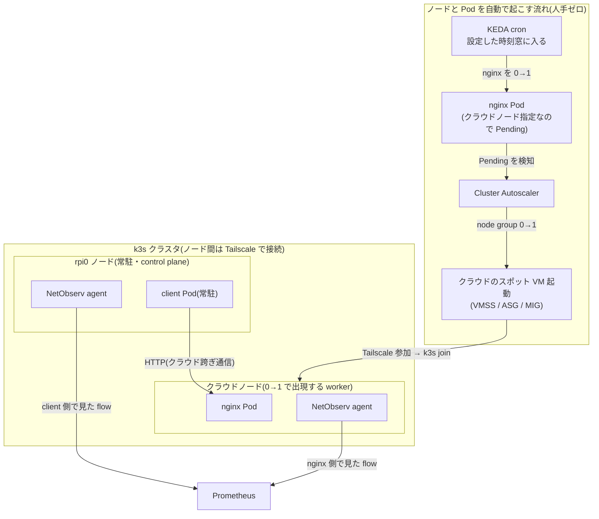
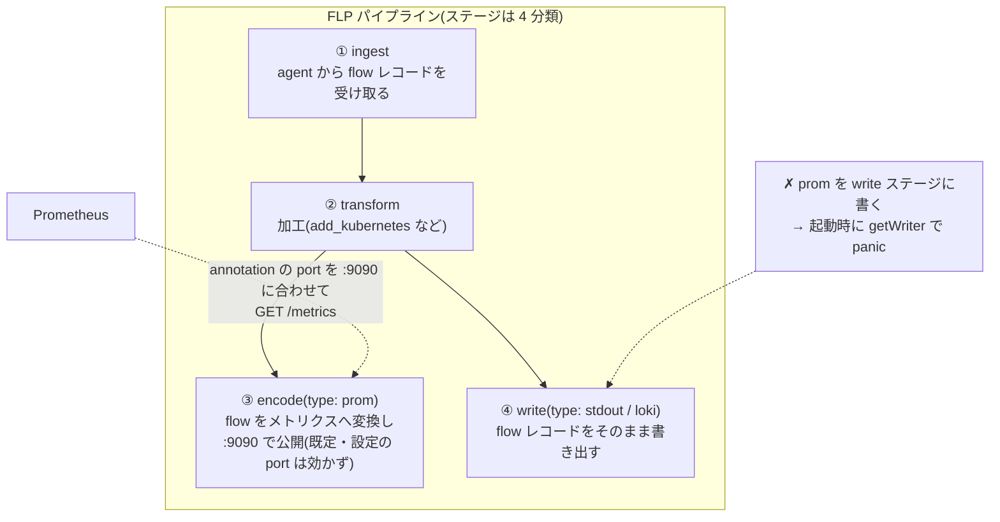

## はじめに

以前の記事（NetObserv eBPF Agent — CNI 非依存のネットワーク観測）では、NetObserv eBPF Agent の direct-flp モードを単一ノードで検証しました。本記事はその続編で、**オンプレの Raspberry Pi とクラウドのスポット VM を 1 つの k3s クラスタに束ねた構成で、クラウドを跨ぐ pod-to-pod 通信を NetObserv が両側のノードから観測できること**を実機で確認します。対象は Azure・AWS・GCP の 3 クラウドで、GCP は Cluster Autoscaler の GCE provider をフォークして成立させました。

もう 1 つのテーマは検証の仕方です。ノードやワークロードを手で起動してしまうと自動化の検証になりません。そこで **KEDA の cron スケーラが決まった時刻にワークロードを 0→1 に起こし、行き場のない Pod を Cluster Autoscaler が検知してクラウドノードを 0→1 で起動する**、という人手ゼロのチェーンを組み、その通信を NetObserv で観測しました。終了時刻には KEDA が 0 に戻し、Cluster Autoscaler がノードを畳むところまで自動です。

:::message
本記事の文章生成・編集には AI (Anthropic Claude) を活用しています。技術的事実については、筆者が公式ドキュメントを引用して検証しています。誤りや改善点があれば、コメント等でご指摘ください。実測値・ログ・スクリーンショットは筆者環境で 2026-08-14 に取得したもので、読者環境では結果が異なる場合があります。
:::

## 検証環境（2026-08-14 時点）

| 項目 | 値 |
|---|---|
| control plane | Raspberry Pi 5（k3s `v1.36.2+k3s1`） |
| worker (Azure) | VMSS スポット（`Standard_B2pls_v2`、2 vCPU / 4 GiB、arm64、通常時 0 台） |
| worker (AWS) | ASG スポット（t4g 系、arm64、通常時 0 台） |
| worker (GCP) | MIG スポット（当初 `e2-micro`、後述の再検証では `e2-medium`、amd64、通常時 0 台） |
| ノード間接続 | Tailscale（各ノードが tailnet に参加し、その IP を k3s の node-ip に使用） |
| CNI | Cilium `v1.19.3`（kube-proxy replacement） |
| 観測 | netobserv-ebpf-agent（`:main` タグ、direct-flp モード） |
| スケール | KEDA（chart 2.20.1）+ Cluster Autoscaler（aws / azure / gce provider を各 1 プロセス） |

検証に使った構成ファイルは [k8s-deploy-public/netobserv](https://github.com/shinichitazawa/k8s-deploy-public/tree/main/netobserv)（commit [`25777ef`](https://github.com/shinichitazawa/k8s-deploy-public/commit/25777ef) 時点。環境固有値はダミーに置換済み）にあります。

## 全体像

このチェーンを 3 クラウドで同型に実行します。ノード供給の実体だけがクラウドごとに異なり（Azure=VMSS / AWS=ASG / GCP=MIG）、KEDA の時刻窓をずらして順に流しました。具体的なタイムラインは次章に載せます。



client は rpi0 側に常駐させておき、nginx が現れた瞬間からクラウド跨ぎの通信になります。client を「置いておく」のは固定の土台であり、通信の開始はチェーンの完成そのものが引き金です。

## 人手ゼロで起こす — KEDA cron と Cluster Autoscaler

KEDA の [cron スケーラ](https://keda.sh/docs/2.20/scalers/cron/)は、時刻窓に入ると対象を望みのレプリカ数へスケールします。公式は次のように説明しています。

> When the time window starts, it will scale from the minimum number of replicas to the desired number of replicas based on your configuration.
>
> — [KEDA: Cron scaler](https://keda.sh/docs/2.20/scalers/cron/)（2026-08 時点で取得）

```yaml
apiVersion: keda.sh/v1alpha1
kind: ScaledObject
metadata: {name: xcloud-nginx-cron, namespace: default}
spec:
  scaleTargetRef: {name: xcloud-nginx}
  minReplicaCount: 0
  maxReplicaCount: 1
  triggers:
    - type: cron
      metadata:
        timezone: Asia/Tokyo
        start: "50 11 * * *"
        end: "30 14 * * *"
        desiredReplicas: "1"
```

起こされた Pod は（Azure の例では）`nodeSelector: cloud=azure` を要求し、該当ノードが 0 台なので Pending になります。ここから先は前回記事（Cluster Autoscaler 編）で構築した scale-from-0 がそのまま働きます。VMSS に付けた node-template タグ（[Azure provider の規約](https://github.com/kubernetes/autoscaler/blob/master/cluster-autoscaler/cloudprovider/azure/README.md)で `/` を `_` に置換したもの）を読んで、Cluster Autoscaler が「このグループなら賄える」と判断します。

実際のイベントとタイムラインです（筆者環境の記録。JST）。

```text
--- Azure ---
11:50:13  KEDA cron が Active に遷移、nginx 0→1（Pending）
12:49:31  TriggeredScaleUp: pod triggered scale-up: [{azure-cil-vmss 0->1 (max: 2)}]
12:52:02  ノード Ready、nginx Running、client の応答が HTTP 200 に

--- AWS（別の KEDA 窓で同型を実行）---
13:35     KEDA cron が nginx-aws を 0→1（Pending）
13:38 頃  Cluster Autoscaler が ASG 0→1、EC2 スポット起動
13:41:59  client が AWS 側 nginx から HTTP 200

--- GCP（CA が使えないため代替経路。詳細は後述）---
14:38:15  CronJob が keyless(WIF) で MIG 0→1 に resize
14:42 頃  GCE VM が join（ただし e2-micro の資源不足で Ready を維持できず）
```

Azure の 11:50 と 12:49 の間が空いているのは、後述する問題（包括 toleration と、詰まったインスタンスの後始末で発生させた CA の backoff）への対処を行っていたためです。修正後のチェーン自体には人手は入っていません。なお AWS の検証中には、スポットの自然な入れ替わり（旧インスタンスの回収と新インスタンスの join）まで観測できました。

## NetObserv の配置 — direct-flp を全ノードへ

NetObserv の標準構成は 2 段です。各ノードの eBPF agent が flow レコードを捕らえ、それを集約側の flowlogs-pipeline（FLP。flow の変換・エンリッチ・出力を担うパイプライン）へ送って処理します。[direct-flp モード](https://github.com/netobserv/netobserv-ebpf-agent/blob/main/docs/config.md)はこの FLP を agent プロセスに内蔵する構成で、collector を別に立てずに各ノード内で変換・出力まで完結します。ノードが増減するマルチクラウド構成では、集約点を持たないこの形が扱いやすいため、本記事では全ノードを direct-flp で動かします。

> In `direct-flp` mode, flowlogs-pipeline is run internally from the agent, allowing more filtering, transformations and exporting options.
>
> — [netobserv-ebpf-agent: config.md](https://github.com/netobserv/netobserv-ebpf-agent/blob/main/docs/config.md)（2026-08 時点で取得）

FLP の設定は `FLP_CONFIG` に渡します。今回の出力は 2 系統で、stdout（ログとして flow を確認する用）と Prometheus（ノード間の流量を可視化する用）です。

```json
{
  "pipeline": [
    {"name": "writer", "follows": "preset-ingester"},
    {"name": "prom", "follows": "preset-ingester"}
  ],
  "parameters": [
    {"name": "writer", "write": {"type": "stdout"}},
    {"name": "prom", "encode": {"type": "prom", "prom": {
      "prefix": "netobserv_",
      "metrics": [
        {"name": "node_flows_total", "type": "counter", "valueKey": "",
         "labels": ["SrcAddr", "DstAddr"], "filters": []}
      ]
    }}}
  ]
}
```

DaemonSet 側のポイントは 2 つです。

```yaml
spec:
  template:
    spec:
      tolerations:
        - operator: Exists          # CP とクラウドノードの dedicated taint 両方に載せる
      initContainers:
        - name: wait-cilium         # Cilium の healthz(:9879) を待ってから起動する
          image: busybox:1.36
          command: ["sh","-c","until wget -q -T 3 -O /dev/null http://127.0.0.1:9879/healthz; do sleep 10; done"]
```

DaemonSet 側の包括 toleration は全ノード配置のためのもので問題ありませんが、**通常の Pod に同じ toleration を付けてはいけません**（後述の注意点 1）。initContainer は、ブート直後に Cilium と agent の初期化が競合しないよう、Cilium の healthz 応答を待ってから agent を開始するための安全策です。

## 観測結果 — 同じ通信を両側から見る

client（rpi0 上、Pod IP `10.0.0.8`）から nginx（Azure 上、Pod IP `10.0.3.150`）への HTTP を、両ノードの agent がそれぞれ観測しました。

Azure 側 agent（要求の到着。nginx の veth `lxcfc89...` で観測）:

```text
map[AgentIP:10.123.1.4 Bytes:572 DstAddr:10.0.3.150 DstPort:80 Interfaces:[lxcfc89467d8c93]
    Packets:7 Proto:6 SrcAddr:10.0.0.8 ...]
```

rpi0 側 agent（応答の到着。client の veth `lxc41cb...` で観測）:

```text
map[AgentIP:192.0.2.17 Bytes:1191 DstAddr:10.0.0.8 DstPort:47740 Interfaces:[lxc41cbf1c5da6e]
    Packets:5 Proto:6 SrcAddr:10.0.3.150 ...]
```

同一のクラウド跨ぎ通信について、要求側と応答側が別ノードの agent に現れています。CNI は Cilium のままで、NetObserv は CNI に依存せず TC(tcx) フックで観測しているため、この構成でもそのまま動きます。

AWS でも同じ形の両側観測が取れました。累計カウンタを見ると、client(`10.0.0.102`) と AWS 側 nginx(`10.0.2.97`) のペアが**双方向 × 2 系列ずつ**（rpi0 の agent と EC2 の agent がそれぞれ独立に数えたもの）出ています。

```text
10.0.0.102 -> 10.0.2.97 = 654   # rpi0 側 agent の観測
10.0.0.102 -> 10.0.2.97 = 706   # EC2 側 agent の観測
10.0.2.97 -> 10.0.0.102 = 651 / 661（同上の逆方向）
```

Prometheus 側では、FLP が出す `netobserv_node_flows_total` を既存の prometheus-server が annotation 経由で scrape します。3 時間分のグラフには検証の経過がそのまま残りました。12:51 に Azure ペアが立ち上がり、13:35 過ぎに client Pod の入れ替えと Azure ノードの一時的なハートビート断で系列が切り替わり、以降は AWS ペアが（スポットの入れ替わりによる Pod IP の変化も含めて）続きます。


### なぜ eBPF だけが通信相手まで分かるのか — パケット構造から

そもそも NetObserv が他の観測手段と何が違うのかは、1 つのパケットの構造にさかのぼると分かりやすいです。クラスタ内を流れる TCP セグメントは、下位から Ethernet(L2)・IP(L3)・TCP(L4)・ペイロード(L7)のヘッダが積み重なった構造をしています。通信の両端（送信元と宛先の IP）が初めて分かるのは L3、どのサービスかが分かるのは L4 のポートです。

各層のヘッダには決まったオフセットで決まったフィールドが並んでいます。flow を一意に決める 5-tuple がどこに書かれているかまで下ると、次のようになります。

| 層 | ヘッダ長 | 主なフィールド | 5-tuple との関係 |
| --- | --- | --- | --- |
| Ethernet (L2) | 14 B | 宛先/送信元 MAC、EtherType（`0x0800`=IPv4） | 次の層が IP だと分かる入口 |
| IPv4 (L3) | 20 B〜（[RFC 791](https://www.rfc-editor.org/rfc/rfc791)） | IHL、Total Length、TTL、**Protocol**（6=TCP / 17=UDP）、**SrcAddr / DstAddr** | 5-tuple のうち 3 つ（src/dst IP、proto） |
| TCP (L4) | 20 B〜（[RFC 9293](https://www.rfc-editor.org/rfc/rfc9293)） | **SrcPort / DstPort**、Seq/Ack、Flags（SYN/ACK/FIN…）、Window | 残り 2 つ（src/dst port） |
| ペイロード (L7) | 可変 | HTTP リクエスト行など | flow 識別には使わない |

本記事で観測した flow レコードと突き合わせると、`SrcAddr: 10.0.0.8` / `DstAddr: 10.0.3.150` は IPv4 ヘッダの送信元/宛先フィールド、`DstPort: 80` は TCP ヘッダの宛先ポート、`Proto: 6` は IPv4 ヘッダの Protocol フィールドの値（TCP）そのものです。つまり agent が出力する 1 行は、この 3 層のヘッダから 5 フィールドを抜き出して束ねたものにすぎません。eBPF プログラムは TC(tcx) フックで生のフレームを受け取り、EtherType → IPv4 の Protocol → TCP/UDP のポートと**オフセットをたどってこの 5 つを読み**、同じ 5-tuple のパケットを 1 つの flow レコードに集約して Bytes / Packets を加算します。


同じパケットを、観測ツールごとに「どこを読むか」で重ねると差が一目で分かります。NetObserv は eBPF で L2〜L4 のヘッダを**その場でパース**して 5-tuple を組み立てます。一方 cAdvisor や node-exporter は veth や NIC の**バイトカウンタを読むだけ**で、パケットのヘッダを解釈しません。だから「合計いくら流れたか」しか出せず、通信相手は分かりません。metrics-server はそもそもネットワークを対象にせず CPU/メモリだけです。


つまり「eBPF 固有」の価値は、カウンタを読むのではなく**ヘッダをパースする**という一点に由来します。そして RTT・DNS・パケットドロップ・（フォークで足した）TCP 再送・SIP も、同じ flow レコードに別々の eBPF プログラムが書き込むだけなので、下記の enrichment がそのまま全フックに効きます。

### Pod 名で見る — Kubernetes enrichment と比較ダッシュボード

ここまでの flow は IP の世界でした（注意点 4 の遠因でもあります）。FLP の `transform/network` に `add_kubernetes` ルールを足すと、flow の IP が in-cluster の informer で解決され、`SrcK8S_Name` / `SrcK8S_Namespace` / `SrcK8S_OwnerName` などの Kubernetes 名が付きます。direct-flp のままで動き、必要なのは agent の ServiceAccount に pods/services/nodes などの read RBAC を与えることだけです。

```json
{"name": "enrich", "transform": {"type": "network", "network": {
  "rules": [
    {"type": "add_kubernetes", "kubernetes": {"ipField": "SrcAddr", "output": "SrcK8S"}},
    {"type": "add_kubernetes", "kubernetes": {"ipField": "DstAddr", "output": "DstK8S"}}
  ]
}}}
```

これで Pod 名ラベル付きのメトリクス（`netobserv_pod_flow_bytes_total` など）が出せるようになり、Grafana で「NetObserv の eBPF flow は既存のメトリクスと何が違うのか」を 1 画面で比較できます。


同じ時間帯の同じ通信を見ても、レイヤごとに見える範囲がまったく違います。

| ソース | 分かること | 分からないこと |
| --- | --- | --- |
| NetObserv (eBPF flow) | **Pod ➜ Pod の通信相手**・向き・バイト/パケット | アプリ層の内容 |
| cAdvisor (`container_network_*`) | Pod 単位の送受信合計 | 通信相手 |
| node-exporter (`node_network_*`) | ノード NIC 合計 | Pod も相手も |
| metrics-server (`kubectl top`) | CPU/メモリ使用量 | ネットワークは一切対象外 |

なお agent には既定で無効の組み込み eBPF フックがあり、`ENABLE_RTT`(TCP RTT)・`ENABLE_DNS_TRACKING`(DNS レイテンシ/応答コード)・`ENABLE_PKT_DROPS`(`kfree_skb` トレースポイントによるドロップ捕捉。tracefs の hostPath マウントが必要)を有効化すると、flow に `TimeFlowRttNs` / `Dns*` / `PktDrop*` フィールドが追加されます。これを FLP でヒストグラム化(`valueScale` で秒に正規化)すれば、ワークロードペア別の RTT p95、DNS レイテンシ、カーネルのドロップ理由別レートまで同じダッシュボードに並びます(上のキャプチャ下段)。

「eBPF 固有」の価値はこの表の 1 行目に尽きます。cAdvisor 以下はどれもインターフェースのカウンタを読んでいるだけなので合計しか出せず、「argocd-repo-server が application-controller と話している」という**ペアの情報**はカーネル内で flow(5-tuple)を捕捉する eBPF でしか得られません。なお NetObserv の専用 UI(flow テーブルやトポロジ画面)は OpenShift Console のプラグインとして提供されるもので、素の k8s/k3s には載らないため、vanilla 環境ではこのように Prometheus/Grafana(または Loki + Grafana)で可視化するのが現実解です。

## GCP だけ Cluster Autoscaler が使えなかった

AWS と Azure が同じ形で成立した一方、GCP では Cluster Autoscaler の GCE provider が**混在 providerID クラスタで scale-up を実行できない**ことが分かりました。GCE provider は判断材料の棚卸しでクラスタの全ノードの providerID を `gce://` として解釈しようとし、他形式に出会うと「無視」ではなくエラーを返すためです。バージョンを変えて 3 回試しましたが、エラー箇所が移動するだけでした（筆者環境の実測）。

```text
v1.32 / v1.34:
  Failed to get node infos for groups: wrong id: expected format
  gce://<project-id>/<zone>/<name>, got k3s://raspberrypi-0
v1.35:
  (棚卸しは通過するが scale-up 直前で)
  Failed to scale up: could not create quotas tracker: failed to get
  node group for node "raspberrypi-0": wrong id: expected format gce://...
```

AWS / Azure の provider は自形式でない providerID を単に読み飛ばすため、同じクラスタで問題なく動きます。この差は実装依存で、`k3s://` の control plane や他クラウドの worker が同居する self-hosted 構成では、GCE provider は現状使えないという結論になりました。

なお調査の過程で、GCE provider の scale-from-0 が**ノードの label/taint を instance template のメタデータ `kube-env`（`AUTOSCALER_ENV_VARS`）から読む**ことも確認し、template には `node_labels=cloud=gcp,...` を追加済みです（CA が解析するところまでは動きました）。GKE 以外でこの経路を使う場合の必須設定ですが、上記の制約により今回は活きませんでした。

代替として、CA-gcp 用に構築済みだった keyless（Workload Identity Federation）の配線をそのまま流用し、**CronJob が STS token-exchange → サービスアカウント impersonation → Compute API で MIG を resize** する時刻ベースの自動スケールを組みました。これは動作し、14:38 の自動発火で GCE VM が起動して k3s に join、Cilium も起動しました。ただし `e2-micro`（1 GiB・共有 vCPU）では kubelet がリソース飢餓で Ready を維持できず、ワークロード配置と flow 観測には至りませんでした。

### GCE provider をフォークして直す

エラー箇所が特定できているので、provider 側を 1 箇所直せば成立するはずです。`NodeGroupForNode` は CloudProvider インターフェースの契約上「自分の管理していないノードには nil を返す」ことになっており、AWS / Azure の実装はそうしています。GCE 実装だけが providerID の parse エラーをそのまま返すため、呼び出し側のループ全体（node-info 構築や resource-quota 集計）が中断されていました。修正は「parse できない providerID は unmanaged としてスキップ」するだけです。

```go
func (gce *GceCloudProvider) NodeGroupForNode(node *apiv1.Node) (cloudprovider.NodeGroup, error) {
	ref, err := GceRefFromProviderId(node.Spec.ProviderID)
	if err != nil {
		// 混在 providerID クラスタでは他プロバイダのノードが混ざる。
		// 契約上、管理外ノードにはエラーではなく nil を返してスキップする。
		klog.V(4).Infof("Node %v has non-GCE providerID %q, treating as unmanaged", node.Name, node.Spec.ProviderID)
		return nil, nil
	}
	mig, err := gce.gceManager.GetMigForInstance(ref)
	return mig, err
}
```

`cluster-autoscaler-1.35.0` タグにこのパッチを当てて arm64 イメージをビルドし、実クラスタの CA-gcp を差し替えたところ、旧版が 1 ループ以内に落ちていた `could not create quotas tracker` の fatal が消え、メインループが安定して回るようになりました。ログには意図どおりのスキップが出ます。

```text
gce_cloud_provider.go:122] Node raspberrypi-0 has non-GCE providerID
  "k3s://raspberrypi-0", treating as unmanaged
gce_cloud_provider.go:122] Node azure-cil-azure-cil-vmss000004 has non-GCE
  providerID "azure:///subscriptions/...", treating as unmanaged
```

このパッチ版で GCP のチェーンを最初から通し直しました。今度は Azure / AWS と完全に同じ形で成立します（VM は `e2-medium` に変更済み）。

```text
18:04  KEDA cron が発火、xcloud-nginx-gcp が 0→1、Pod は Pending
18:05  CA: Final scale-up plan: [{... gcp-cil-mig 0->1 (max: 2)}]
       CA: Scale-up: setting group ... gcp-cil-mig size to 1
18:08  GCE VM が k3s に join、約 100 秒で Ready(e2-medium)
18:10  Pod Running(10.0.5.44)、client からの HTTP が 200 に
18:11  rpi0 側と GCP 側、両方の agent の flow カウンタに
       10.0.0.180 ⇄ 10.0.5.44 が出現
```

kube-env に仕込んだ label/taint の広告も実際に機能し、scale-from-0 のシミュレーション段階で Pod の nodeSelector / toleration と突き合わせて「このグループなら賄える」と判断されています。**GCE provider の 1 箇所の契約違反さえ直せば、混在 providerID クラスタでも AWS / Azure と同列に使える**ことが確認できました。

この結果は upstream にも報告しました（[kubernetes/autoscaler#10140](https://github.com/kubernetes/autoscaler/issues/10140)）。ちょうど `NodeGroupForNode` まわりの契約を明確化する議論（[#9877](https://github.com/kubernetes/autoscaler/issues/9877)）が進行中で、AWS 側でも EKS Hybrid Nodes で同型の問題が報告・修正されており（[#8045](https://github.com/kubernetes/autoscaler/issues/8045)）、混在 providerID クラスタは provider 実装が想定してこなかった領域だということが分かります。


## 検証で判明した注意点

### 1. 包括 toleration の Pod が「死にかけノード」に吸着する

検証用 Pod に `tolerations: [{operator: Exists}]` を付けていたところ、**cordon（`node.kubernetes.io/unschedulable`）や NotReady の taint まで許容してしまい**、撤収中の死にかけノードへスケジュールされました。Pod は Pending にならないため、Cluster Autoscaler は「unschedulable な Pod なし」と判断してスケールアップしません。toleration は対象クラウドの dedicated taint だけに絞る必要があります（DaemonSet の全ノード配置とは要件が異なります）。

### 2. Prometheus 出力は `encode` ステージに書く

FLP のステージは ingest → transform → encode → write という分類で、Prometheus 出力は「書き出し」ではなく flow をメトリクスへ変換する `encode` に属します。`write` ステージに書くと、起動時に panic します（`getWriter` で落ちる様子がスタックトレースに出ます）。また設定に port を書いても実測では効かず、メトリクスサーバは既定の `:9090` で待ち受けました（起動ログに `StartServerAsync: addr = :9090` と出ます）。scrape 側の annotation はこの実効ポートに合わせます。



「Prometheus に出す＝書き出し(write)」と考えると④に書きたくなりますが、FLP の分類では「flow をメトリクスという別形式へ変換する」③の仕事、というのがこの罠の正体です。

### 3. ASG のタグが消えると CA は静かに沈黙する

AWS 側で最初、CA が何の反応も示さなかった原因は、ASG から Cluster Autoscaler 用のタグが消えていたことでした（`Name` タグ 1 つだけが残った状態）。auto-discovery タグ 2 つ（`k8s.io/cluster-autoscaler/enabled` とクラスタ名）が無いと CA はグループを発見せず、scale-from-0 用の node-template タグ 3 つ（label 2 + taint 1）が無いと発見しても賄えると判断できません。どちらもエラーにはならず、単に何も起きないため気づきにくいです。5 つのタグを付け直したところ、その周回から発見・スケールとも正常になりました。

### 4. IP をラベルにした flow メトリクスは Pod の入れ替えで分断される

flow メトリクスを `SrcAddr`/`DstAddr` ラベルで集計していたため、client Pod をローリング更新した瞬間に IP が変わり、**グラフ上は通信が止まったように見えました**（実際は新 IP の別系列として継続）。スポットの入れ替わりでも同じことが起きます。K8s 名（Pod 名や workload 名）で追いたい場合は、FLP の Kubernetes enrichment を有効にしてラベルを付け替える必要があります。direct-flp の素の flow は IP の世界だ、という当たり前の事実を、グラフの「偽の断絶」で体感しました。

### 5. 外部からインスタンスを消すと Cluster Autoscaler が backoff する

詰まったインスタンスを `az vmss delete-instances` で外から消したところ、ちょうど走っていた Cluster Autoscaler のリサイズ要求と競合して失敗が記録され、**ノードグループがスケールアップ backoff に入りました**。イベントには何も出ず、ログに `Node group azure-cil-vmss is not ready for scaleup - backoff` が出るだけなので気づきにくいです。CA が管理するリソースには外から触らないのが原則で、触ってしまった場合は backoff の解消（時間経過か CA の再起動）が要ります。

## まとめ

- NetObserv eBPF Agent（direct-flp）は、Tailscale 越しに束ねたマルチクラウド k3s で、**Azure・AWS・GCP の 3 クラウドについてクラウドを跨ぐ pod-to-pod 通信を両側のノードから**観測できました。
- 検証チェーンは KEDA cron（0→1）と Cluster Autoscaler（node group 0→1）で人手ゼロにでき、終了時刻の自動撤収まで含めて再現可能です。スポットの自然な入れ替わりもそのまま観測に乗りました。
- GCP は Cluster Autoscaler の GCE provider が混在 providerID クラスタで scale-up できないため（3 バージョンで実測）、まず keyless の CronJob resize で代替しました。その後 GCE provider の `NodeGroupForNode` を 1 箇所パッチした CA に差し替えたところ、**Azure / AWS と同じ全チェーン（KEDA → CA scale-up 0→1 → join → 両側 flow 観測）が成立**しました。
- 検証の過程で 5 つの注意点が実測で判明しました。特に「包括 toleration が死にかけノードに吸着して CA が発火しない」「IP ラベルの flow メトリクスは Pod 入れ替えで分断される」は、同種の構成を組む際に先に知っておくと時間を節約できます。

## 参考

- 検証時の構成ファイル: [netobserv（overlay と検証フィクスチャ）](https://github.com/shinichitazawa/k8s-deploy-public/tree/main/netobserv)（[k8s-deploy-public](https://github.com/shinichitazawa/k8s-deploy-public) commit [`25777ef`](https://github.com/shinichitazawa/k8s-deploy-public/commit/25777ef) 時点。環境固有値はダミーに置換済み）
- [netobserv-ebpf-agent: configuration（EXPORT / direct-flp / FLP_CONFIG）](https://github.com/netobserv/netobserv-ebpf-agent/blob/main/docs/config.md)
- [flowlogs-pipeline](https://github.com/netobserv/flowlogs-pipeline)
- [KEDA: Cron scaler](https://keda.sh/docs/2.20/scalers/cron/)
- [Cluster Autoscaler: Azure provider（node-template タグ規約）](https://github.com/kubernetes/autoscaler/blob/master/cluster-autoscaler/cloudprovider/azure/README.md) / [AWS provider（auto-discovery と node-template タグ）](https://github.com/kubernetes/autoscaler/blob/master/cluster-autoscaler/cloudprovider/aws/README.md) / [GCE provider](https://github.com/kubernetes/autoscaler/tree/master/cluster-autoscaler/cloudprovider/gce)
- [Cilium: kube-proxy replacement](https://docs.cilium.io/en/stable/network/kubernetes/kubeproxy-free/)
