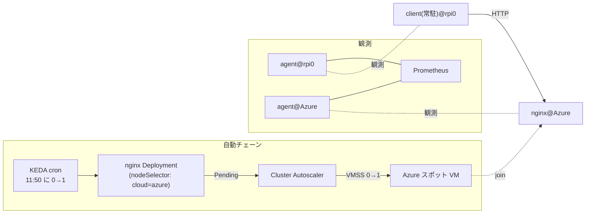

## はじめに

以前の記事（NetObserv eBPF Agent — CNI 非依存のネットワーク観測）では、NetObserv eBPF Agent の direct-flp モードを単一ノードで検証しました。本記事はその続編で、**オンプレの Raspberry Pi と Azure のスポット VM を 1 つの k3s クラスタに束ねた構成で、クラウドを跨ぐ pod-to-pod 通信を NetObserv が両側から観測できること**を実機で確認します。

もう 1 つのテーマは検証の仕方です。ノードやワークロードを手で起動してしまうと自動化の検証になりません。そこで **KEDA の cron スケーラが決まった時刻にワークロードを 0→1 に起こし、行き場のない Pod を Cluster Autoscaler が検知してクラウドノードを 0→1 で起動する**、という人手ゼロのチェーンを組み、その通信を NetObserv で観測しました。終了時刻には KEDA が 0 に戻し、Cluster Autoscaler がノードを畳むところまで自動です。

:::message
本記事の文章生成・編集には AI (Anthropic Claude) を活用しています。技術的事実については、筆者が公式ドキュメントを引用して検証しています。誤りや改善点があれば、コメント等でご指摘ください。実測値・ログ・スクリーンショットは筆者環境で 2026-08-14 に取得したもので、読者環境では結果が異なる場合があります。
:::

## 検証環境（2026-08-14 時点）

| 項目 | 値 |
|---|---|
| control plane | Raspberry Pi 5（k3s `v1.36.2+k3s1`） |
| worker | Azure VMSS スポット（`Standard_B2pls_v2`、2 vCPU / 4 GiB、arm64、通常時 0 台） |
| ノード間接続 | Tailscale（各ノードが tailnet に参加し、その IP を k3s の node-ip に使用） |
| CNI | Cilium `v1.19.3`（kube-proxy replacement） |
| 観測 | netobserv-ebpf-agent（`:main` タグ、direct-flp モード） |
| スケール | KEDA（chart 2.20.1）+ Cluster Autoscaler（azure provider） |

検証に使った構成ファイルは [k8s-deploy-public/netobserv](https://github.com/shinichitazawa/k8s-deploy-public/tree/main/netobserv)（commit [`8978253`](https://github.com/shinichitazawa/k8s-deploy-public/commit/8978253) 時点。環境固有値はダミーに置換済み）にあります。

## 全体像



client は rpi0 側に常駐させておき、nginx が現れた瞬間からクラウド跨ぎの通信になります。client を「置いておく」のは固定の土台であり、通信の開始はチェーンの完成そのものが引き金です。

## 人手ゼロで起こす — KEDA cron と Cluster Autoscaler

KEDA の [cron スケーラ](https://keda.sh/docs/2.20/scalers/cron/)は、時刻窓に入ると対象を望みのレプリカ数へスケールします。公式は次のように説明しています。

> When the time window starts, it will scale from the minimum number of replicas to the desired number of replicas based on your configuration.
>
> — [KEDA: Cron scaler](https://keda.sh/docs/2.20/scalers/cron/)（2026-08 時点で取得）

```yaml
apiVersion: keda.sh/v1alpha1
kind: ScaledObject
metadata: {name: xcloud-nginx-cron, namespace: default}
spec:
  scaleTargetRef: {name: xcloud-nginx}
  minReplicaCount: 0
  maxReplicaCount: 1
  triggers:
    - type: cron
      metadata:
        timezone: Asia/Tokyo
        start: "50 11 * * *"
        end: "30 14 * * *"
        desiredReplicas: "1"
```

起こされた Pod は `nodeSelector: cloud=azure` を要求し、該当ノードが 0 台なので Pending になります。ここから先は前回記事（Cluster Autoscaler 編）で構築した scale-from-0 がそのまま働きます。VMSS に付けた node-template タグ（[Azure provider の規約](https://github.com/kubernetes/autoscaler/blob/master/cluster-autoscaler/cloudprovider/azure/README.md)で `/` を `_` に置換したもの）を読んで、Cluster Autoscaler が「このグループなら賄える」と判断します。

実際のイベントとタイムラインです（筆者環境の記録。JST）。

```text
11:50:13  KEDA cron が Active に遷移、nginx 0→1（Pending）
12:49:31  TriggeredScaleUp: pod triggered scale-up: [{azure-cil-vmss 0->1 (max: 2)}]
12:51     ノード azure-cil-azure-cil-vmss000004 が Ready
12:52:02  nginx Running、client の応答が HTTP 200 に切り替わり
```

11:50 と 12:49 の間が空いているのは、後述する落とし穴（包括 toleration と、詰まったインスタンスの後始末で発生させた CA の backoff）を踏んで修正していたためです。修正後のチェーン自体には人手は入っていません。

## NetObserv の配置 — direct-flp を全ノードへ

agent は [direct-flp モード](https://github.com/netobserv/netobserv-ebpf-agent/blob/main/docs/config.md)で動かします。公式の説明どおり、flowlogs-pipeline（FLP）が agent 内で動くため、collector を別に立てずに変換・出力まで完結します。

> In `direct-flp` mode, flowlogs-pipeline is run internally from the agent, allowing more filtering, transformations and exporting options.
>
> — [netobserv-ebpf-agent: config.md](https://github.com/netobserv/netobserv-ebpf-agent/blob/main/docs/config.md)（2026-08 時点で取得）

FLP の設定は `FLP_CONFIG` に渡します。今回の出力は 2 系統で、stdout（ログとして flow を確認する用）と Prometheus（ノード間の流量を可視化する用）です。

```json
{
  "pipeline": [
    {"name": "writer", "follows": "preset-ingester"},
    {"name": "prom", "follows": "preset-ingester"}
  ],
  "parameters": [
    {"name": "writer", "write": {"type": "stdout"}},
    {"name": "prom", "encode": {"type": "prom", "prom": {
      "prefix": "netobserv_",
      "metrics": [
        {"name": "node_flows_total", "type": "counter", "valueKey": "",
         "labels": ["SrcAddr", "DstAddr"], "filters": []}
      ]
    }}}
  ]
}
```

DaemonSet 側のポイントは 2 つです。

```yaml
spec:
  template:
    spec:
      tolerations:
        - operator: Exists          # CP とクラウドノードの dedicated taint 両方に載せる
      initContainers:
        - name: wait-cilium         # Cilium の healthz(:9879) を待ってから起動する
          image: busybox:1.36
          command: ["sh","-c","until wget -q -T 3 -O /dev/null http://127.0.0.1:9879/healthz; do sleep 10; done"]
```

DaemonSet 側の包括 toleration は全ノード配置のためのもので問題ありませんが、**通常の Pod に同じ toleration を付けてはいけません**（後述の落とし穴 1）。initContainer は、後述の落とし穴 3 で導入した安全策です。

## 観測結果 — 同じ通信を両側から見る

client（rpi0 上、Pod IP `10.0.0.8`）から nginx（Azure 上、Pod IP `10.0.3.150`）への HTTP を、両ノードの agent がそれぞれ観測しました。

Azure 側 agent（要求の到着。nginx の veth `lxcfc89...` で観測）:

```text
map[AgentIP:10.123.1.4 Bytes:572 DstAddr:10.0.3.150 DstPort:80 Interfaces:[lxcfc89467d8c93]
    Packets:7 Proto:6 SrcAddr:10.0.0.8 ...]
```

rpi0 側 agent（応答の到着。client の veth `lxc41cb...` で観測）:

```text
map[AgentIP:192.0.2.17 Bytes:1191 DstAddr:10.0.0.8 DstPort:47740 Interfaces:[lxc41cbf1c5da6e]
    Packets:5 Proto:6 SrcAddr:10.0.3.150 ...]
```

同一のクラウド跨ぎ通信について、要求側と応答側が別ノードの agent に現れています。CNI は Cilium のままで、NetObserv は CNI に依存せず TC(tcx) フックで観測しているため、この構成でもそのまま動きます。

Prometheus 側では、FLP が出す `netobserv_node_flows_total` を既存の prometheus-server が annotation 経由で scrape します。チェーン完成の 12:51 を境に、client↔nginx の flow レートが立ち上がりました。


## 踏んだ落とし穴

### 1. 包括 toleration の Pod が「死にかけノード」に吸着する

検証用 Pod に `tolerations: [{operator: Exists}]` を付けていたところ、**cordon（`node.kubernetes.io/unschedulable`）や NotReady の taint まで許容してしまい**、撤収中の死にかけノードへスケジュールされました。Pod は Pending にならないため、Cluster Autoscaler は「unschedulable な Pod なし」と判断してスケールアップしません。toleration は対象クラウドの dedicated taint だけに絞る必要があります（DaemonSet の全ノード配置とは要件が異なります）。

### 2. FLP の Prometheus は write ではなく encode、ポートは既定の :9090

FLP の設定で Prometheus を `write` ステージに書くと、起動時に panic します（`getWriter` で落ちる様子がスタックトレースに出ます）。正しくは `encode` ステージです。また設定に port を書いても実測では効かず、メトリクスサーバは既定の `:9090` で待ち受けました（起動ログに `StartServerAsync: addr = :9090` と出ます）。scrape 側の annotation はこの実効ポートに合わせます。

### 3. 1 GiB の VM では Cilium が起動ループに入る

当初の VMSS は `Standard_B2pts_v2`（2 vCPU / 1 GiB）でした。ブート直後は k3s agent・Cilium・Envoy・Tailscale・NetObserv agent の初期化が重なり、**load average が 2 vCPU に対して 10〜11 のまま 28 分収束しませんでした**（実測）。Cilium は probe が応答できず、`Timed out waiting for pre-existing resources ... CiliumNetworkPolicy` の fatal で再起動し、再起動のたびに BPF の再ロードで負荷が上がる悪循環に入ります。`Standard_B2pls_v2`（4 GiB）へ上げたところ、同じ構成が数分で安定しました。あわせて、NetObserv agent には Cilium の healthz を待つ initContainer を入れ、ブート時の競合を減らしています。

### 4. 外部からインスタンスを消すと Cluster Autoscaler が backoff する

詰まったインスタンスを `az vmss delete-instances` で外から消したところ、ちょうど走っていた Cluster Autoscaler のリサイズ要求と競合して失敗が記録され、**ノードグループがスケールアップ backoff に入りました**。イベントには何も出ず、ログに `Node group azure-cil-vmss is not ready for scaleup - backoff` が出るだけなので気づきにくいです。CA が管理するリソースには外から触らないのが原則で、触ってしまった場合は backoff の解消（時間経過か CA の再起動）が要ります。

## まとめ

- NetObserv eBPF Agent（direct-flp）は、Tailscale 越しに束ねたマルチクラウド k3s でも、クラウドを跨ぐ pod-to-pod 通信を**両側のノードから**観測できました。
- 検証チェーンは KEDA cron（0→1）と Cluster Autoscaler（VMSS 0→1）で人手ゼロにでき、終了時刻の自動撤収まで含めて再現可能です。
- 実測で 4 つの落とし穴を踏みました。特に「包括 toleration が死にかけノードに吸着して CA が発火しない」と「1 GiB VM では Cilium がブート負荷で起動ループに入る」は、同種の構成を組む際に先に知っておくと時間を節約できます。

## 参考

- 検証時の構成ファイル: [netobserv（overlay と検証フィクスチャ）](https://github.com/shinichitazawa/k8s-deploy-public/tree/main/netobserv)（[k8s-deploy-public](https://github.com/shinichitazawa/k8s-deploy-public) commit [`8978253`](https://github.com/shinichitazawa/k8s-deploy-public/commit/8978253) 時点。環境固有値はダミーに置換済み）
- [netobserv-ebpf-agent: configuration（EXPORT / direct-flp / FLP_CONFIG）](https://github.com/netobserv/netobserv-ebpf-agent/blob/main/docs/config.md)
- [flowlogs-pipeline](https://github.com/netobserv/flowlogs-pipeline)
- [KEDA: Cron scaler](https://keda.sh/docs/2.20/scalers/cron/)
- [Cluster Autoscaler: Azure provider（node-template タグ規約）](https://github.com/kubernetes/autoscaler/blob/master/cluster-autoscaler/cloudprovider/azure/README.md)
- [Cilium: kube-proxy replacement](https://docs.cilium.io/en/stable/network/kubernetes/kubeproxy-free/)
