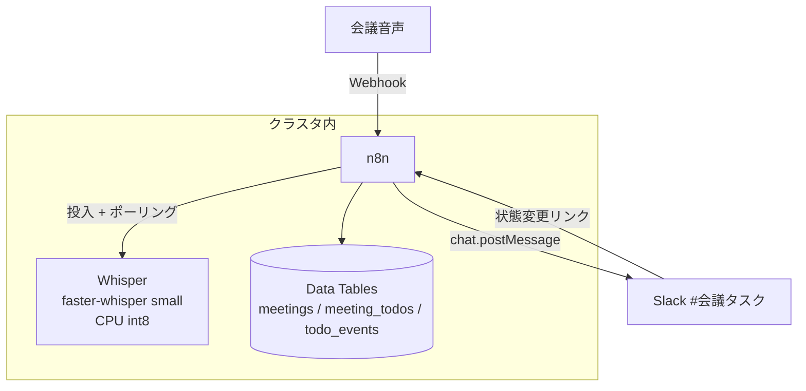
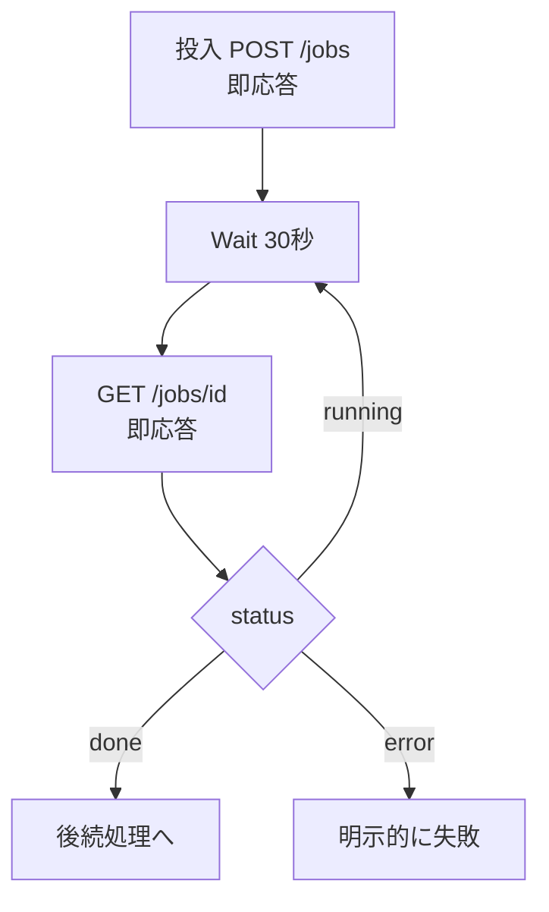
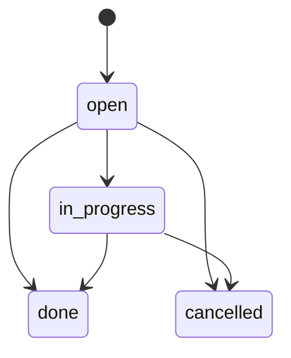

## はじめに

会議の録音から「決定事項と ToDo(担当・期限)」を自動で起こし、Slack に流して期限管理まで回す仕組みを、セルフホストの n8n と OSS の音声認識(Whisper)で組みました。本記事はその構築と検証の記録です。

構成を選ぶうえで、先に次の制約を置いています。

- **会議音声を社外に出さない**。文字起こしはクラスタ内で完結させる(そのため SaaS の文字起こし API は使わない)
- 実行基盤は自宅の Kubernetes(Raspberry Pi コントロールプレーン + クラウドノードのハイブリッド)。**GPU なし・arm64**
- AI の判断はすべてコードで検証してから確定する(このシリーズで一貫している方針です)

したがって Amazon Transcribe などのマネージド音声認識や、GPU 前提の構成は比較対象に入れていません。「この構成が最良」という主張ではなく、上記の制約下での実測記録です。

- 想定読者: n8n で業務ワークフローを組んでいる方、音声認識をオンプレで動かしたい方
- 検証日: 2026-08(実測はすべて筆者環境)
- 検証環境: n8n 2.33.3 / Kubernetes(k3s)/ Raspberry Pi 4(arm64・4core・8GB)

:::message
本記事の文章生成・編集には AI (Anthropic Claude) を活用しています。技術的事実については、筆者が公式ドキュメントを引用して検証しています。誤りや改善点があれば、コメント等でご指摘ください。
:::

## 全体構成



処理の流れは次のとおりです。

1. 音声を Webhook で受け取り、クラスタ内の Whisper で文字起こし
2. AI が誤認識を**正規化**し、コードが「数値・人名が変わっていないか」を検証
3. AI が決定事項と ToDo(担当・期限・根拠発言)を**抽出**し、コードが期限の絶対日付化・引用の実在照合・金額の裏取りを行って確定
4. Data Table に登録し、Slack に着手/完了リンク付きで投稿
5. 以降は状態変更(リンク → 確認画面)と毎朝のリマインドで運用

実装した n8n ワークフロー(23 ノード)の全景です。左側の「30秒待つ → 結果を取得 → 完了したか」の輪が後述する非同期ポーリングです。


*会議音声 → 議事録 → ToDo → Slack の本体(n8n 2.33.3)*

## Whisper をクラスタ内に置く

音声認識は [whisper-asr-webservice](https://github.com/ahmetoner/whisper-asr-webservice) を使いました。OpenAI の Whisper モデルを REST API として提供するラッパーで、エンジンとして OpenAI Whisper / Faster Whisper / WhisperX を選べ、`ASR_ENGINE` と `ASR_MODEL` の環境変数で切り替えます(同 README)。

エンジンは [faster-whisper](https://github.com/SYSTRAN/faster-whisper) にしました。公式 README によると:

> **faster-whisper** is a reimplementation of OpenAI's Whisper model using CTranslate2, which is a fast inference engine for Transformer models.
>
> This implementation is up to 4 times faster than openai/whisper for the same accuracy while using less memory.

CPU での int8 量子化に対応しており、README のベンチマークでは small モデル + int8 が CPU で 1477MB のメモリで動いています。GPU なしの Raspberry Pi でも現実的に動く根拠がこれです。

デプロイは素の Kubernetes manifest で、要点は次の3つです。

- **モデルキャッシュを PVC に置く**。small モデルは初回に約 462MB をダウンロードするため(実測)、Pod 再起動のたびに落とし直さないよう永続化する
- **ClusterIP のみで公開しない**。音声とその文字起こしを外に出さないため、Ingress を付けず n8n からのみ到達させる
- **リソース制限を慎重に決める**。ここで2回事故を起こしました(後述)

## テスト音声の作り方 — 台本を正解データにする

検証には「正解が分かっている会議音声」が必要です。[Amazon Polly](https://aws.amazon.com/polly/pricing/) のニューラル音声(日本語話者 3 名: Takumi / Kazuha / Tomoko)で、12 発話・約 71 秒の定例会議を合成しました。台本には検証したい要素を仕込んであります。

- 品番と数量: 「A001 を三十個発注」
- 金額 2 種: 「税抜き二十八万円」「合計三十二万円」
- 相対期限 3 種: 「今週金曜までに」「来週水曜までに」「明日までに」
- 業務用語: 見積、備品、稟議、納期、五営業日
- 次回日程: 「八月二十一日の十時から」

費用は Neural 音声が $16.00/100 万文字(2026-08 時点、[公式 pricing](https://aws.amazon.com/polly/pricing/) より。無料利用枠あり)で、台本約 400 文字なら 1 円未満です。**台本がそのまま正解データになる**ため、後段の精度評価がすべて突き合わせで行えます。

## 文字起こしの実力(faster-whisper small・日本語)

Polly 音声を通した結果です(実測)。**数値・金額・日付・人名はすべて正しく残りました**。A001、12個、30個、28万円、32万円、2台、8月21日の10時、田中さん、佐藤さん — ここが壊れると業務では使えないので、これは重要な結果です。

一方、業務用語は明確に崩れました。

| 正解 | Whisper 出力 |
|---|---|
| 見積 / 見積書 | 三森 / 三森省 |
| 備品 | 美品 |
| 稟議 | 品技 |
| 納期 | aと脳期 |
| 五営業日 | 語役業備 |
| (発注点を)割りまして | 終わりまして |

「数値は無事、専門用語が壊れる」という崩れ方なので、**後段に修正の工程を置けば成立する**と判断できます。これが次の正規化ステップの根拠です。

## 正規化: AI に直させ、コードで検証する

誤認識の修正は AI(Bedrock 上のモデル)に任せますが、指示を強く縛ります。

- 文脈から明らかな同音・類似音の誤変換だけを直す
- **数値・金額・日付・人名・型番は一切変更しない**
- 直した語はすべて `corrections` に {from, to} で列挙し、確信が持てない語は `uncertain` に残す

そのうえで、AI の出力を信用せずコードで照合します。

- 原文の数値(正規表現で抽出)が正規化後にすべて残っているか
- 「◯◯さん」形式の人名が消えていないか
- 文字数の増減が ±20% 以内か(要約・水増しの検知)

違反があればフラグを立て、**正規化後ではなく原文を後段に渡します**。壊れた正規化を入力にして抽出するより、誤字混じりの原文の方が安全だからです。実測では「美品→備品」「品技→稟議」は直り、「三森→見積」は直りませんでした(モデルは Amazon Nova Lite。この品質差への対応は後述)。

## 抽出: 判断は AI、確定はコード

正規化済みテキストから、AI が構造化出力で次を抽出します。

```json
{
  "decisions": ["田中さんが今週金曜までにA001を30個発注する"],
  "todos": [{
    "title": "A001を30個発注する",
    "assignee": "田中さん",
    "due_raw": "今週金曜まで",
    "evidence": "根拠発言の引用(原文のまま)",
    "kind": "task",
    "amount": 0
  }],
  "next_meeting": "2026-08-21 10:00"
}
```

ポイントは **AI に日付計算をさせない**ことです。「今週金曜」は言い方のまま `due_raw` に受け取り、開催日基準の絶対日付化はコードで行います。同様にコードで:

- **引用の実在照合**: `evidence` が本文に存在するかを 15 文字チャンクの一致率で測る(完全一致の二値判定は、わずかな言い換えまで捏造扱いする誤検知が多いため)
- **金額の裏取り**: AI が付けた金額が本文に存在しない場合は棄却して 0 にする
- **次回会議の除外**: 次回日程が ToDo として混入したら落とす(`next_meeting` に入っていれば十分)

この検証層は実測で仕事をしました。初回の実行では AI が「購買申請書の作成」に本文に無い 30,000 円を付けましたが、裏取りで棄却されています。また 2 件の引用に「一致率 50%」のフラグが付き、AI の言い換えを検出しました。

## 同期 API は 5 分で切れる — 非同期化が必須

ここで想定外の問題を踏みました。Whisper の `/asr` は**処理が終わるまで一切応答しない**同期 API で、71 秒の音声の処理に約 313 秒かかったところ(CPU 1 コア制限時の実測)、n8n の HTTP Request が **313 秒で `socket hang up`** になりました。ノードの timeout を 30 分にしても変わりません。

原因は Node.js の HTTP クライアント(undici)の既定値です。[undici の Client オプション](https://github.com/nodejs/undici/blob/main/docs/docs/api/Client.md)より:

> `headersTimeout` {number|null} The timeout, in milliseconds, the parser waits to receive the complete HTTP headers before the request times out. Use `0` to disable it entirely. **Default:** `300e3`.

応答ヘッダを 300 秒しか待たない、という制限です。10 分の会議なら処理は 40 分かかる想定なので、そもそも同期呼び出しで待つ設計に無理があります。

対処として、Whisper の Pod に**非同期の受付シム**(FastAPI 約 40 行)を同居させました。受付は即座に `job_id` を返し、裏で `/asr` を呼んで結果をファイルに保存、別エンドポイントで取得できるようにします。n8n 側は次のループになります。



各リクエストが秒で返るためヘッダ待ちの制限に当たらず、音声の長さに関係なく動きます。あわせてワークフローの実行タイムアウトを 1 時間に設定し、ジョブが返らない場合の無限ループを止めています。

## Kubernetes 側で踏んだ 2 つの事故

**1. 文字起こしがコントロールプレーンを巻き込んだ。** 当初 CPU 制限 3 コアで動かしたところ、文字起こし中にノードが逼迫し、同居する共有 PostgreSQL への接続を n8n が失って 503 になりました。CPU 1 コア + 低い [PriorityClass](https://kubernetes.io/docs/concepts/scheduling-eviction/pod-priority-preemption/)(`preemptionPolicy: Never`)に落とし、逼迫時はデータベースより先に Whisper が退避する設定にしています。代償として処理時間は音声長の約 4.4 倍です。

**2. liveness probe が処理中の Whisper を殺した。** `httpGet` の liveness probe(timeout 1 秒 × 60 秒間隔 × 5 回)を付けていたところ、文字起こし中は単一ワーカーが処理を占有して HTTP に応答できず、**開始からちょうど 5 分で kubelet がコンテナを kill** しました(実測)。probe を [tcpSocket](https://kubernetes.io/docs/tasks/configure-pod-container/configure-liveness-readiness-startup-probes/) に変更して解決しています。TCP の接続確認はカーネルが受け付ける限り成功するため、アプリが忙しくても生存と判定できます。

## Slack 投稿と ToDo 管理

抽出した ToDo は Data Table(n8n 内蔵の簡易データベース)に `status=open` で登録し、[chat.postMessage](https://docs.slack.dev/reference/methods/chat.postMessage) で Slack に投稿します。各タスクには操作リンクを付けます。


*実際の投稿(接続確認時のもの)。担当・期限・根拠発言の引用が 1 カードに収まる*

### 状態管理の設計

Data Table には変更履歴も権限もないため、ToDo 管理に使うなら自前で設計する必要があります。



- **「期限超過」は状態にしない**。`due_on < 今日 かつ 未完了` を読むたびに計算します。状態として保存すると、期限を変更したときの戻し忘れが起きるためです
- **変更履歴は追記専用の別テーブル**(`todo_events`)に残す。誰が・いつ・どの経路で変更したかを記録します
- 状態変更は Slack 投稿内のリンク → **確認画面 → 確定の 2 段階**。GET では何も変更せず(リンクプレビューの誤発火対策)、POST で遷移の正当性(done からの巻き戻し拒否など)を検証してから更新します
- 操作者は Tailscale の Ingress が付与する [識別ヘッダ](https://tailscale.com/s/serve-headers)から記録します。ただし公式が明記するとおりヘッダは経路を迂回すれば偽装できるため、認証ではなく監査記録として扱います

状態変更ワークフローのキャンバスです。上段が確認画面(GET、何も変更しない)、下段が確定(POST)で、遷移の検証 → 更新 → 履歴記録 → スレッド返信の順に流れます。


*確認(GET)と確定(POST)を分け、GET では状態を変更しない*

毎朝 8 時にはスケジュール実行で未完了を「🔴 期限超過 / 🟡 今日・明日 / ⚪ その他」に分類して 1 通で投稿します。分類と期日計算はすべてコードで、ここに AI は使いません。

検証では、抽出された ToDo をリンクから完了にし、行の更新・履歴の記録(`open→done / 操作者メール / via=link`)・元投稿へのスレッド返信・巻き戻しの拒否まで一連で確認しました(実測)。

## 検証結果

71 秒の会議音声からの通し実行(310 秒)で、最終的に次の 3 件が抽出・登録されました(実測)。

| ToDo | 担当 | 期限 | 判定 |
|---|---|---|---|
| A001 を 30 個発注する | 田中 | 2026-08-14(今週金曜) | 正 |
| 三森稟議を作成する | 佐藤 | 2026-08-19(来週水曜) | 期限・担当は正。「三森」は「見積」の誤認識が残存 |
| 購買申請書を出す | 田中 | 2026-08-15(あす) | 正。本文に無い金額はコードが棄却 |

期限の絶対日付化は 3 パターンすべて正しく解決しました。残る品質課題は正規化(「三森→見積」が直らない)で、これは使用モデル(Amazon Nova Lite)の日本語能力によるものです。同一クラスタの別ワークフローでの実測から、Claude 系への切り替えで改善する見込みです(帳票読み取りの比較は別記事に書きました)。

## この構成の限界 — 専用ツールとの比較

正直な結論として、**ToDo 管理そのものは Jira などの専用ツールの方が適しています**。今回 Data Table で自作したもの(状態機械・変更履歴・リマインド)は、専用ツールなら最初から付いています。権限管理・検索・ダッシュボードもありません。

それでも今回の構成に意味があるのは次の場合です。

- 会議音声 → 抽出までの**入口の自動化**が主目的で、出口(タスク管理)は既存ツールに差し替え可能な形にしておきたい(実際、Slack 投稿部分を Jira の Issue 作成 API に置き換えるのはノード 1 つの差し替えです)
- 音声を外部に出せない制約があり、文字起こしをクラスタ内で完結させたい
- 検証として「タスク管理ツールを成立させる最小要素は何か」を確かめたい

## まとめ

1. **GPU なし・arm64 でも Whisper は動く**。faster-whisper(CTranslate2 / int8)の small モデルで、数値・金額・人名は保持された。業務用語の誤認識は後段の正規化で扱う
2. **テスト音声は台本から合成すると、台本がそのまま正解データになる**。Polly のニューラル音声なら約 400 文字で 1 円未満、後段の精度評価がすべて突き合わせで行える
3. **処理時間が読めない同期 API を n8n から呼んではいけない**。undici の headersTimeout(既定 300 秒)で切断される。受付 + ポーリングの非同期に分ける
4. **重い推論をコントロールプレーンに同居させるなら、リソース制限・PriorityClass・probe 方式まで含めて設計する**。liveness の httpGet は「忙しくて応答できない」を「死んでいる」と誤判定する
5. **AI の出力はコードで裏取りしてから確定する**。本文に無い金額の棄却・引用の一致率・日付計算のコード化は、今回も実測で誤りを検出した

## 参考

- [whisper-asr-webservice(GitHub)](https://github.com/ahmetoner/whisper-asr-webservice)
- [faster-whisper(GitHub)](https://github.com/SYSTRAN/faster-whisper)
- [Amazon Polly pricing](https://aws.amazon.com/polly/pricing/)
- [undici Client オプション(headersTimeout)](https://github.com/nodejs/undici/blob/main/docs/docs/api/Client.md)
- [Liveness / Readiness / Startup Probes — Kubernetes Docs](https://kubernetes.io/docs/tasks/configure-pod-container/configure-liveness-readiness-startup-probes/)
- [Pod Priority and Preemption — Kubernetes Docs](https://kubernetes.io/docs/concepts/scheduling-eviction/pod-priority-preemption/)
- [chat.postMessage — Slack Developer Docs](https://docs.slack.dev/reference/methods/chat.postMessage)
- [Tailscale Serve が付与するヘッダ](https://tailscale.com/s/serve-headers)
- [Wait node — n8n Docs](https://docs.n8n.io/integrations/builtin/core-nodes/n8n-nodes-base.wait/)
- 検証時の構成ファイル: [n8n](https://github.com/shinichitazawa/k8s-deploy-public/tree/main/n8n)([k8s-deploy-public](https://github.com/shinichitazawa/k8s-deploy-public)。whisper のマニフェストは公開リポジトリへの同期後にリンクを追加予定)
