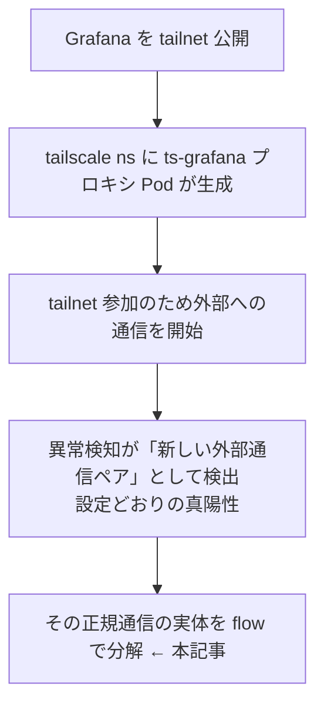
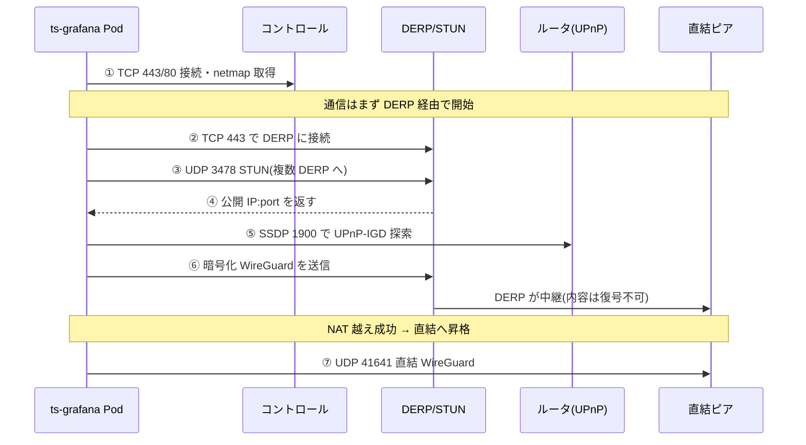

## はじめに

Kubernetes クラスタ内の Grafana を Tailscale の Ingress で tailnet に公開したところ、自作のネットワーク異常検知(NetObserv の eBPF flow を n8n で分析するもの)が「外部宛の新規通信」を検知しました。その通信元は Tailscale の Ingress プロキシ Pod で、通信の中身を NetObserv の eBPF flow ログで追うと、Tailscale がピア間接続を確立するときの通信(コントロールプレーン・STUN・DERP リレー・直結 WireGuard)が、そのままポート単位で並んでいました。

この記事は、その実測ログを一次データにして、Tailscale の接続確立の各段階を「クラスタ側の flow」から復元します。あわせて、なぜこの粒度が eBPF flow だと見えて Prometheus や cAdvisor では見えないのか、そして eBPF で「見えること・見えないこと」の境界を整理します。

- 想定読者: Kubernetes とネットワークの中級者(Tailscale/WireGuard/NAT 越えの概念を触ったことがある方)
- 前提環境: k3s + Cilium 上に NetObserv の eBPF agent を DaemonSet で常駐、Tailscale Kubernetes operator で Ingress を公開
- 実測データは筆者環境で取得した実物です。筆者自身の tailnet 名・tailnet アドレス(100.x)・デバイス・直結ピアの公開 IP など、個人や自環境を特定し得る値は伏字(`<...>`)にしています。これらが外部に公開されることはありません(公開しているのは tailnet 内アクセス限定の Grafana のみで、Funnel は使っていません)。
- 一方で、掲載している DERP・コントロールプレーン・STUN サーバの IP は、筆者の機器ではなく Tailscale 社がインターネット上で運用する全ユーザー共通のサーバ群です(例: `derp1.tailscale.com` は公開 DNS で誰でも解決できます)。筆者個人を示す情報ではないため、そのまま掲載しています。DERP は暗号化済みパケットを中継するだけで中身は読めません([DERP servers](https://tailscale.com/kb/1232/derp-servers))。

:::message
本記事の文章生成・編集には AI (Anthropic Claude) を活用しています。技術的事実については、筆者が公式ドキュメントを引用して検証しています。誤りや改善点があれば、コメント等でご指摘ください。
:::

## きっかけ(異常検知が捕捉した新しい外部通信)

Grafana を tailnet 公開すると、Tailscale operator は `tailscale` namespace にプロキシ Pod(`ts-grafana-...`)を作ります。この Pod は tailnet に参加するために外部へ通信を始めます。異常検知はこれを「これまで無かった外部宛の通信ペア」として拾いました。設定上は正しい検知(真陽性)ですが、中身は tailnet 参加のための正規の通信です。そこで、その正規通信が具体的に何をしているのかを flow で分解しました。



## eBPF flow でこの粒度が見える理由

NetObserv の eBPF agent は、各 Pod の仮想 NIC(veth。Cilium 環境では `lxc...`)に TC(tcx)フックで eBPF プログラムを載せ、その NIC を通過するパケットの L3/L4 メタデータを取り出します。取得できるのは送信元/宛先 IP、送信元/宛先ポート、プロトコル番号、バイト/パケット数、TCP の RTT などで、さらに Kubernetes のメタデータ(namespace / Pod 名 / Owner)で enrich されます。

| 観測手段 | 分かること | 通信相手と宛先ポート |
|---|---|---|
| cAdvisor / metrics-server / node-exporter | Pod・ノードの送受信量の合計 | 持たない |
| eBPF flow(NetObserv) | Pod 単位の相手 IP・ポート・プロトコル・バイト数・RTT | 分かる(暗号化ペイロードの中身は見えない) |

この「Pod 単位で、通信相手の IP:ポートまで分かる」点が重要です。cAdvisor や metrics-server、node-exporter は Pod やノードの送受信の合計は分かっても、通信相手とポートは持ちません(cAdvisor の [Prometheus メトリクス一覧](https://github.com/google/cadvisor/blob/master/docs/storage/prometheus.md) にある `container_network_*` はインターフェース単位のカウンタ、[node_exporter](https://github.com/prometheus/node_exporter) の netdev コレクタも NIC 単位の統計、[metrics-server](https://github.com/kubernetes-sigs/metrics-server) はそもそも CPU/メモリのリソースメトリクスのみが対象です。いずれも 2026-08 時点)。つまり「`ts-grafana` Pod が外部の 3478/udp をどこへ何回叩いたか」は、これらのメトリクスでは復元できません。

一方で、eBPF flow はあくまでパケットの外側(ヘッダ)を見るため、WireGuard や DERP で暗号化された中身(ペイロード)は見えません。見えるのは「誰が・どこへ・何のプロトコルとポートで・どれだけ」というメタデータに限られます。

## 捕捉した実データ

ここでいう flow(フロー)とは、同じ 5 タプル(送信元/宛先 IP・ポート・プロトコル)に属するパケット群を一定時間まとめた「会話」の単位で、flow レコードはそれを 1 件に集約したものです。個々のパケットではなく、バイト数・パケット数・開始/終了時刻・TCP RTT などの集計値を持ちます(考え方は NetFlow / IPFIX や VPC Flow Logs と同じで、相手やポートは残しますが中身は持ちません)。

NetObserv agent はこの flow レコードを標準出力に出しており(`EXPORT=direct-flp` は、カーネル内 eBPF マップに溜めた集計を FLP(flowlogs-pipeline)へ直接送る設定です)、`ts-grafana` Pod(クラスタ内 IP `10.0.0.134`)が絡む行を集計しました。代表的な生レコードは次の形です(長いので関係フィールドのみ、ピアの公開 IP は伏字)。

```text
# 直結 WireGuard(UDP 41641)。SrcK8S_* は Kubernetes enrichment
map[SrcK8S_Namespace:tailscale SrcK8S_Name:ts-grafana-tsx58-0
    SrcAddr:10.0.0.134 SrcPort:39497
    DstAddr:<peer-public-ip> DstPort:41641 Proto:17 Bytes:166 Packets:1]

# DERP/コントロールへの HTTPS 応答(TCP 443)。TimeFlowRttNs で RTT も取得
map[DstK8S_Namespace:tailscale DstK8S_Name:ts-grafana-tsx58-0
    DstAddr:10.0.0.134 DstPort:52302
    SrcAddr:172.238.6.179 SrcPort:443 Proto:6 Bytes:331 TimeFlowRttNs:9930000]
```

`Proto` は IP プロトコル番号で、`6`=TCP、`17`=UDP、`1`=ICMP です([IANA Protocol Numbers](https://www.iana.org/assignments/protocol-numbers/protocol-numbers.xhtml))。これを宛先ポートとプロトコルで束ねると、Tailscale の各機能が綺麗に分かれて見えます。

| 役割(推定) | プロトコル/ポート | 観測した相手(例) | 備考 |
|---|---|---|---|
| コントロールプレーン | TCP 443 / TCP 80 | `52.207.202.187`(AWS us-east-1) ほか | 持続的な HTTPS。80 併用は後述の公式仕様と一致 |
| STUN(公開エンドポイント発見) | UDP 3478 | `172.238.6.179`, `205.147.105.30`, `192.73.240.132`, `162.248.221.248` ほか多数 | 複数 DERP へ一斉にプローブ |
| DERP リレー | TCP 443 + UDP 3478(同一ホスト) | `172.238.6.179` | 443 と 3478 の両方を同一 IP に出しており DERP サーバの特徴 |
| ポートマッピング探索 | UDP 239.255.255.250:1900(SSDP マルチキャスト) | ルータ向けマルチキャスト | UPnP-IGD の探索。後述 |
| 直結 WireGuard | UDP 41641(+一時ポート) | `<peer-public-ip>` | NAT 越え成功後の実データ経路 |
| ICMP unreachable | ICMP type3/code3 | `192.0.0.2` | 閉じたポートへのプローブに対する応答 |

数値は筆者環境で 2026-08 に取得したものです。相手 IP のうち直結ピアの公開 IP は伏字にしています(結論はその値の中身に依存しません)。

## flow から Tailscale の接続確立を復元する

観測されたポートを、Tailscale 公式ドキュメントの記述に当てはめていきます。

### 1. コントロールプレーン(TCP 443 / 80)

Tailscale はまずコーディネーションサーバ(コントロールプレーン)に接続し、鍵や他ノードの情報(netmap)を受け取ります。[公式のファイアウォールポートの解説](https://tailscale.com/kb/1082/firewall-ports)は次のように述べています。

> Connections to the coordination server prefer to use HTTP on port 80 with an efficient encrypted transport ... data connections to the DERP relays use HTTPS on port 443.
>
> — [Firewall ports](https://tailscale.com/kb/1082/firewall-ports)

観測でも、AWS us-east-1 のアドレスへ持続的な TCP 443、および別ホストへ TCP 80 が出ていました。80 でも「efficient encrypted transport」で暗号化されるため、中身は flow からは見えません。コントロールプレーンと断定はできませんが、443/80 の持続接続かつ AWS us-east-1 という特徴は上記の公式仕様と一致します。

### 2. STUN による公開エンドポイント発見(UDP 3478)

直結を目指すには、まず自分が NAT の外からどう見えるか(公開 `IP:ポート`)を知る必要があります。ここで STUN を使います。[NAT 越えの公式解説](https://tailscale.com/blog/how-nat-traversal-works)は STUN の役割をこう説明します。

> when you talk to a server on the internet from a NATed client, the server sees the public `ip:port` that your NAT device created for you.
>
> — [How NAT traversal works](https://tailscale.com/blog/how-nat-traversal-works)

そして公式は、STUN 宛の UDP 3478 をファイアウォールで許可するよう案内しています。

> Let your internal devices start UDP to *:3478.
>
> — [Firewall ports](https://tailscale.com/kb/1082/firewall-ports)

観測では、複数の DERP サーバ(STUN サーバを兼ねる)へ UDP 3478 が一斉に出ていました。複数の DERP に対して同時に叩くのは、応答時間から最も近い DERP リージョンを選ぶためと考えられます(理由: 直後に特定の DERP へ 443 の接続が集中したため)。

### 3. NAT のポートマッピング探索(UPnP-IGD / SSDP)

STUN と並行して、Tailscale はルータに恒久的なポートマッピングを要求できます。公式は 3 つの方式を挙げています。

> UPnP IGD ... NAT-PMP ... PCP ... making one NAT vanish from the data path.
>
> — [How NAT traversal works](https://tailscale.com/blog/how-nat-traversal-works)

観測では UDP 239.255.255.250:1900 が出ていました。これは SSDP マルチキャストで、UPnP-IGD がゲートウェイを探索する際の宛先です。つまり公式が挙げる UPnP-IGD の探索段階が、そのまま flow に現れています。

### 4. DERP リレー(TCP 443、暗号化 WireGuard の中継)

直結ができるまでの間、通信は DERP 経由で始まります。[DERP サーバの公式解説](https://tailscale.com/kb/1232/derp-servers)は次のように述べます。

> DERP servers relay two types of packets: DISCO packets and encrypted WireGuard packets ... a DERP server blindly forwards already-encrypted traffic from one device to another.
>
> — [DERP servers](https://tailscale.com/kb/1232/derp-servers)

さらに接続タイプの公式解説は、接続がまず DERP 経由で始まり、その後に直結へ昇格する順序を明言しています。

> All connections start as relayed through a DERP server, and Tailscale then tries to upgrade them to a direct connection.
>
> — [Connection types](https://tailscale.com/kb/1257/connection-types)

観測でも、STUN(3478)を出していた `172.238.6.179` に対して同時に TCP 443 が確立していました。443 と 3478 を同一ホストに出しているのは DERP サーバ(リレー+STUN)の典型です。中継されるのは暗号化済みの WireGuard パケットなので、flow からは「DERP と 443 で話している」ことは分かっても中身は分かりません。

### 5. 直結 WireGuard への昇格(UDP 41641)

NAT 越えに成功すると、通信は DERP から直結の WireGuard トンネルへ移ります。直結のデフォルトポートは公式に定義されています。

> Direct WireGuard tunnels use UDP with a source port that defaults to 41641.
>
> — [Firewall ports](https://tailscale.com/kb/1082/firewall-ports)

観測では、直結ピアの公開 IP に対して UDP 41641(と一時ポート)が出ていました。ここまで来ると、以降の実データは DERP を介さずピア間で直接流れます。

### 全体像

以上を時系列に並べると次のようになります。図は上から下へ時間が進み、接続がまず DERP 経由で始まってから直結へ昇格する流れを表します。



## eBPF flow で「見えること・見えないこと」

今回の調査で確認できた境界を整理します。

| 項目 | eBPF flow で見えるか | 補足 |
|---|---|---|
| 通信相手の IP / ポート / プロトコル | 見える | Pod 単位で復元でき、機能(STUN/DERP/直結)を推定できる |
| バイト数・パケット数・TCP RTT | 見える | `Bytes` / `Packets` / `TimeFlowRttNs` |
| Kubernetes の Pod / namespace / Owner | 見える | enrichment による(どの Pod の通信かが分かる) |
| WireGuard / DERP のペイロード | 見えない | 暗号化済み。中継内容は復元不可 |
| どの tailnet ピアと論理的に繋がったか | 見えない | flow は物理経路(公開 IP)まで。tailnet の 100.x 論理アドレスの対応は別情報が必要 |

enrich された内部通信は、そのまま可視化にも使えます。NetObserv の flow から作成した依存グラフを Grafana の Node Graph で表示すると、次のようになります。


*線の太さが流量、赤い線が再送や drop の発生を表します。ハブになっている `raspberrypi-0`(コントロールプレーンノード)から各ワークロードへ通信が広がる構造が読み取れます。K8s の Owner 名で識別できる内部通信がノードになる一方、本記事で追った DERP のような外部エンドポイントは K8s 識別子を持たないため、このグラフには名前付きノードとして現れません。だからこそ相手の IP:ポートは、集約済みのグラフではなく生の flow レコードから読み取りました。*

この「メタデータは観測できるが、暗号化されたペイロードは観測できない」という切り分けは、WireGuard と DERP の設計に由来します。DERP サーバ自身も[暗号化済みのトラフィックをそのまま転送するだけで中身を復号できません](https://tailscale.com/kb/1232/derp-servers)。監視の観点でいえば、通信の有無・相手・通信量は把握できる一方で、通信内容は暗号化によって保護されたままになります。

### クラウドのマネージド監視との対比

同じ「コンテナのネットワークを見る」でも、クラウドのマネージド監視は粒度が異なります。AWS ECS の Container Insights が集めるネットワークメトリクスは `NetworkRxBytes` と `NetworkTxBytes` で、[タスク/サービス/クラスタ単位の送受信バイト合計](https://docs.aws.amazon.com/AmazonCloudWatch/latest/monitoring/Container-Insights-metrics-ECS.html)であり、Docker runtime から取得されます。通信相手の IP・ポート・コネクションは含みません。これは本記事の前半で触れた cAdvisor / metrics-server と同じ「合計は分かるが相手は分からない」層です。

AWS で通信相手まで見たい場合は VPC Flow Logs が該当し、ENI 単位で [5 タプル(srcaddr / dstaddr / srcport / dstport / protocol と packets / bytes)](https://docs.aws.amazon.com/vpc/latest/userguide/flow-log-records.html)を記録できます。`awsvpc` ネットワークモードのタスクはタスクごとに ENI を持つため、これで「タスク → 相手 IP:ポート」までは追えます。ただし ECS のタスク名などでの enrich は自前で行う必要があり、集計はおよそ 1 分粒度、TCP RTT や同一 ENI 内の通信は対象外です。観測レイヤも Pod の veth ではなく VPC/ENI です。

| 観点 | ECS Container Insights | VPC Flow Logs | NetObserv(eBPF) |
|---|---|---|---|
| 通信相手の IP:ポート | 持たない(合計バイトのみ) | 持つ(5 タプル) | 持つ |
| 向き・プロトコル | 持たない | 持つ | 持つ |
| TCP RTT / L4 詳細 | 持たない | 持たない | 持つ |
| コンテナ/Pod の意味づけ | タスク/サービスで集計 | 自前で ENI と対応付け | K8s enrich で自動 |
| 観測レイヤ | Docker runtime の集計値 | VPC / ENI | Pod の veth(TC/tcx) |

出典: [Container Insights ECS metrics](https://docs.aws.amazon.com/AmazonCloudWatch/latest/monitoring/Container-Insights-metrics-ECS.html) / [VPC flow log records](https://docs.aws.amazon.com/vpc/latest/userguide/flow-log-records.html)

なお eBPF flow はノードのカーネルにエージェントを常駐させる方式のため、ホスト(カーネル)を管理できる環境が前提になります。今回のような自前ノードや EC2 起動タイプでは載せられますが、ホストを管理しないマネージドなデータプレーンでは同じ方式は使えず、VPC Flow Logs 側に寄せることになります。

## まとめ

- Grafana の tailnet 公開で発火した異常検知を入り口に、Tailscale の接続確立を NetObserv の eBPF flow から段階ごとに復元できました。
- 観測ポートは公式仕様と一致しました。コントロールは TCP 443/80、[STUN は UDP 3478](https://tailscale.com/kb/1082/firewall-ports)、[直結 WireGuard は UDP 41641](https://tailscale.com/kb/1082/firewall-ports)、UPnP-IGD 探索は SSDP(239.255.255.250:1900)です。
- [接続はまず DERP 経由で始まり、その後に直結へ昇格する](https://tailscale.com/kb/1257/connection-types)という順序も、DERP への 443 と直結の 41641 の両方が観測されたことと整合します。
- この粒度(Pod 単位で相手 IP:ポートまで)が見えるのは eBPF flow だからで、cAdvisor / metrics-server では通信相手を持たないため復元できません。
- 一方でペイロードは暗号化されて見えません。監視で得られるのは「誰が・どこへ・何で・どれだけ」というメタデータに限られます。

## 参考

- [Tailscale: Firewall ports (使用ポートの一覧)](https://tailscale.com/kb/1082/firewall-ports)
- [Tailscale: Connection types (direct と relayed)](https://tailscale.com/kb/1257/connection-types)
- [Tailscale: DERP servers](https://tailscale.com/kb/1232/derp-servers)
- [Tailscale blog: How NAT traversal works](https://tailscale.com/blog/how-nat-traversal-works)
- [IANA: Protocol Numbers](https://www.iana.org/assignments/protocol-numbers/protocol-numbers.xhtml)
- 検証時の構成ファイル: [netobserv（overlay と検証フィクスチャ）](https://github.com/shinichitazawa/k8s-deploy-public/tree/main/netobserv)（[k8s-deploy-public](https://github.com/shinichitazawa/k8s-deploy-public) の main 時点。環境固有値はダミーに置換済み）
