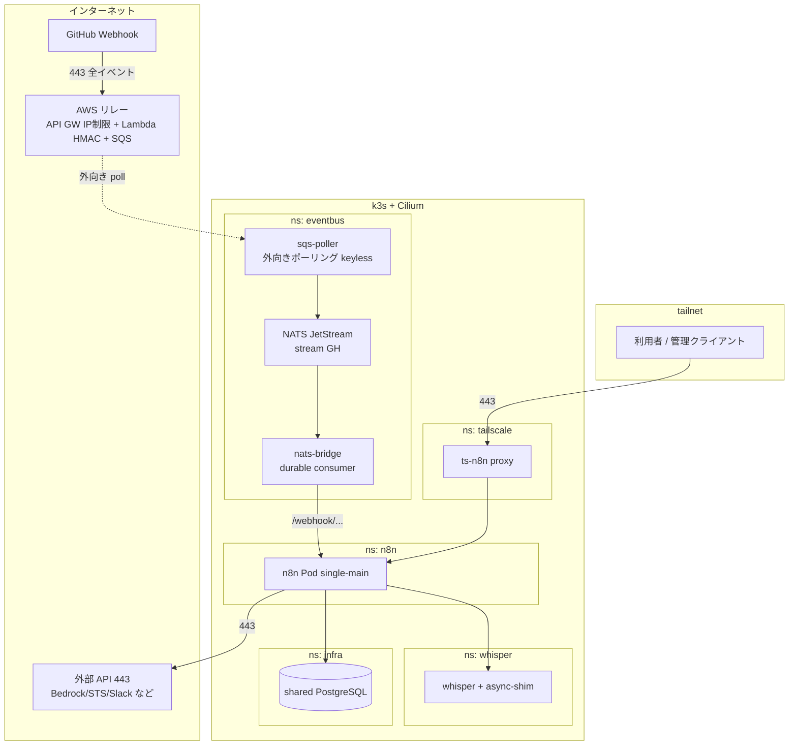
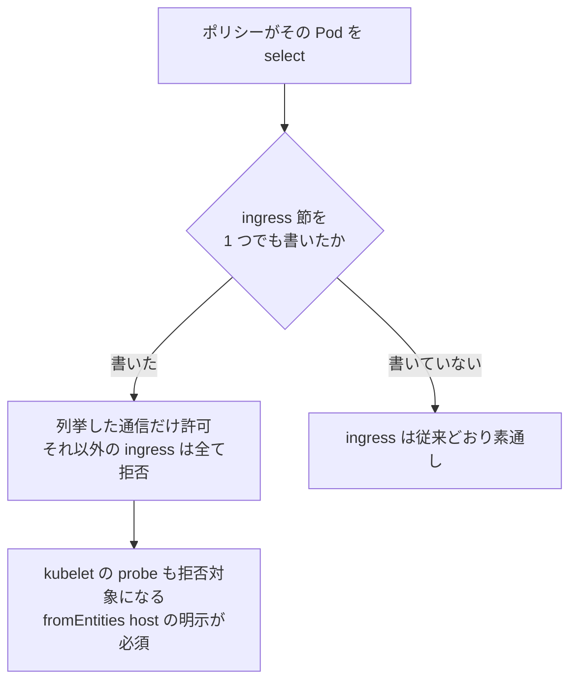
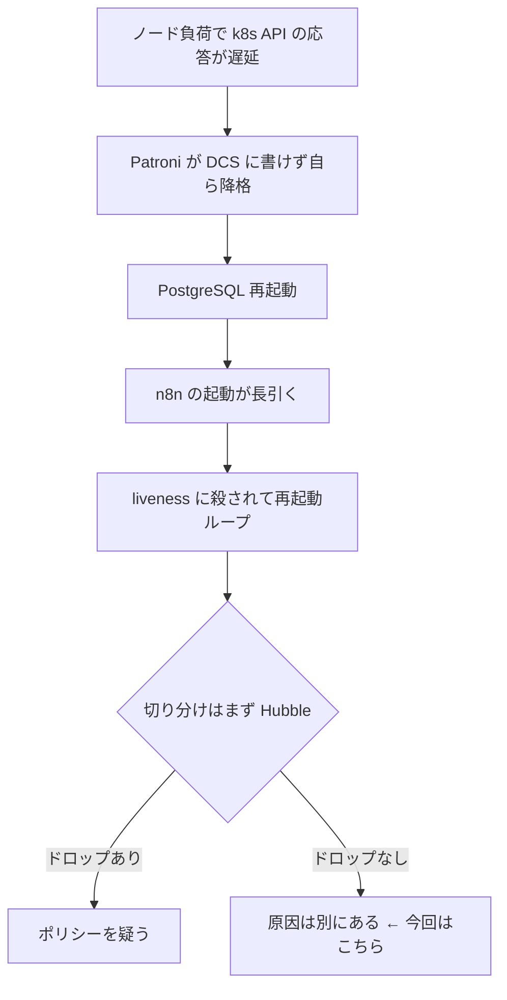

## はじめに

セルフホストの n8n で AI ワークフローの検証を重ねてきた環境に、GitHub の全イベントを受けるイベントバス(NATS JetStream)を足したタイミングで、**通信要件を全部洗い出して Cilium のネットワークポリシーで固めました**。本記事はその設計と、適用して初めて分かった Tailscale 特有の注意点の記録です。

- 検証環境: k3s(Raspberry Pi コントロールプレーン)+ Cilium / n8n 2.33.3 / Tailscale operator
- 実測はすべて筆者環境(2026-08 時点)

:::message
本記事の文章生成・編集には AI (Anthropic Claude) を活用しています。技術的事実については、筆者が公式ドキュメントを引用して検証しています。誤りや改善点があれば、コメント等でご指摘ください。
:::

## 全体構成



図は主要経路のみを示しています。通信要件マトリクスに登場する CoreDNS や kubelet(host)への経路は、図を簡潔に保つため省いています。

設計の柱は 2 つです。

1. **tailnet / クラスタに着信経路を作らない**。GitHub の受信は AWS 側リレーで行い、クラスタは外向き接続だけにする(この結論に至る経緯は後述。当初は Tailscale Funnel で 1 サービスだけ公開する案でした)
2. n8n が直接イベントを受けず、**JetStream を耐久バッファとして挟む**。n8n が停止していてもイベントは stream に残り、復帰後に配送される

## 受信経路の選定(Funnel から AWS リレーへ)

n8n は tailnet 内にあり、GitHub の Webhook はインターネットからしか届きません。この受信経路には最初から通信要件を 1 つ課していました。**GitHub の配送元以外からの着信を拒否できること(送信元制限)**です。

その前提で、まず試したのは [Tailscale Funnel](https://tailscale.com/kb/1223/funnel) です。公式の説明のとおり、tailnet 内のサービスをインターネットへ公開する機能です。

> Tailscale Funnel lets you route traffic from the broader internet to a local service running on a device in your Tailscale network (known as a tailnet).

公開するのは 100 行弱の受信レシーバだけで、[GitHub 公式の手順](https://docs.github.com/en/webhooks/using-webhooks/validating-webhook-deliveries)どおり `X-Hub-Signature-256`(HMAC-SHA256)を検証し、通ったイベントだけを JetStream の subject `gh.<owner>.<repo>.<event>` へ publish します。署名なしのリクエストは 401 で捨てます(実測)。

n8n への配送は、durable consumer を持つ小さなブリッジが行います。n8n の Webhook へ POST し、**2xx のときだけ ack、失敗は nak して再送**します。検証中、n8n 側の受け口ができる前からイベントを流し始めましたが、全イベントが stream に保持され、404 のたびに再送され続けました。「n8n が落ちていてもイベントを失わない」がそのまま実測できた形です。

なお Funnel の有効化には tailnet ポリシーファイルでの許可が必要です。

> Tailscale Funnel requires a node attribute (`nodeAttrs`) of `funnel` in your tailnet policy file to tell Tailscale who can use Funnel.

これを付与するまでは、`tailscale funnel status` が「Funnel on」を表示していても**公開 DNS レコードが配布されず、外部からは到達できません**(実測。GitHub からの配送は 502 になりました)。ローカル表示と実際の公開状態が食い違う点は要注意です。

### Funnel を不採用にした理由: 送信元制限ができない

到達の確認までは進みましたが、冒頭の通信要件が満たせないことが分かりました。Funnel には**インターネット側の送信元制限がありません**([公式](https://tailscale.com/kb/1223/funnel)。tailnet の ACL(Access Control List)は Funnel トラフィックに適用されず、制御できるのは「誰が Funnel を作れるか」だけです)。HMAC 検証は不正なリクエストを弾けますが、着信そのものは全世界から届く状態になります。送信元制限を通信要件とする以上 Funnel は使えないと判断し、受信は AWS 側のリレーに切り替えました。

```text
GitHub → API Gateway(リソースポリシー: GitHub の hooks CIDR のみ許可)
       → Lambda(HMAC 検証)→ SQS(保持 14 日)
クラスタ内 sqs-poller → SQS を外向きロングポーリング(keyless)→ NATS → n8n
```

- 送信元 CIDR は [GitHub の meta API](https://api.github.com/meta) から Terraform の apply 時に取得し、レンジ外は 403(実測: 自端末からの直叩きは 403、GitHub からの配送は 200)
- クラスタ側は外向き接続だけになり、**インターネットからの着信経路がゼロ**になります
- 費用は実測イベント量(月 100 件強)で月 1 円未満(API Gateway のリクエスト課金のみ。Lambda / SQS は常時無料枠内)

Funnel は「手早く 1 サービスを公開する」には便利です。ただし送信元制限を通信要件に含めるなら、選ぶべきは AWS 側リレーです。

## 通信要件マトリクスを書く

ポリシーを書く前に、実環境の Pod・Service・ログから通信を棚卸しして表にしました(抜粋)。

| # | 送信元 | 宛先 | ポート | 用途 |
|---|---|---|---|---|
| 1 | GitHub | AWS API Gateway(GitHub hooks CIDR のみ許可) | 443 | Webhook 全イベント → Lambda(HMAC)→ SQS |
| 2 | sqs-poller | SQS / STS / OIDC(外向き) | 443 | ロングポーリング(keyless) |
| 3 | poller / bridge | NATS | 4222 | publish / pull |
| 4 | bridge | n8n | 5678 | イベント配送 |
| 5 | 利用者(tailnet) | proxy → n8n | 443→5678 | UI / API / 承認リンク |
| 6 | n8n | 共有 PostgreSQL | 5432 | 実行履歴・Data Tables(TLS) |
| 7 | n8n | whisper | 9001 | 文字起こし(非同期) |
| 8 | n8n | 外部 | 443 | Bedrock / Slack ほか |
| 9 | 全 Pod | CoreDNS | 53 | 名前解決 |
| 10 | kubelet(host) | 各 Pod | probe | liveness / readiness |

この表がそのままポリシーの仕様になります。逆に言えば、**表に書けない通信はポリシーで落ちる**ので、洗い出しの漏れがそのまま障害になります。

## Cilium ポリシーの要点

Cilium のポリシーは方向ごとのデフォルト拒否です。[公式ドキュメント](https://docs.cilium.io/en/stable/security/policy/intro/)より:

> If any rule selects an Endpoint and the rule has an ingress section, the endpoint goes into default deny-mode for ingress.

つまり ingress 節を 1 つでも書けば、書かなかった ingress は全部落ちます。



マトリクスの各行を `CiliumNetworkPolicy` に写し、次の 3 点だけ一般則から補いました。

1. **kubelet の probe 用に `fromEntities: [host]`** を全 ingress に入れる(これを忘れると liveness が失敗して Pod が再起動し続けます)
2. 外部 443 は当面 `toEntities: [world]` で許可(FQDN 単位の制限は DNS プロキシが前提になるため段階 2)
3. 共有 DB 側のポリシーは対象外(他の利用者の全量調査が先。n8n 側 egress の 5432 制限で片側は担保)

適用後、正常系(UI 経路・DB・Slack・whisper)と**負例 2 経路(bridge → whisper、whisper → n8n)が遮断されること**を実測で確認しました。

## Tailscale proxy は Pod ラベルで識別できない

適用直後、**UI 経路だけが 502** になりました。Hubble でドロップを観測すると:

```text
tailscale/ts-n8n-...:34658 (ID:17903) <> 10.0.0.x:5678 (world) ... DROPPED (TCP Flags: SYN)
```

Tailscale の Ingress proxy は、バックエンドへの接続を **tailnet アドレス(100.64.0.0/10)を送信元として**張ることがあります。Cilium はこの送信元をクラスタ内 Pod として識別できず `world` 扱いにするため、`fromEndpoints`(Pod ラベル)による許可ではマッチしません。次の CIDR 許可を追加して解決しました(実測)。

```yaml
- fromCIDRSet:
    - cidr: 100.64.0.0/10   # Tailscale が使う CGNAT レンジ
  toPorts:
    - ports: [{ port: "5678", protocol: TCP }]
```

「Tailscale operator の Ingress 配下に Cilium ポリシーを敷くときは、proxy を Pod ラベルではなく tailnet CIDR で許可する」——この 1 行が本記事でいちばん伝えたい実測です。

## 障害の切り分け(まず Hubble を見る)

適用直後に n8n が再起動ループに入り、一瞬ポリシーを疑いました。しかし Hubble にドロップはなく、実際の原因は別でした。



1. ノード負荷で k8s API サーバーの応答が遅延
2. 共有 PostgreSQL の Patroni が DCS(k8s API)に書けず**自ら降格**(`demoting self because DCS is not accessible and I was a leader`)
3. DB 再起動で n8n の起動(crash recovery 込み)が長引き、liveness に殺されてループ

対処は n8n の起動猶予を `startupProbe`(最大 10 分)に分離することでした。**ポリシー適用と同時に起きた障害でも、まず Hubble でドロップの有無を確認する**——切り分けの順序が守られていれば、疑う先を間違えません。

## まとめ

1. ポリシーは「書く」より「通信要件を洗い出す」が本体です。マトリクスがそのまま仕様になります
2. Cilium は方向ごとのデフォルト拒否。probe 用の `fromEntities: [host]` を忘れると Pod が死にます
3. Tailscale proxy 経由の ingress は Pod ラベルで許可できないことがあります。tailnet CIDR(100.64.0.0/10)で許可します
4. 送信元制限が要件なら Funnel ではなく AWS リレー(API Gateway の IP 制限 + Lambda の HMAC)。JetStream を耐久バッファにすれば、クラスタへの着信経路ゼロで GitHub 全イベントを受けられます
5. 適用直後の障害はまず Hubble で。ドロップが無ければ原因は別にあります

## 参考

- [Network Policy — Cilium Docs](https://docs.cilium.io/en/stable/security/policy/intro/)
- [Tailscale Funnel](https://tailscale.com/kb/1223/funnel)
- [Validating webhook deliveries — GitHub Docs](https://docs.github.com/en/webhooks/using-webhooks/validating-webhook-deliveries)
- [JetStream — NATS Docs](https://docs.nats.io/nats-concepts/jetstream)
- [Liveness / Readiness / Startup Probes — Kubernetes Docs](https://kubernetes.io/docs/tasks/configure-pod-container/configure-liveness-readiness-startup-probes/)
