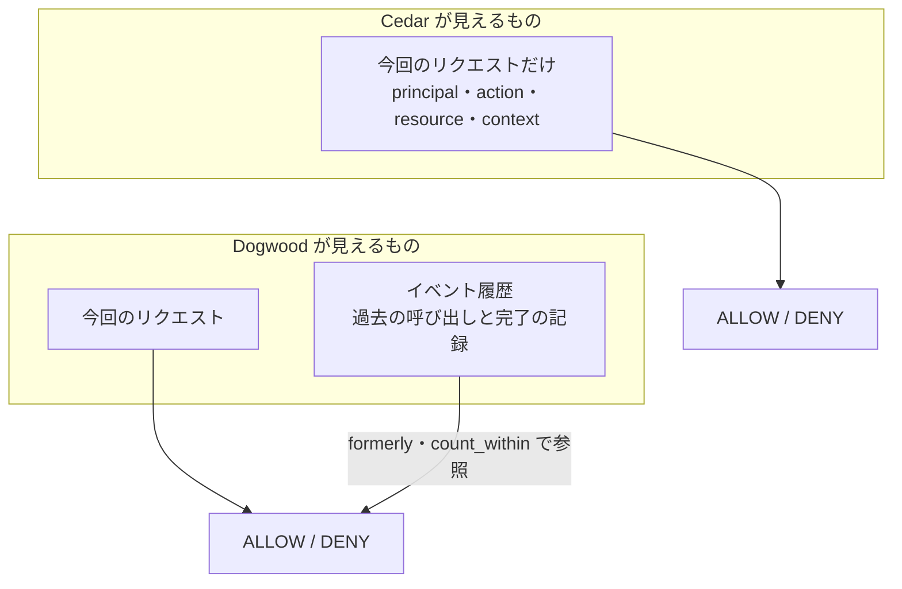
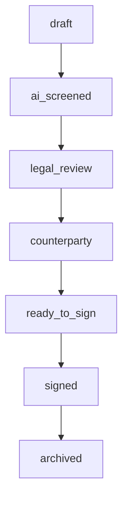
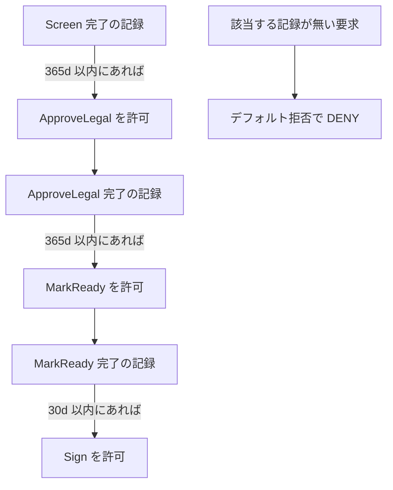
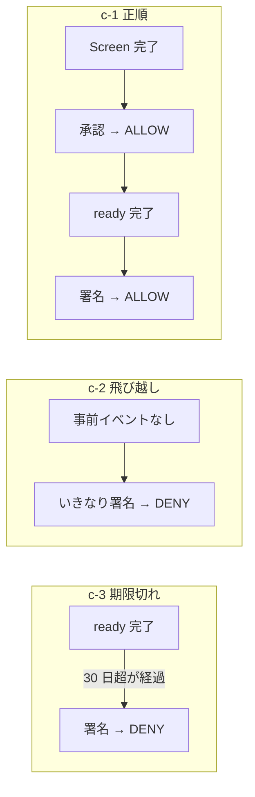
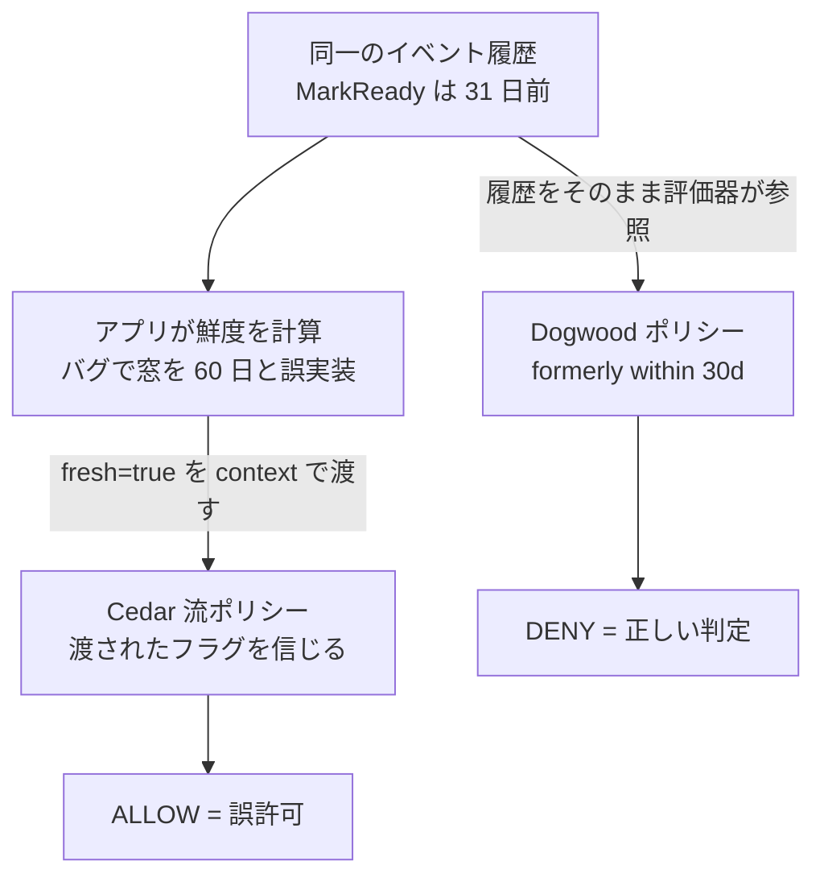
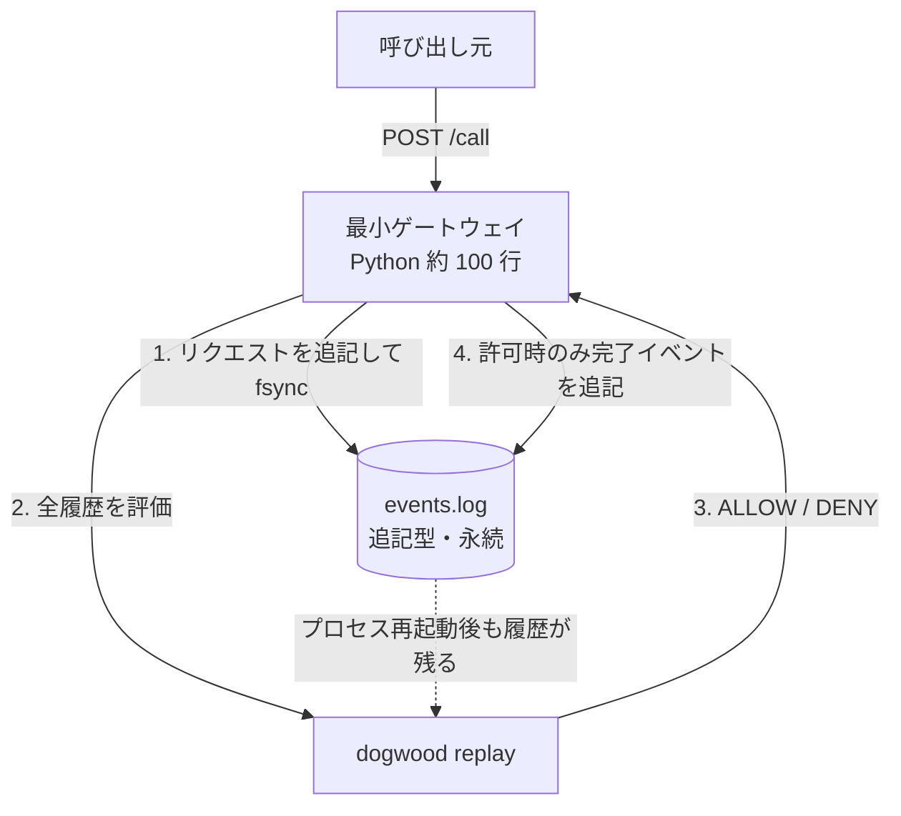
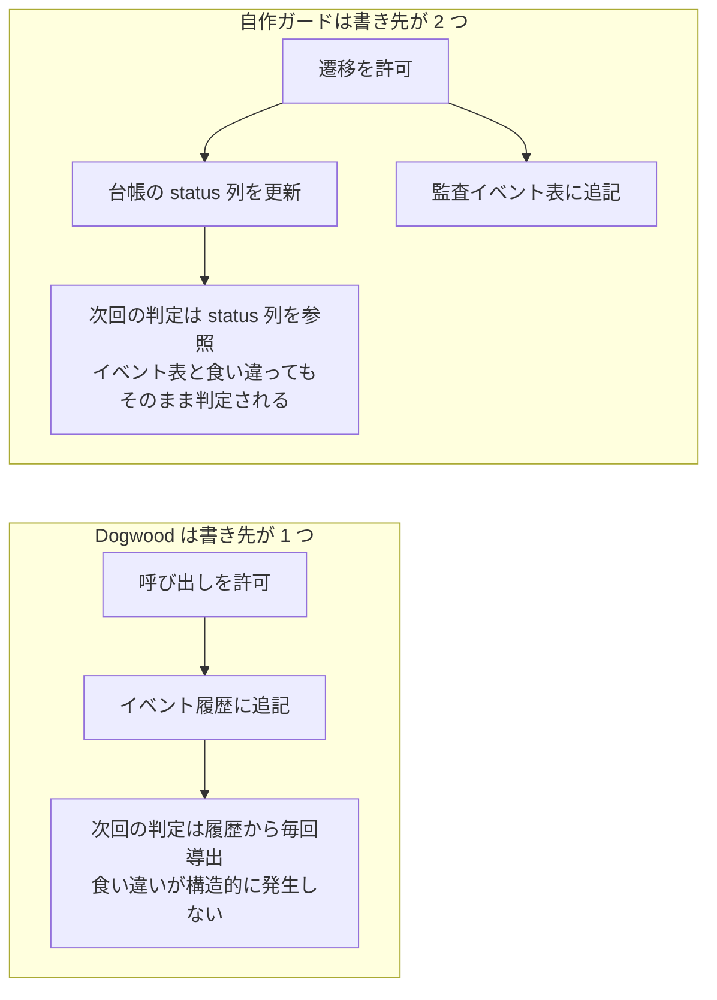

## はじめに

セルフホストの n8n で契約文書の管理フロー(作成 → レビュー → 締結)を検証するなかで、「正当な順序の状態遷移だけを許可し、承認から 30 日を超えた締結は拒否する」というガードを Code ノードの手続きとして実装しました。

その直後の 2026-08 に、AWS が **Dogwood** という AI エージェント向けのポリシー言語を Apache 2.0 で公開しました([AWS Open Source Blog](https://aws.amazon.com/blogs/opensource/introducing-dogwood-runtime-verification-for-ai-agents/)、[GitHub リポジトリ](https://github.com/dogwood-policy/dogwood))。単発の認可判定しかできない従来のポリシー言語と違い、**ツール呼び出しの「履歴」を条件にできる**のが特徴で、Amazon Bedrock AgentCore の Policy 機能にも統合されています([AWS Machine Learning Blog](https://aws.amazon.com/blogs/machine-learning/control-agent-behaviors-and-cost-beyond-a-single-action-new-capabilities-in-amazon-bedrock-agentcore/))。

これは自作したガードと同じ問題を解いているように見えます。そこで本記事では、Dogwood のリファレンス実装を実際にビルドし、**同じガードを Dogwood のポリシーとして書いて同じ 6 シナリオで自作ガードと判定を突き合わせ**、さらに **Cedar 単体に対する優位性の実測(同一履歴で判定が割れる実験)と、ゲートウェイ + 耐久履歴ストアを用意した強制の実測**まで行った結果を記録します。

- 実測はすべて筆者環境(2026-08-18 時点、cargo 1.93.0 / WSL2)
- 比較対象の自作ガードは k3s 上の n8n 2.33.3 の Code ノード実装

:::message
本記事の文章生成・編集には AI (Anthropic Claude) を活用しています。技術的事実については、筆者が公式ドキュメントを引用して検証しています。誤りや改善点があれば、コメント等でご指摘ください。
:::

## Dogwood とは

[Cedar](https://docs.cedarpolicy.com/)(AWS のポリシー言語)の上位互換で、時系列の条件を書ける演算子を追加した言語です。[公式ブログ](https://aws.amazon.com/blogs/opensource/introducing-dogwood-runtime-verification-for-ai-agents/)は互換性を次のように説明しています。

> any syntactically valid Cedar policy is a syntactically valid Dogwood policy
>
> — [Introducing Dogwood (AWS Open Source Blog)](https://aws.amazon.com/blogs/opensource/introducing-dogwood-runtime-verification-for-ai-agents/)

追加される主な演算子は `formerly`(過去に該当イベントがあったか)、`count_within`(時間窓内の回数)、`sum_within`(時間窓内の数値合計)などです。判定材料の違いを図にすると次のとおりです。



重要なのは、**Bedrock AgentCore が前提ではない**ことです。リポジトリは Rust の言語実装と CLI(`validate` / `lower` / `replay`)を含む単体の OSS で、評価に必要なイベント履歴の保持と強制ポイントの用意はアプリケーション側の責務になります([リポジトリ README](https://github.com/dogwood-policy/dogwood))。

## 比較対象の状態遷移ガード(n8n 実装)

契約管理フローの状態遷移は次のとおりです。



Code ノードのガードは 2 つの規則を実装しています。

1. **順序**: 現在の状態から列挙された遷移だけを許可する(飛び越しは拒否)
2. **鮮度**: `signed` への遷移は、`ready_to_sign` の監査記録が **30 日以内**に存在する場合だけ許可する(古い承認での締結を防ぐ)

遷移の要求は Webhook で受け、許可した場合だけ台帳の状態更新と監査イベントの追記を行います。

## 同じガードを Dogwood で書く

Dogwood では、状態変数を参照する代わりに**過去のイベントの存在を条件にする**形で同じ規則を表現します。ポリシーの骨格は Cedar と同じで、`permit (principal, action, resource)` の 3 要素は「誰が(principal)」「何を(action)」「何に対して(resource)」行う要求かを表し、`when` 以下の条件を満たす場合だけ許可します。Dogwood はこの条件部に `temporal { formerly ... }`(過去イベントの存在)を書ける点が拡張です。3 本のポリシーを書きました。

```text:policy.dw
// 法務承認は、一次スクリーニング完了の記録が前提
@id("approve_requires_screening")
permit ( principal, action == Keiyaku::Action::"ApproveLegal", resource )
when temporal {
    formerly within 365d Keiyaku::Action::"Screen"::response{
        input.contract: context.input.contract
    }
};

// ready_to_sign へは法務承認済みの契約のみ
@id("ready_requires_legal_approval")
permit ( principal, action == Keiyaku::Action::"MarkReady", resource )
when temporal {
    formerly within 365d Keiyaku::Action::"ApproveLegal"::response{
        input.contract: context.input.contract
    }
};

// 締結は ready_to_sign から 30 日以内のみ
@id("sign_requires_fresh_ready")
permit ( principal, action == Keiyaku::Action::"Sign", resource )
when temporal {
    formerly within 30d Keiyaku::Action::"MarkReady"::response{
        input.contract: context.input.contract
    }
};
```

`{ input.contract: context.input.contract }` の部分が相関条件で、「**同じ契約についての**過去イベント」に限定します。また Cedar と同じくデフォルト拒否のため、n8n 側で列挙した「正当な遷移」以外(状態の飛び越し)は、**拒否のルールを書かなくても落ちます**。3 本の連鎖を図にすると次のとおりです。



### つまずいた点: 時間窓の上限は既定 24 時間

最初にそのまま `within 30d` と書いたところ、検証で失敗しました(実測)。

```text
error: temporal window `720h` exceeds the maximum allowed window `24h`
set by the event schema's `max_window`; shorten this window to at most `24h`,
or raise `max_window` in the event schema
```

時間窓の上限は既定で 24 時間に制限されており、超える窓を使うにはイベントスキーマ側で上限を明示的に引き上げる必要があります([リポジトリ同梱の max_window_raised 例](https://github.com/dogwood-policy/dogwood)より。ディレクティブはイベント宣言より前に書きます)。

```text:event.dwschema
max_window = 365d
```

「どこまで履歴を保持するか」を書き手に宣言させることで、履歴ストアの際限ない成長を言語側で防ぐ設計だと読み取れます。

## 実測 1: Dogwood の replay

検証入力はイベントトレース(3 契約分)です。要点だけ抜粋します。

```text:trace.log(抜粋)
@0       c-1 の Screen::response(スクリーニング完了の記録)
@100     c-1 の ApproveLegal::request     ← 判定対象
@205     c-1 の MarkReady::response
@300     c-1 の Sign::request             ← 判定対象
@310     c-2 の Sign::request             ← 事前イベントなし(飛び越し)
@320     c-2 の ApproveLegal::request     ← スクリーニング記録なし
@2593000 c-3 の Sign::request             ← MarkReady から 30 日超
```

`replay` の結果です(実測)。

```bash
$ dogwood replay --policy-schema schema.cedarschema \
    --event-schema event.dwschema --trace trace.log policy.dw
@100 (time point 0): ALLOW  [rules: 0]
@200 (time point 1): ALLOW  [rules: 1]
@300 (time point 2): ALLOW  [rules: 2]
@310 (time point 3): DENY
@320 (time point 4): DENY
@2593000 (time point 5): DENY
```

3 契約の履歴と判定の関係を図にすると次のとおりです。



## 実測 2: n8n 側で同じ 6 シナリオ

n8n 側では、実在する台帳の契約(#1 はスクリーニング済み、#2 は draft、#3 は 31 日前の承認記録を持つ ready_to_sign)に対して Webhook で同じ遷移を要求しました(実測)。

```bash
$ curl "$N8N/webhook/contract-status?id=1&to=legal_review&actor=legal"
{"allowed":true,"contract":"1","transition":"ai_screened -> legal_review"}
$ curl "$N8N/webhook/contract-status?id=1&to=signed&actor=owner"     # ready 直後
{"allowed":true,"contract":"1","transition":"ready_to_sign -> signed"}
$ curl "$N8N/webhook/contract-status?id=2&to=signed&actor=owner"     # 飛び越し
{"allowed":false,"reason":"不正な遷移: draft → signed"}
$ curl "$N8N/webhook/contract-status?id=3&to=signed&actor=owner"     # 31 日前の承認
{"allowed":false,"reason":"ready_to_sign の記録が 30 日以内に無い(再レビューが必要)"}
```

## 判定の突き合わせ

| シナリオ | Dogwood | 自作ガード(n8n) |
|---|---|---|
| スクリーニング済み契約の法務承認 | ALLOW | 許可 |
| 承認済み契約を ready へ | ALLOW | 許可 ※実行ログは本文に未掲載 |
| ready 直後の締結 | ALLOW | 許可 |
| draft からの締結(飛び越し) | DENY | 拒否 |
| スクリーニング無しの法務承認 | DENY | 拒否 ※実行ログは本文に未掲載 |
| 31 日前の承認での締結 | DENY | 拒否 |

n8n 側の 6 シナリオのうち、本文に curl の実行ログを載せたのは 4 件で、残り 2 件(承認済み契約を ready へ / スクリーニング無しの法務承認)は同じ手順で実行した判定結果のみを表に記載しています。**6 シナリオすべてで判定が一致しました。** 手続きで書いたガードが、宣言的なポリシー 3 本 + デフォルト拒否に置き換わる対応関係を実測で確認できたことになります。

## 実測 3: Cedar に対する優位性

Cedar 単体との差がいちばん分かる実験を組みました。

Cedar の認可は 1 リクエスト(principal / action / resource / context)に対する一時点の判定で、**過去のイベントを参照する構文がありません**([Cedar 公式の認可モデル](https://docs.cedarpolicy.com/auth/authorization.html))。したがって「MarkReady から 30 日以内」を Cedar で表現するには、**アプリ側が履歴を調べて真偽値を計算し、context で渡す**しかありません。ポリシーは渡されたフラグを信じるだけになります。

```text:policy-cedar-style.dw(Cedar で書ける限界)
@id("sign_if_app_says_fresh")
permit ( principal, action == Keiyaku::Action::"Sign", resource )
when { context.fresh == true };
```

そこで次の状況を作りました。MarkReady が **31 日前**にある同一の履歴に対し、フラグを計算するアプリが**窓を 60 日と誤実装している**(30 日のつもりが 60 日)と想定して、`fresh: true` 付きの署名要求を流します。実験の構図は次のとおりです。



```bash
$ dogwood replay ... policy-cedar-style.dw   # Cedar 流: アプリのフラグを信じる
@1787067043 (time point 0): ALLOW    # ← 31 日前の承認で署名できてしまう(誤許可)
$ dogwood replay ... policy-temporal.dw      # Dogwood: 履歴から導出する
@1787067043 (time point 0): DENY     # ← 同じ履歴・同じ要求で正しく拒否
```

**同一の履歴・同一の要求に対して、Cedar 流は誤許可し、Dogwood は正しく拒否しました**(実測)。差が生まれた理由は単純で、Cedar 流ではガードの実体(30 日の判定)がポリシーの外のアプリコードにあり、そのバグがそのまま判定を誤らせるのに対し、Dogwood は条件がポリシーの中にあり、評価器が履歴から毎回導出するためです。

これは n8n の Code ノード実装とも同じ構図です。手続き実装の正しさはコード品質に依存します。Dogwood の優位性は「Cedar でも書けることが書ける」ことではなく、「**アプリコード側に持たせるしかなかった履歴条件を、ポリシーに移して評価器に任せられる**」ことにあります。

なお互換性そのものも確認しました。temporal 構文を使わない純 Cedar のポリシーだけのファイル(`permit` 2 本 + `forbid` 1 本)は `dogwood validate` を無変更で通過し、[forbid が permit に優先する](https://docs.cedarpolicy.com/auth/authorization.html)評価規則(deny-overrides)が temporal 規則と混在しても維持されることは次の実測 4 で確認します。既存の Cedar 資産の上に履歴条件を追加できる、という位置づけです。

## 実測 4: ゲートウェイと耐久履歴ストアを用意して強制する

`replay` はバッチの再判定であり、実運用の形は「すべての呼び出しが通るゲートウェイでの評価」です。そこで検証用の最小構成を用意しました(Python 約 100 行)。

- 受けたリクエストをイベント行として**追記型のログファイルに永続化**(fsync)してから、`dogwood replay` を評価器として全履歴を判定し、最新リクエストの判定を返します
- 許可した場合のみ完了イベント(response)を追記します。拒否されたリクエストも履歴には残ります(replay の例と同じ意味論)



このゲートウェイ越しに同じシナリオを流した結果です(実測)。

```text
Screen c-9 → ALLOW / ApproveLegal c-9 → ALLOW / MarkReady c-9 → ALLOW / Sign c-9 → ALLOW
Sign c-10(事前イベントなし)          → DENY
Sign c-blocked(時系列条件は全て充足)  → DENY  ← 純 Cedar の forbid が temporal の permit に優先
Sign c-11(31 日前の承認記録のみ)      → DENY
```

`c-blocked` は正順のチェーンを完了させた(時系列の許可条件を満たした)うえで、純 Cedar の `forbid` 1 本によって締結が拒否されました。**deny-overrides が temporal 規則との混在でも維持される**ことの実測です。

さらに、ゲートウェイのプロセスを kill して再起動した後も判定は同一でした(Sign c-9 → ALLOW、c-10 / c-11 → DENY。実測)。履歴をファイルに永続化しているため、リファレンス実装のインメモリエンジンと違い**再起動で判定が変わりません**。

なお、この実装は判定のたびに全履歴を再評価するため、計算量が履歴長に比例します。検証用の割り切りであり、本番では dogwood-language を組み込んだ常駐評価器によるインクリメンタル評価が必要です。

## 設計上の 3 つの違い

### 1. 状態の「正」がどこにあるか

自作ガードは台帳の status 列(状態変数)と監査イベント表への**二重書き**で、両者がずれる余地があります。Dogwood は状態変数を持たず、**毎回イベント履歴だけから判定を導出**します。



ずれが構造的に発生しない代わりに、履歴の耐久性が生命線になります。リファレンス実装のインメモリエンジンには永続化が無いと[リポジトリ](https://github.com/dogwood-policy/dogwood)に明記されており、本番では耐久ストアを自前で用意する必要があります。

### 2. 強制ポイントがどこにあるか

自作ガードはワークフロー内のコードなので、別のワークフローや DB への直接更新では素通りします。Dogwood はゲートウェイ層(すべてのツール呼び出しが通る場所)での評価を前提にしており、呼び出し側の実装に依存しません(実測 4 の最小ゲートウェイはこの配置を模したものです)。AgentCore Policy はこのゲートウェイと履歴管理をマネージドで提供する位置づけです([AWS Machine Learning Blog](https://aws.amazon.com/blogs/machine-learning/control-agent-behaviors-and-cost-beyond-a-single-action-new-capabilities-in-amazon-bedrock-agentcore/))。

### 3. 回帰テストのしやすさ

Dogwood の `replay` は、固定したトレースに対してポリシーを決定的に再判定します。ポリシーを変更するたびに同じトレースで判定の差分を確認できるため、そのまま回帰テストとして機能します。自作ガード側の同等物は、今回のような curl でのシナリオ実行を手で繰り返すことでした。

## 使い分けの結論

今回の検証環境(単一の n8n、ガードを課す遷移 1 種類)では、Code ノードの手続き実装で十分でした。Dogwood の導入に必要なゲートウェイと耐久履歴ストアは、検証用の最小構成であれば約 100 行で用意できました(実測 4)。ただし本番相当にするには、リクエストごとの全履歴再評価をインクリメンタル評価に置き換え、履歴ストアの容量・保持期間の運用を設計する必要があります。この規模の環境では、そこまでの作り込みに見合う効果がありません。

一方で、次のいずれかが成立した時点で Dogwood(または AgentCore Policy)が候補になります。

| 状況 | 推奨 | 理由 |
|---|---|---|
| 実行主体が 1 つ・ガードする遷移が少数(今回) | 手続き実装(Code ノード) | ゲートウェイと履歴ストアの作り込みが不要 |
| 同じ API を複数のエージェント・システムが呼び出す | Dogwood + 自前ゲートウェイ | 呼び出し側の実装に依存せず一箇所で強制できる |
| ポリシーを監査側が読める形で一元管理したい | Dogwood | ガードが宣言的になり、replay で回帰テストできる |
| ゲートウェイと履歴管理を運用したくない | AgentCore Policy | 強制点と履歴がマネージドで提供される |

## まとめ

1. Dogwood は Cedar 上位互換の時系列ポリシー言語で、Bedrock AgentCore 前提ではなく単体の OSS として動かせます(実測: cargo build 2 分半)
2. 状態遷移の順序ガードと 30 日の鮮度ガードは、`formerly within` とデフォルト拒否で宣言的に表現でき、手続き実装と**判定が 6/6 で一致**しました
3. 時間窓の上限は既定 24 時間で、超える場合はイベントスキーマの `max_window` を明示的に引き上げます
4. Cedar 単体に対する優位性を実測で確認しました。Cedar では履歴条件をアプリ側で計算したフラグに委ねるしかなく、その計算を誤ると誤許可になります。同一履歴・同一要求で **Cedar 流 ALLOW(誤許可)/ Dogwood DENY(正)** と判定が割れました。互換面でも、純 Cedar のポリシーは無変更で妥当と判定され、deny-overrides(forbid 優先)は temporal 規則との混在でも維持されます
5. ゲートウェイ + 耐久履歴ストアは検証用なら約 100 行で用意でき、**プロセス再起動後も判定が保たれる**ことを確認しました。ただし本番はインクリメンタル評価と履歴運用の設計が必要です
6. 判定が同じでも、状態の正(イベント導出か状態変数か)・強制ポイント(ゲートウェイかフロー内か)・回帰テスト(replay の有無)が違います。導入判断はガードの規則数ではなく、この 3 点で行うことを推奨します

## 参考

- [Introducing Dogwood: runtime verification for AI agents — AWS Open Source Blog](https://aws.amazon.com/blogs/opensource/introducing-dogwood-runtime-verification-for-ai-agents/)
- [dogwood-policy/dogwood — GitHub](https://github.com/dogwood-policy/dogwood)
- [Control agent behaviors and cost beyond a single action — AWS Machine Learning Blog](https://aws.amazon.com/blogs/machine-learning/control-agent-behaviors-and-cost-beyond-a-single-action-new-capabilities-in-amazon-bedrock-agentcore/)
- [Cedar policy language — 公式ドキュメント](https://docs.cedarpolicy.com/)
