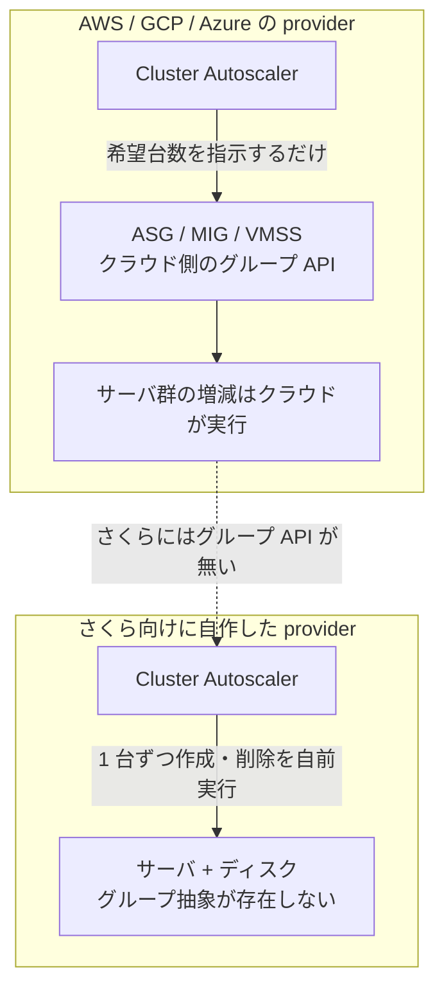

## はじめに

自前 k3s の [Cluster Autoscaler](https://github.com/kubernetes/autoscaler/blob/master/cluster-autoscaler/FAQ.md) を AWS / GCP / Azure の3クラウドで keyless に動かす構成は、本シリーズの別記事「自前 k3s の Cluster Autoscaler を 3 クラウドで keyless に動かす（`021-multicloud-cluster-autoscaler-keyless-k3s`）」で扱いました。その記事では「OCI・Sakura は対象外」と断りましたが、本記事はその積み残しのうち、さくらのクラウド向けの Cluster Autoscaler provider を**自作する話**です。さくらには後述のとおりオートスケールの土台となるグループ抽象が無いため、provider 自身がサーバを作成・削除する設計になります。実装は upstream（kubernetes/autoscaler）にも PR として出しました。

さくらのクラウドには AWS の Auto Scaling Group（ASG）や GCP の Managed Instance Group（MIG）に相当する「グループを 0→N に伸縮させる」プリミティブがありません。そのため、既存の多くの provider のように ASG/MIG/VMSS を薄くラップする方式は使えず、**Cluster Autoscaler 自身がサーバとディスクを1台ずつ作成・削除する**方式（[Hetzner Cloud provider](https://github.com/kubernetes/autoscaler/tree/master/cluster-autoscaler/cloudprovider/hetzner) と同型）で実装します。

- 想定読者: Kubernetes の Cluster Autoscaler と Go、クラウドの IaaS API を触ったことのある中級者
- 前提環境: オンプレの Raspberry Pi を k3s コントロールプレーンにし、さくらのクラウドのサーバを Tailscale オーバーレイで同じクラスタに join させるハイブリッド構成
- 実測データ・タイムラインは筆者環境（2026-08 時点）で取得したもので、読者環境では結果が異なる場合があります。API キー・スタートアップスクリプト・アカウント固有 ID は伏字（`<...>`）にしています。

:::message
本記事の文章生成・編集には AI (Anthropic Claude) を活用しています。技術的事実については、筆者が公式ドキュメントを引用して検証しています。誤りや改善点があれば、コメント等でご指摘ください。
:::

## 自作の理由(さくらに ASG 相当が無い)

Cluster Autoscaler の `CloudProvider` インターフェースは「NodeGroup（ノードのグループ）を伸縮させる」抽象で成り立っています。AWS provider は ASG、GCP provider は MIG、Azure provider は VMSS(Virtual Machine Scale Sets)をそれぞれ NodeGroup にマッピングします。つまり「グループを 0→N にする API」がクラウド側にあることが前提です。



さくらのクラウドの [API v1.1](https://manual.sakura.ad.jp/cloud-api/1.1/) にはこのグループ抽象がなく、操作単位は個々のサーバとディスクです。この場合の実装モデルが Hetzner Cloud provider で、NodeGroup の increase/decrease を受けたら **provider 自身が API でサーバを1台ずつ作成・削除**します。本記事の provider も同じ方針を採り、フォークの `cluster-autoscaler/cloudprovider/sakuracloud/` に追加しました（upstream には存在せず、公開実装も見当たらなかったため新規に実装しています）。

## 実装の骨子

provider は3ファイル構成です。

| ファイル | 役割 |
|---|---|
| `sakuracloud_cloud_provider.go` | `CloudProvider` 実装（NodeGroups の一覧、`NodeGroupForNode` 等） |
| `sakuracloud_manager.go` | さくら API を直接叩く層（サーバ/ディスクの CRUD、プラン解決） |
| `sakuracloud_node_group.go` | `NodeGroup` 実装（`IncreaseSize` / `DeleteNodes` / `TargetSize`） |

外部 SDK には依存せず、`net/http` で REST を直接叩いています。API のベースはゾーンごとに `https://secure.sakura.ad.jp/cloud/zone/<zone>/api/cloud/1.1` で、認証は API アクセストークンとシークレットの Basic 認証です。

Cluster Autoscaler がノードとグループを識別するための規約を2つ決めました。

- **providerID**: `sakuracloud://<zone>/<serverName>`。kubelet の `--provider-id` に相当する値で、サーバ名で一意化します。
- **グループ所属タグ**: `ca-group-<nodeGroupName>`。作成するサーバにこのタグを付け、一覧時にグループを逆引きします。

なお、Cluster Autoscaler の master ブランチは cloudprovider の登録方式が変わっており、`init()` 内で `builder.RegisterCloudProvider` を呼ぶ自己登録方式＋`cloudprovider/router/` の blank import に変わっています（[router パッケージの README](https://github.com/kubernetes/autoscaler/blob/master/cluster-autoscaler/cloudprovider/router/README.md) がこの方式を説明しており、共通パッケージも [master の go.mod](https://github.com/kubernetes/autoscaler/blob/master/cluster-autoscaler/go.mod) が参照する `sigs.k8s.io/cluster-autoscaler/pkg/*` に移動しています。いずれも 2026-09 時点の master を参照）。PR はこの新方式に合わせています。

## ノード作成の API フロー(実測)

`IncreaseSize` で1台増やすときの API 呼び出しは次の順序です。順序と待ち合わせが重要で、ここに実測で判明した癖が集中します。

```go
// 1. ディスク作成 → available になるまで待つ
//    (POST /disk。作成直後は Status=available まで使えない)
diskID := createDisk(...)
waitDiskAvailable(diskID)

// 2. サーバ作成。ServerPlan は「プラン ID」ではなく CPU/MemoryMB 指定
doRequest("POST", "/server", map[string]any{
    "Server": map[string]any{
        "Name":              name,
        "ServerPlan":        map[string]any{"CPU": core, "MemoryMB": memGB * 1024},
        "Tags":              []string{"ca-group-" + group},
        "ConnectedSwitches": []map[string]any{{"Scope": "shared"}},
    },
})

// 3. ディスク接続 + hostname / スタートアップスクリプト注入
doRequest("PUT", "/disk/"+diskID+"/to/server/"+serverID, nil)
doRequest("PUT", "/disk/"+diskID+"/config", map[string]any{
    "HostName": name,
    "Notes":    []map[string]any{{"ID": "<startup-note-id>"}},
})

// 4. config 書き込みでディスクが「変更中」に戻るので、再び available を待つ
//    (待たずに power on すると 409 disk_is_not_available)
waitDiskAvailable(diskID)

// 5. 電源 ON (PUT /server/:id/power)
doRequest("PUT", "/server/"+serverID+"/power", nil)
```

サーバ作成の [`POST /server`](https://manual.sakura.ad.jp/cloud-api/1.1/server/index.html) は、公式ドキュメントでも `ServerPlan` を `{"CPU": 2, "MemoryMB": 4096, ...}` のように**リソース値で指定する形**が示されています。ディスクは [`POST /disk`](https://manual.sakura.ad.jp/cloud-api/1.1/disk/index.html) で作成し、公式に「作成直後は Status が available になるまで利用できません」とあるとおり、次の操作前に available を待ちます。hostname やスタートアップスクリプトの注入は [`PUT /disk/:diskid/config`](https://manual.sakura.ad.jp/cloud-api/1.1/disk/index.html) で行います。

## さくら API の癖(実測)

公式ドキュメントに沿って実装しても、実際に動かして初めて分かった挙動が5つありました。

| # | 実測した挙動 | 対処 |
|---|---|---|
| 1 | サーバ作成でプランを ID 指定すると 400 になる | `ServerPlan` を CPU/MemoryMB のリソース値で指定する（公式もこの形を提示） |
| 2 | `PUT /disk/:id/config` の直後にディスクが「変更中」に戻り、すぐ電源 ON すると 409 `disk_is_not_available` | config の後にもう一度 available を待ってから電源 ON する |
| 3 | サーバ一覧のレスポンスに電源状態が含まれない | 削除時は常に強制停止を先行し、既に停止済みで返る 409 `power_must_be_down` は無視する |
| 4 | 外部 IdP との OIDC federation が無い（AWS/GCP/Azure のような keyless ができない） | 静的な API キー（トークン/シークレット）を Secret で渡す |
| 5 | 途中で失敗するとサーバ/ディスクが残ることがある | `ca-group-<ノードグループ名>` タグと `<ノードグループ名>-<乱数>` のサーバ命名で棚卸しできるようにする |

癖 2 は、公式の「起動中のサーバのディスクの書き換えはできません」「作成直後は available まで利用できません」という記述の裏返しで、config 書き込みもディスクを一時的に available でない状態にする、という実測です。癖 3 の強制停止は、公式のサーバ電源オフ [`DELETE /server/:id/power`](https://manual.sakura.ad.jp/cloud-api/1.1/server/index.html) が `Force: true` を受け付けることに対応します。削除自体は [`DELETE /server/:id`](https://manual.sakura.ad.jp/cloud-api/1.1/server/index.html) に `WithDisk` でディスク ID を渡し、サーバとディスクを一括削除します。

癖 4 は他の3クラウドとの大きな違いです。AWS/GCP/Azure では自前 OIDC issuer で keyless にできましたが（別記事 `021`）、さくらは静的 API キーが必要でした。

## 検証(KEDA → Cluster Autoscaler → さくら 0→1→0)

作った provider を実クラスタに載せ、スケールの全チェーンが通ることを確認しました（2026-08 実施）。

1. KEDA でスケール条件を満たすと `nodeSelector` 付きの pending pod が生まれます。
2. Cluster Autoscaler が対応する NodeGroup を 0→1 と判断し、上記フローでさくらにサーバを作成します（作成〜電源 ON まで実測で約7分）。
3. サーバ起動時にスタートアップスクリプトが Tailscale 参加と k3s join を実行し、ノードがクラスタに現れて pending pod がそこに載り Running になります。
4. スケール条件が解消されると、Cluster Autoscaler が該当サーバを [`DELETE /server/:id`](https://manual.sakura.ad.jp/cloud-api/1.1/server/index.html)（`WithDisk`）でディスクごと削除し、さくら側のサーバ台数が 0 に戻ります。

作成から削除まで一連が自動で完了し、さくらのコントロールパネル上でもサーバが 0→1→0 と推移することを確認しました。流れを時系列にするとこうなります。

```text
KEDA 発火       → nodeSelector 付き pending pod が発生
CA が 0→1 判断  → ディスク作成 → available 待ち → サーバ作成 → config → available 待ち → 電源 ON
(実測 約 7 分)  → 起動スクリプトが Tailscale 参加 + k3s join
ノード出現      → pending pod が新ノードに配置され Running
条件解消        → CA が DELETE /server/:id(WithDisk)→ さくら側のサーバ台数 0 に復帰
```

## upstream に出す

実装は kubernetes/autoscaler に PR として提出しました。

| PR | 内容 |
|---|---|
| [#10146](https://github.com/kubernetes/autoscaler/pull/10146) | sakuracloud provider の新規追加（provider 本体 + テスト + OWNERS + README + FAQ） |
| [#10145](https://github.com/kubernetes/autoscaler/pull/10145) | 混在 providerID で GCE provider が停止する不具合の修正（ハイブリッド構成で他クラウドのノードが混ざると顕在化） |

新規 provider を upstream に入れる場合、その provider の継続的なメンテナンス（Cloudprovider Maintenance Request の枠組み）を担う前提になります。レビューの過程で SIG Autoscaling の合意が要る点も、社内利用のフォーク運用とは異なる部分です。

## まとめ

- さくらのクラウドには ASG/MIG 相当が無いため、Cluster Autoscaler provider は Hetzner 型（provider 自身がサーバ+ディスクを作成・削除）で実装しました。
- ノード作成は「ディスク作成→available 待ち→サーバ作成（プランは CPU/MemoryMB 指定）→ディスク接続・config→**再度 available 待ち**→電源 ON」の順で、待ち合わせを省くと [`disk_is_not_available`](https://manual.sakura.ad.jp/cloud-api/1.1/disk/index.html) で失敗します。
- 実測で判明した癖（プラン ID 400 / config 後の再 available 待ち / 一覧に電源状態が無い / OIDC federation 無し / 中断時の残存）を対処に落とし込みました。
- KEDA→Cluster Autoscaler→さくらの 0→1→0 を実機で確認し、実装を upstream に PR しました。

## 参考

- [さくらのクラウド API v1.1 ドキュメント](https://manual.sakura.ad.jp/cloud-api/1.1/)
- [さくらのクラウド API: サーバ関連](https://manual.sakura.ad.jp/cloud-api/1.1/server/index.html)
- [さくらのクラウド API: ディスク関連](https://manual.sakura.ad.jp/cloud-api/1.1/disk/index.html)
- [さくらのクラウド API: 商品関連（プラン）](https://manual.sakura.ad.jp/cloud-api/1.1/product/index.html)
- [Cluster Autoscaler FAQ / cloudprovider](https://github.com/kubernetes/autoscaler/blob/master/cluster-autoscaler/FAQ.md)
- [Cluster Autoscaler: Hetzner cloudprovider（実装モデル）](https://github.com/kubernetes/autoscaler/tree/master/cluster-autoscaler/cloudprovider/hetzner)
- [PR #10146: add SAKURA cloud (sakuracloud) cloud provider](https://github.com/kubernetes/autoscaler/pull/10146)
- provider 実装（フォーク）: [github.com/shinichitazawa/autoscaler](https://github.com/shinichitazawa/autoscaler)（`cluster-autoscaler-1.35.0` ツリー）
- 検証時の構成ファイル: [k8s-deploy-public/netobserv 配下の検証フィクスチャ](https://github.com/shinichitazawa/k8s-deploy-public/tree/main/netobserv)（[k8s-deploy-public](https://github.com/shinichitazawa/k8s-deploy-public) の main 時点。API キー等の環境固有値はダミーに置換済み）
