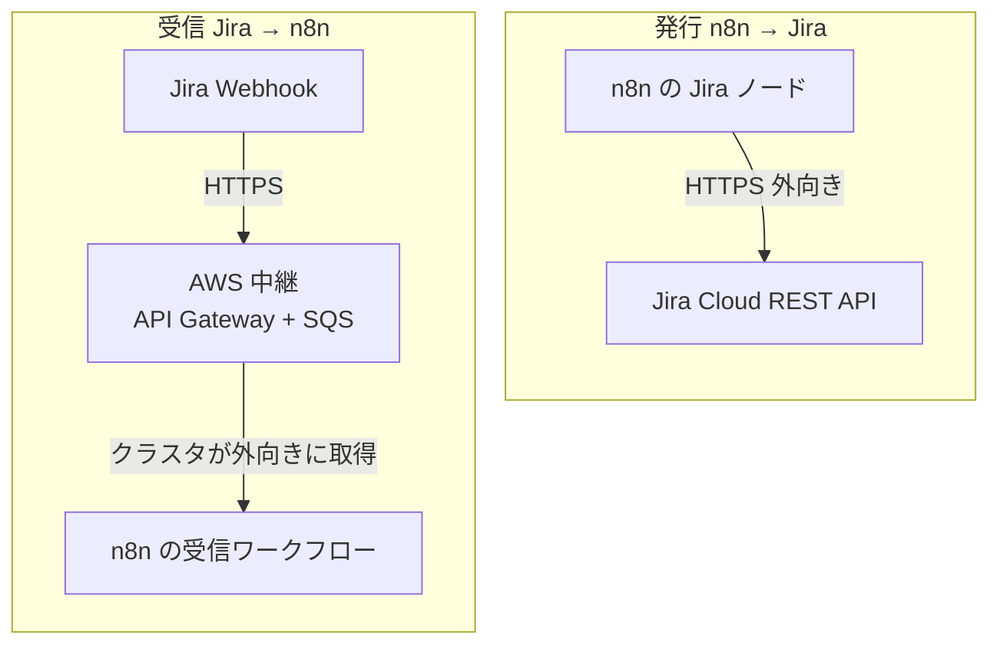
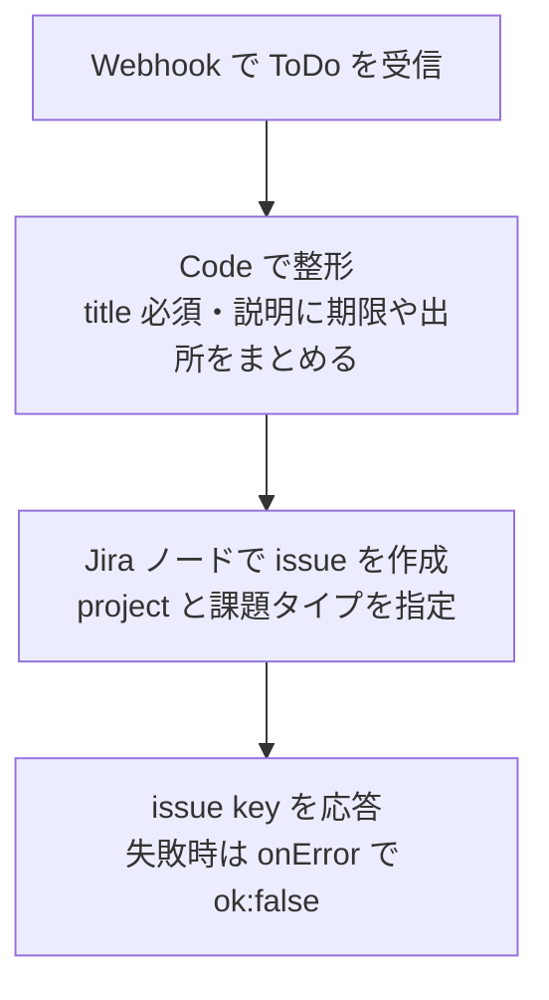
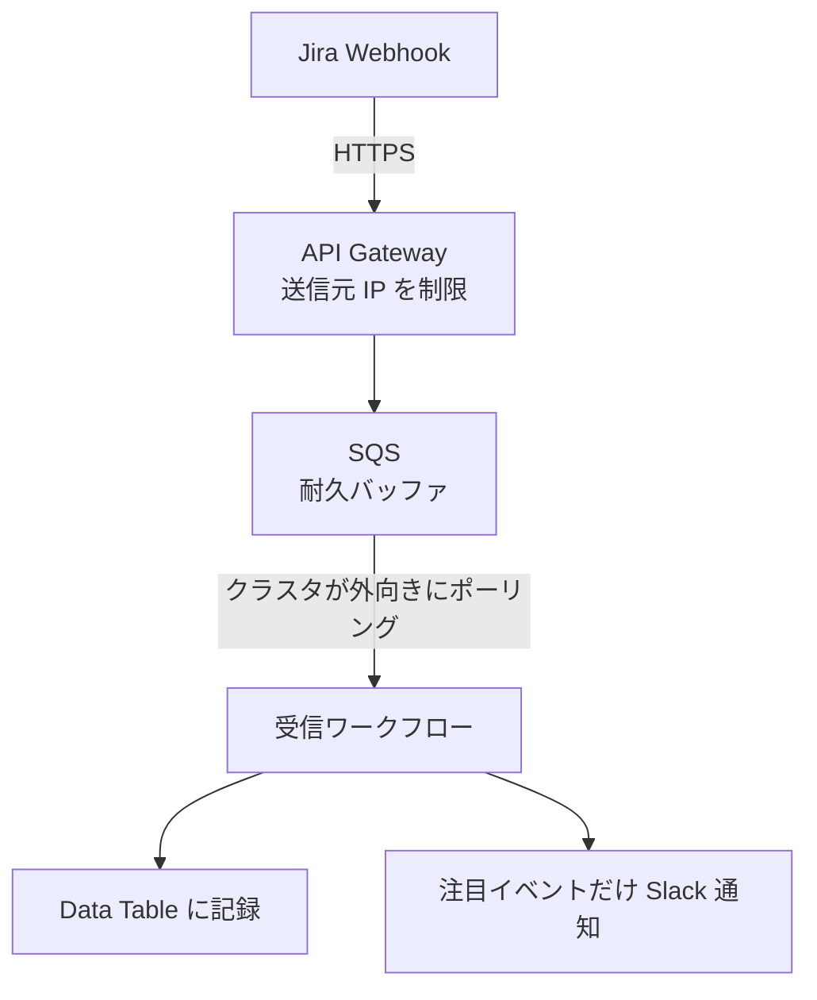

## はじめに

セルフホストの n8n を業務ワークフローの土台に使う検証を続けています。今回は **n8n と Jira Cloud を双方向でつなぐ**構成を作り、実際に issue の起票と受信まで確認しました。

ポイントは方向によって設計が変わることです。

- **発行(n8n → Jira)**: n8n から Jira の API を叩くだけ。外向き通信なので追加の経路は不要
- **受信(Jira → n8n)**: Jira の Webhook はインターネットから飛んでくるため、そのまま受けると自宅クラスタに着信経路を開けることになる。これを避ける中継設計にしました

- 検証環境: セルフホスト n8n 2.33.3 / Kubernetes(Raspberry Pi コントロールプレーン + マルチクラウド)
- 実測はすべて筆者環境(2026-08 時点)

:::message
本記事の文章生成・編集には AI (Anthropic Claude) を活用しています。技術的事実については、筆者が公式ドキュメントを引用して検証しています。誤りや改善点があれば、コメント等でご指摘ください。
:::

## 全体設計

発行と受信で経路が非対称になります。

発行は外向きの API 呼び出しで完結します。受信側だけ、着信をクラスタに直接向けない工夫が要ります(後述)。

## 発行: n8n から Jira issue を起票する

n8n には Jira Software ノードがあり、issue の作成・更新・遷移・コメントなどを扱えます([n8n 公式ドキュメント](https://docs.n8n.io/integrations/builtin/app-nodes/n8n-nodes-base.jira/))。認証は API トークン(メールアドレス + トークン)か OAuth2 を選べます([Jira credentials](https://docs.n8n.io/integrations/builtin/credentials/jira/))。個人のセルフホスト用途なら API トークンが簡単です。

作ったワークフローはこの形です。

会議から抽出した ToDo や、契約レビューの結果を、Slack 投稿の代わりに Jira issue として起票する出口に使えます。外向き API のみなので、着信経路は不要です。

実測では、`{title, description, due_on, source}` を送ると Jira Cloud に issue が作成され、issue key が返りました(検証用プロジェクトに実際に 2 件作成し、いずれも成功)。

:::message
掲載にあたり、Jira のサイト名・プロジェクト・issue key は例示用の値に置き換えています。結果はこれらの文字列の中身に依存しません。
:::

## 受信: Jira の Webhook を「穴を開けずに」受ける

Jira Cloud の Webhook は、[公式ドキュメント](https://developer.atlassian.com/cloud/jira/platform/webhooks/)のとおり HTTPS のコールバックで、イベント発生時に登録先 URL へ POST を送ります。

> A webhook is a user-defined callback over HTTPS.
>
> — [Webhooks — Atlassian Developer](https://developer.atlassian.com/cloud/jira/platform/webhooks/)

登録は管理 UI・REST API・Automation のいずれでもでき、`jira:issue_created` や `jira:issue_updated` などのイベントを送れます。ただし**受け口はインターネットから到達できる HTTPS でなければなりません**。これは、自宅 Kubernetes クラスタにインターネット側からの着信経路を作ることを意味します。

そこで、別記事「n8n 検証環境の通信要件を洗い出して Cilium ポリシーで固める」(`029-n8n-k8s-network-requirements-cilium`)で GitHub イベント用に組んだ中継をそのまま使いました。**Jira の Webhook を AWS 側(API Gateway + SQS)で受け、クラスタは外向きにキューを取りに行く**構成です。クラスタへの着信経路はゼロのままになります。

受信ワークフローは、**Jira の生 Webhook 形式と、中継を挟んだ封筒形式の両方を受理**できるようにしました。これで「まず tailnet 内で直接叩いて動作確認 → 本番は中継経由」と段階を踏めます。

整形処理は決定的な抽出だけを行います。issue key・要約・ステータス・担当者・ブラウズ URL を取り出し、`jira:issue_created` か、ステータスが完了・Done・クローズ・Closed になった場合だけ Slack に通知します。

## 検証結果(2026-08 時点)

- **発行**: API トークンの資格情報を接続し、検証用プロジェクトに issue を実際に起票。連続作成も成功
- **受信**: 生 Webhook 形式(`jira:issue_created`)と封筒形式(`jira:issue_updated`・ステータス Done)の両方を投入し、いずれも正しく整形・記録され、通知判定(作成と完了は通知対象)まで動作
- **既知の改善点**: 発行ワークフローで `title` が空のときは Code ノードが例外を投げ、Webhook 応答が HTTP 500 になりました。入力検証は専用の分岐にして 400 を返す方が親切です

## まとめ

1. n8n と Jira の連携は方向で設計が変わります。発行(n8n → Jira)は外向き API だけで完結し、追加経路は不要です
2. 受信(Jira → n8n)は、Webhook が[インターネット到達可能な HTTPS を要求する](https://developer.atlassian.com/cloud/jira/platform/webhooks/)ため、そのまま受けるとクラスタに着信経路を開けることになります
3. 受信は AWS 中継(API Gateway + SQS)に載せ、クラスタは外向きにキューを取りに行くことで、着信経路ゼロを維持できます。GitHub 用に作った中継をそのまま流用できました
4. 受信ワークフローを生 Webhook と封筒の両対応にしておくと、直結テストと本番中継を同じ実装で回せます

## 参考

- [Webhooks — Atlassian Developer](https://developer.atlassian.com/cloud/jira/platform/webhooks/)
- [Jira Software node — n8n Docs](https://docs.n8n.io/integrations/builtin/app-nodes/n8n-nodes-base.jira/)
- [Jira credentials — n8n Docs](https://docs.n8n.io/integrations/builtin/credentials/jira/)
- [The Jira Cloud platform REST API](https://developer.atlassian.com/cloud/jira/platform/rest/v3/)
