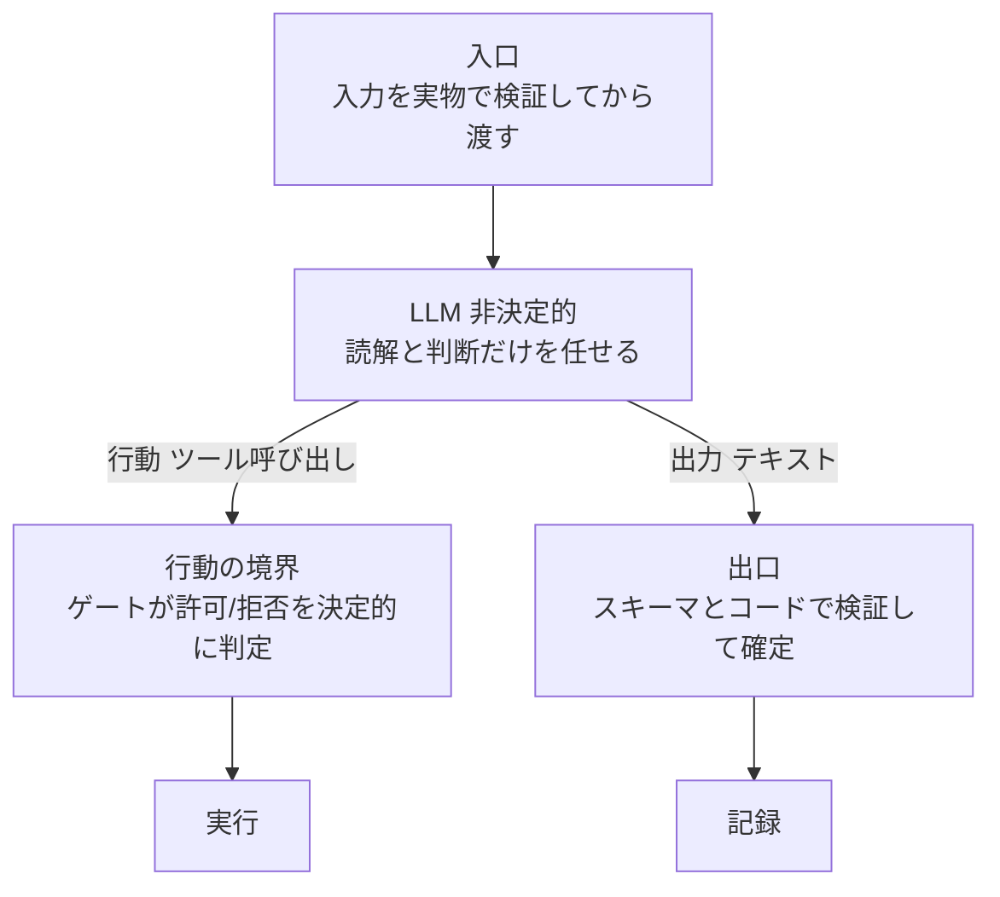

## はじめに

AI エージェントを業務に組み込むとき、まず直面する問いがあります。**出力が毎回変わる(非決定的な)プログラムに、どうやって決定的な制限をかけるのか**です。

**LLM そのものを決定的にすることはできません**。できるのは、LLM を決定的な殻で包むことです。制限をかける場所は LLM の中ではなく、**その境界**です。

本記事は、セルフホスト n8n での業務ワークフロー検証と、AWS の時系列ポリシー言語 Dogwood の実測(別記事 `030-dogwood-temporal-policy-vs-n8n-guard`)を通じて整理した、「非決定的な実行を決定的に囲い込む」設計の考え方をまとめます。特定の製品の使い方ではなく、方針の記録です。

:::message
本記事の文章生成・編集には AI (Anthropic Claude) を活用しています。技術的事実については、筆者が公式ドキュメントを引用して検証しています。誤りや改善点があれば、コメント等でご指摘ください。
:::

## 発想の転換: 中ではなく境界に枷をかける

LLM の推論そのものは非決定的で、内部を直接制約することはできません。そこで、**結果を伴う行動が、必ず決定的なチェックを通る**ようにします。チェックを置く境界は 3 つです。



非決定性は「消す」のではなく「囲い込む」。この視点で 3 つの境界を順に見ます。

## 境界 1: 入口 — 何を読ませるかを固定する

AI に渡す前に、入力を決定的に検証します。空の本文、判読できない画像、想定外の形式を、AI に渡す前のコードで弾きます。非決定性の材料そのものを絞る段階です。

実務では、RSS の本文が空でも AI は「それらしい要約」を作ってしまいます。入口で弾かないと、下流の処理すべてがその誤った入力を前提に進みます。

## 境界 2: 行動 — ツール呼び出しをゲートで判定する

この境界では、**エージェントは「何を実行したいか」を提案するだけ**にし、実際に実行されるかは、LLM のコード外にある**ゲートの決定的な判定**が決めます。

- LLM がどんな理由で「この操作をする」と言っても、ゲートは定められた条件だけを見て許可・拒否する
- **デフォルト拒否**: 許可ルールに合致しない要求はすべて拒否する
- **全決定の記録**: 許可・拒否のすべてを監査ログに残す
- **LLM の実装の外側で評価する**: ゲートはエージェントのコードやプロンプトに依存しない。だから **エージェントの不具合やプロンプトインジェクションがあっても、ゲートは迂回できない**

ポリシー言語で言うと、[Cedar](https://docs.cedarpolicy.com/) は「今この 1 回の呼び出し」を判定します。ただし Cedar は一時点の判定で、過去の呼び出し履歴を参照する構文を持ちません([Cedar 認可モデル](https://docs.cedarpolicy.com/auth/authorization.html))。「30 日以内に承認があること」のような**行動の並び**を条件にしたい場合は、履歴を扱える仕組みが要ります。

この用途に使えるのが、AWS が OSS 化した [Dogwood](https://aws.amazon.com/blogs/opensource/introducing-dogwood-runtime-verification-for-ai-agents/) です。Cedar の上位互換で、`formerly`(過去に該当イベントがあったか)などの時系列演算子を足し、**呼び出しの系列**に条件をかけられます。評価はエージェントの外、すべてのツール呼び出しが通るゲートで行われます。

### 実測で確認した効果

別記事「AWS の時系列ポリシー言語 Dogwood を実測して自作の状態遷移ガードと判定を突き合わせる」(`030-dogwood-temporal-policy-vs-n8n-guard`)で、同じ履歴に対して 2 通りの実装を比較しました。「30 日以内か」の判定を**アプリのコードに持たせた場合**(フラグを計算して渡す)と、**ポリシー側に持たせた場合**(履歴から評価器が判定する)です。

ポリシーの形で書くと、Cedar 型は `permit(...) when { context.ready_within_30d == true }` のようにアプリが計算したフラグを条件にし、Dogwood 型は `permit(...) when temporal { formerly within 30d MarkReady::response{...} }` のように評価器が履歴そのものを条件にします。アプリのフラグ計算にバグ(窓を 60 日と誤実装)があると、同一の履歴・同一の要求で判定が割れました。

```text
Cedar 流(アプリのフラグを信じる)   → ALLOW = 誤許可
Dogwood(履歴から評価器が判定する) → DENY  = 正しい判定
```

差が生まれた理由は、**ガードの実体がポリシーの外(アプリコード)にあると、そのバグがそのまま判定を誤らせる**からです。ガードをポリシー側=エージェントの外に移すと、アプリの不具合に依存せず制限を保証できます。これが「行動の境界に枷をかける」ことの要点です。

## 境界 3: 出口 — 出力をコードで検証して確定する

エージェントの出力(テキスト)も、そのまま採用しません。**AI は読解と判断だけ、その結果をコードが検証してから確定**します。実務で効いた検証はこの種類です。

- 構造化出力とスキーマで、非決定的なテキストを型に押し込み、合わなければ捨てる
- AI が付けた引用が原文に実在するかを、一致率で照合する(捏造を弾く)
- 金額・日付・版数比較・状態遷移の正当性は、AI に判断させずコードで確定する
- どうしても判定できないものは needs_review フラグで人間に回し、黙って通さない

非決定的な出力を、決定的な検証層で受け止める段階です。

## なぜ「境界」に置くのか

3 つに共通するのは、**制限が LLM の実装の外にある**ことです。もし制限をエージェントのプロンプトや内部ロジックに埋め込むと、モデル出力のゆらぎ・バグ・注入攻撃によって破られ得ます。境界に置けば、中で何が起きても、結果を伴う行動は必ず決定的なチェックを通ります。

- Dogwood / [AgentCore Policy](https://aws.amazon.com/blogs/machine-learning/control-agent-behaviors-and-cost-beyond-a-single-action-new-capabilities-in-amazon-bedrock-agentcore/) は、境界 2(行動)をエージェントの外で強制する仕組み
- 入口の検証と出口のコード検証は、ワークフロー側(n8n など)で決定的に組む

## まとめ

1. LLM そのものは決定的にできません。制限は LLM の中ではなく、**入口・行動・出口の 3 つの境界**にかけます
2. 行動の境界(ツール呼び出しの許可・拒否)は、エージェントの実装の外に置きます。外に置けば、不具合や注入攻撃があっても迂回されません
3. Cedar は一時点、Dogwood は行動の系列を判定できます。「承認から N 日以内なら実行可」のような時間条件は Dogwood 型が向きます
4. 出口では、構造化出力・引用の実在照合・決定的な計算で、非決定的な出力を受け止めます
5. 非決定性は消すものではなく囲い込むもの。すべての**結果を伴う行動**が、いずれかの境界で決定的なチェックを通る状態を作るのが設計の目標です

## 参考

- [Cedar policy language](https://docs.cedarpolicy.com/)
- [Cedar authorization model](https://docs.cedarpolicy.com/auth/authorization.html)
- [Introducing Dogwood: runtime verification for AI agents — AWS Open Source Blog](https://aws.amazon.com/blogs/opensource/introducing-dogwood-runtime-verification-for-ai-agents/)
- [Control agent behaviors and cost beyond a single action — AWS Machine Learning Blog](https://aws.amazon.com/blogs/machine-learning/control-agent-behaviors-and-cost-beyond-a-single-action-new-capabilities-in-amazon-bedrock-agentcore/)
