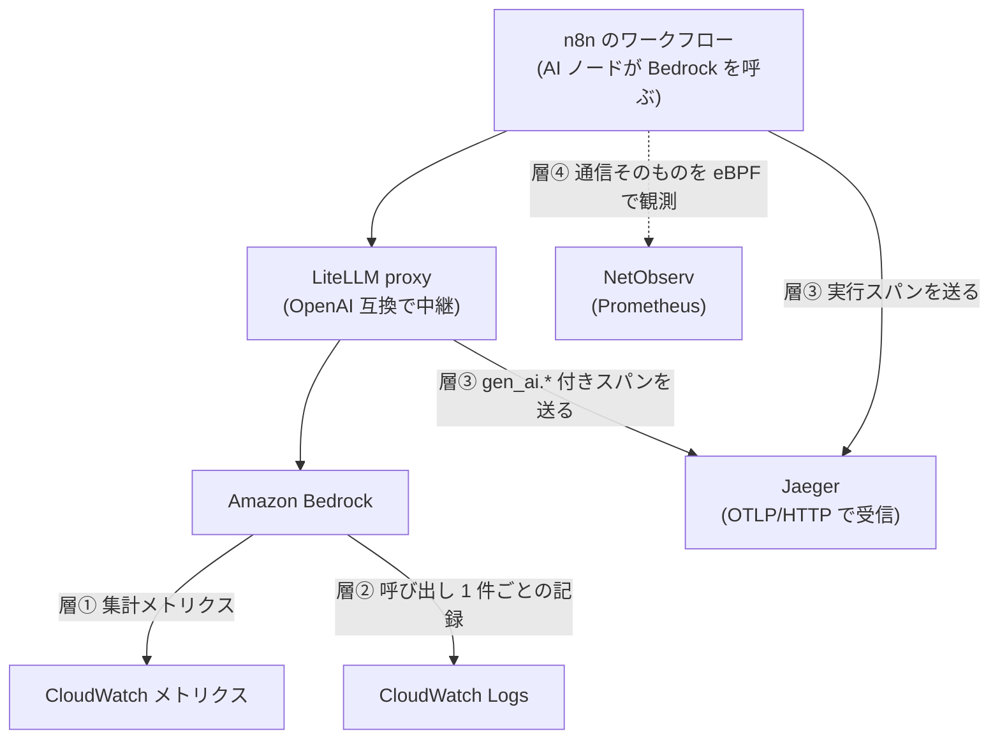

## はじめに

自前の k3s クラスタで n8n のワークフローが Amazon Bedrock を呼んでいます。異常検知の診断文を Nova Lite に書かせ、過去インシデントの埋め込みを Titan で作る、といった使い方です。運用を続けるうちに「今月いくら使ったのか」「どのワークフローが呼んでいるのか」「遅いのはモデルか経路か」を知りたくなりましたが、最初に用意した CloudWatch メトリクスのダッシュボードでは、そのどれにも答えられませんでした。

本記事は、LLM 呼び出しについて **何がどの層で観測できるか** を 4 つの層に分けて実測した記録です。層ごとに「分かること」と「分からないこと」がはっきり分かれ、足りない層を足すたびに見えるものが変わりました。

- 想定読者: LLM をアプリケーションから呼んでいて、コストや失敗の原因を追える状態にしたい方
- 検証環境: Raspberry Pi 5 を k3s コントロールプレーンにし、クラウドの VM を Tailscale で参加させたハイブリッドクラスタ。n8n 2.33.3(queue モード: main 1 + worker 2)、Jaeger all-in-one 1.60、Grafana 11.6.0、LiteLLM `main-stable`、モデルは Bedrock の Nova Micro / Nova Lite / Titan Embeddings V2(いずれも ap-northeast-1)
- 実測値・タイムラインは筆者環境で 2026-09 に取得したものです

:::message
本記事の文章生成・編集には AI (Anthropic Claude) を活用しています。技術的事実については、筆者が公式ドキュメントを引用して検証しています。誤りや改善点があれば、コメント等でご指摘ください。
:::

## 観測の 4 層

同じ 1 回の LLM 呼び出しについて、次の 4 か所にそれぞれ違う情報が残ります。

| 層 | 何が分かるか | 粒度 |
|---|---|---|
| ① CloudWatch メトリクス | 呼び出し数、入出力トークン、レイテンシ(平均・p90・p99)、エラー数 | 1 分の集計、モデル別 |
| ② Bedrock の呼び出しログ | 1 呼び出しごとの requestId・モデル・トークン数・呼び出し元・失敗理由 | 呼び出し 1 件 |
| ③ OpenTelemetry のスパン | 呼び出しがアプリのどの処理の中で起きたか、処理内の内訳 | スパン |
| ④ ネットワークの flow | クライアントから外部エンドポイントへの実流量・RTT・再送・ドロップ | flow |



## 層① CloudWatch メトリクス — 集計は分かるが、内訳は分からない

Bedrock は `AWS/Bedrock` 名前空間にメトリクスを自動で出します([Amazon Bedrock の CloudWatch メトリクス](https://docs.aws.amazon.com/bedrock/latest/userguide/monitoring-cw.html))。筆者環境で実際に発行されていたのは次の 6 種で、ディメンションは `ModelId` だけでした(2026-09 実測)。

```text
Invocations / InputTokenCount / OutputTokenCount
InvocationLatency / InvocationClientErrors / EstimatedTPMQuotaUsage
```

直近 7 日の集計は次のとおりです(筆者環境で実測)。

| モデル | 呼び出し | 入力トークン | 出力トークン |
|---|---|---|---|
| Nova Micro | 171 | 43,600 | 79,990 |
| Nova Lite | 81 | 76,802 | 22,727 |
| Titan Embeddings V2 | 20 | 580 | — |

単価は [AWS Price List API](https://docs.aws.amazon.com/aws-cost-management/latest/APIReference/API_pricing_GetProducts.html) から ap-northeast-1 のオンデマンド価格を取得しました(2026-09-08 取得)。Nova Micro が入力 $0.042 / 出力 $0.168(いずれも 100 万トークンあたり)、Nova Lite が $0.072 / $0.288、Titan Embeddings V2 が入力 $0.029 です。この単価で上の実測値を計算すると 1 週間で約 $0.027 でした。

この層で答えられるのは「合計いくつ・いくら・どのモデルが遅いか」までです。ディメンションが `ModelId` だけのため、**どのワークフローが呼んだのか、失敗が何のエラーだったのかは分かりません**。レイテンシの分布(p90 / p99)はこの層だけが持ち、後述の呼び出しログには含まれません。

## 層② 呼び出しログ — 1 件ごとの記録は既定で残らない

Bedrock には呼び出し 1 件ごとの記録を残す機能があり、[公式ドキュメント](https://docs.aws.amazon.com/bedrock/latest/userguide/model-invocation-logging.html)は次のように書いています。

> Model invocation logging is disabled by default. After model invocation logging is enabled, logs are stored until the logging configuration is deleted.

既定で無効なので、有効化するまで 1 件ごとの情報はどこにも残りません。有効化には CloudWatch Logs のロググループと、Bedrock が assume するサービスロール(`logs:CreateLogStream` / `logs:PutLogEvents`)が必要です。

ここで注意したいのが、この機能はプロンプトと応答の本文も保存できる点です。本文の配信はモダリティごとに切り替えられるため、筆者はすべて無効にしました。

```bash
aws bedrock put-model-invocation-logging-configuration --region ap-northeast-1 --logging-config '{
  "cloudWatchConfig": {"logGroupName": "/aws/bedrock/modelinvocations",
                       "roleArn": "arn:aws:iam::111111111111:role/ack/bedrock-invocation-logging-role"},
  "textDataDeliveryEnabled": false, "imageDataDeliveryEnabled": false,
  "embeddingDataDeliveryEnabled": false, "videoDataDeliveryEnabled": false }'
```

この設定でも、メタデータとトークン数は記録されます。実際に残ったレコードです(筆者環境で実測。本文は含まれていません)。

```json
{"timestamp":"2026-09-08T12:10:33Z","accountId":"111111111111","region":"ap-northeast-1",
 "requestId":"00000000-0000-0000-0000-000000000000","operation":"Converse",
 "modelId":"apac.amazon.nova-micro-v1:0",
 "input":{"inputContentType":"application/json","inputTokenCount":1},
 "output":{"outputContentType":"application/json","outputTokenCount":8},
 "identity":{"arn":"arn:aws:sts::111111111111:assumed-role/..."},
 "schemaType":"ModelInvocationLog","schemaVersion":"1.0"}
```

有効化した直後、この層のおかげで 1 つ問題が見つかりました。n8n の keyless ロールから `jp.anthropic.claude-haiku-4-5-20251001-v1:0` を呼ぶ処理が `ResourceNotFoundException` で 5 件失敗していたのです。失敗したレコードは `input` と `output` が空で、代わりに `errorCode` が入ります。層①のメトリクスでは `InvocationClientErrors` が数件ある、というところまでしか分からず、モデルも理由も特定できませんでした。

この層の制約は 2 つあります。1 つは**レイテンシがレコードに含まれない**こと(上記の公式ドキュメントのフィールド一覧に無く、筆者環境のレコードにもありません)。もう 1 つは、CloudWatch Logs Insights のクエリで**識別子に非 ASCII を使えない**ことです。列名を日本語にしようとしたところ `MalformedQueryException: token recognition error` になりました(筆者環境で実測)。集計の別名は ASCII にして、表示名はダッシュボード側で付け替えています。

## 層③ スパン — 呼び出しが「どの処理の中で」起きたか

ここまでの 2 層は Bedrock 側の記録です。アプリケーション側から見て「ワークフローのどこで LLM を呼び、その前後で何をしていたか」を知るにはトレースが要ります。

### n8n 内蔵の OpenTelemetry

n8n は 2.19.0 から OpenTelemetry に対応していて、環境変数だけで有効化できます([公式ドキュメント](https://docs.n8n.io/deploy/host-n8n/configure-n8n/basic-configuration/use-environment-variables/opentelemetry/))。既定値は `N8N_OTEL_EXPORTER_OTLP_ENDPOINT` が `http://localhost:4318`、`N8N_OTEL_TRACES_INCLUDE_NODE_SPANS` が `true`、`N8N_OTEL_TRACES_PRODUCTION_ONLY` が `true` です。公式は出力されるスパンを次のように説明しています。

> One span per workflow execution. It records the workflow ID, name, version, node count, execution mode, status, and any error type.

> One span per node execution, nested inside its workflow span. It records the node ID, name, type, version, and the number of input and output items.

有効化すると、確かにワークフロー実行のスパンが届きました。ただし属性は `n8n.*` の系統だけで、モデル名やトークン数はどこにもありません。


*n8n 単体のトレース。Total Spans は 1 で、属性は `n8n.*` のみ。モデル名・トークン数・コストは含まれない(筆者環境で実測)*

ノード単位のスパン(`node.execute`)は、**main インスタンスが実行するワークフローでは観測できました**。ノード名・ノード種別・所要時間が個別のスパンになり、どのノードで時間を使ったかが分かります(筆者環境では 15 ノードのワークフローで 15 スパン)。

一方、筆者の定期実行ワークフローは queue モードで worker が実行するため、ここでは実行スパンしか得られませんでした。公式ドキュメントは「In queue mode, the OpenTelemetry variables must be set on all instances.」「In queue mode, workers read the parent trace context from the database.」と説明しており、main と worker の両方に環境変数を設定し、worker から OTLP エンドポイントへ到達できることも確認しています。それでも `service.name` を `n8n-worker` にしたトレースは 1 件も届かず、worker が実行した分のノードスパンは観測できませんでした。**原因は特定できていません(※未解決)。** 定期実行のワークフローでノード単位の内訳を見たい場合は、この点を先に確認することをおすすめします。

なお n8n 2.33.0 からは AI エージェント実行のスパンも追加されており、公式は「These spans use the OpenTelemetry GenAI semantic conventions (`gen_ai.*` attributes)」と説明しています。筆者のワークフローは AI Agent ノードではなく Basic LLM Chain を使っているため、この対象外でした。

### LiteLLM を経由させる

LLM 呼び出しそのものを詳細に見るには、呼び出しを中継する層を挟む方法があります。[LiteLLM](https://docs.litellm.ai/docs/observability/opentelemetry_integration) は設定 1 行(`litellm_settings.callbacks: ["otel"]`)で OpenTelemetry の GenAI セマンティック規約に沿ったスパンを出します。

同じ Bedrock 呼び出しを LiteLLM 経由にすると、1 回の呼び出しが 6 スパンに分解されました。


*LiteLLM 経由のトレース。Total Spans は 6。中心の `litellm_request` スパンに `gen_ai.*` 属性が付き、`gen_ai.cost.total_cost` まで計算されている(筆者環境で実測)*


*同じスパンのトークン属性。プロバイダ(`gen_ai.system=bedrock`)・要求モデル・入出力トークンが 1 スパンに揃う(筆者環境で実測)*

属性は OpenTelemetry の [GenAI セマンティック規約](https://opentelemetry.io/docs/specs/semconv/gen-ai/)に沿った名前で、`gen_ai.system` / `gen_ai.request.model` / `gen_ai.usage.input_tokens` / `gen_ai.usage.output_tokens` が付きます。加えて LiteLLM 独自の `gen_ai.cost.total_cost`(この呼び出しは $0.000006549)や、経路を示す `litellm.model_group` などが載りました。

本文の扱いは環境変数で制御できます。筆者は層②と同じ方針で `OTEL_INSTRUMENTATION_GENAI_CAPTURE_MESSAGE_CONTENT=NO_CONTENT` を設定し、プロンプトと応答をスパンに載せていません。

### トレースは繋がるか

層③を入れる動機の 1 つは「アプリの処理と LLM 呼び出しを 1 本のトレースで追う」ことです。これは [W3C Trace Context](https://www.w3.org/TR/trace-context/) の `traceparent` ヘッダが呼び出し元から中継層へ伝わるかどうかで決まります。

LiteLLM 側は対応していました。`traceparent` を付けて呼ぶと、指定したトレース ID の下に 6 スパンがぶら下がります(筆者環境で実測)。

```text
$ curl -H "traceparent: 00-<32桁の trace id>-<16桁の span id>-01" -X POST .../v1/chat/completions
# → Jaeger でそのトレース ID を引くと、Received Proxy Server Request が指定した span の CHILD_OF として入る
```

一方、n8n から LiteLLM を呼んだ実行では、n8n のスパンと LiteLLM のスパンは別トレースになりました。n8n には送信時に `traceparent` を注入する設定(`N8N_OTEL_TRACES_INJECT_OUTBOUND`、既定 `true`)がありますが、筆者環境では schedule トリガー・webhook トリガーのいずれでも繋がりませんでした。どちらも queue モードで worker が実行する経路で、worker からスパンが出ない件と同じ範囲と考えられます(※未解決)。

## 層④ ネットワークの flow — モデルが遅いのか経路が遅いのか

最後の層は、そもそもの通信です。筆者環境では [NetObserv の eBPF agent](https://github.com/netobserv/netobserv-ebpf-agent) が flow を集めて Prometheus メトリクスにしています。flowlogs-pipeline の設定でどのラベルを持たせるかが決まり、筆者の構成では次のようになっています(筆者環境の設定)。

| メトリクス | 主なラベル | 使いどころ |
|---|---|---|
| `netobserv_pod_flow_bytes_total` | Src/Dst の namespace・Pod 名・Owner | Pod 単位の流量。外部宛は Dst の namespace が空になる |
| `netobserv_node_flows_total` | `SrcAddr` / `DstAddr` | 宛先 IP 単位の flow 数。外部エンドポイント別に見える |
| `netobserv_flow_rtt_seconds` | Src/Dst の Owner | TCP RTT のヒストグラム |
| `netobserv_tcp_retrans_packets_total` | Src/Dst の Owner | 再送 |

LLM の観点では、レイテンシが悪化したときに「モデル側の応答が遅いのか、経路が劣化しているのか」を切り分けるために使います。層①の `InvocationLatency` が伸びていないのに応答が遅いなら、RTT や再送を見ることになります。なお AWS のエンドポイント IP は変動し、Bedrock・STS・S3 の通信が同じ IP レンジに混ざるため、宛先 IP から用途を断定はできません。

## どの層に何を任せるか

4 層を入れてみて、知りたいことと見る場所の対応は次のように整理できました。

| 知りたいこと | 見る層 | 理由 |
|---|---|---|
| 今月いくら使ったか | ① メトリクス、または ③ LiteLLM のスパン | トークン数 × 単価。LiteLLM は `gen_ai.cost.total_cost` を自分で計算する |
| 誰(どの IAM プリンシパル)が呼んだか | ② 呼び出しログ | `identity.arn` を持つのはこの層だけ |
| 失敗した理由 | ② 呼び出しログ | `errorCode` を持つのはこの層だけ。①は件数のみ |
| レイテンシの分布 | ① メトリクス | p90 / p99 を持つのはこの層だけ |
| 1 回の呼び出しの内訳 | ③ LiteLLM のスパン | ルーティング・前処理・API 呼び出しが分解される |
| アプリのどの処理で呼んだか | ③ アプリのスパン | 実行単位までは n8n が出す |
| 遅延がモデル側か経路側か | ④ flow | RTT・再送・ドロップ |

層を足す判断は、コストと手間から見ると次のようになります。呼び出しログ(層②)は有効化するだけで、本文を配信しなければ量もわずかです。筆者環境の記録は 1 件あたり 500 バイト程度で、週 300 件なら CloudWatch Logs の取り込みは 1 円に届きません。スパン(層③)は保存先が要ります。筆者環境の Jaeger は all-in-one をメモリ保存のまま使っているため、再起動でトレースが消えます。継続的に残すなら永続化した保存先が必要です。

LiteLLM を挟むかどうかは、得られる `gen_ai.*` 属性と、中継が 1 段増えることの引き換えになります。筆者環境の実測では proxy 内の処理に約 90ms、モデル呼び出しに約 2.4 秒かかっており、比率としては小さいものでした。ただし可用性の観点では単一障害点が 1 つ増えるため、冗長化するか、障害時に直接 Bedrock へ切り替えられるようにしておく必要があります。

なお本記事の構成では、Bedrock を呼ぶ側(n8n・LiteLLM)も CloudWatch を読む側(Grafana)も、静的なアクセスキーを持っていません。self-hosted の OIDC issuer を使った IRSA 相当の仕組みで、ServiceAccount のトークンから一時credentials を得ています。層を増やしても鍵の数が増えないのは、この方式の利点でした。

## まとめ

- LLM 呼び出しの情報は 4 層に分かれて存在し、層ごとに答えられる問いが違います。集計は CloudWatch メトリクス、1 件ごとの記録は Bedrock の呼び出しログ、処理内の内訳はスパン、通信の質は flow です
- Bedrock の呼び出しログは既定で無効です。本文の配信を無効にすればメタデータとトークン数だけが残り、失敗した呼び出しの `errorCode` から原因を特定できます。実際にこれで、集計メトリクスでは分からなかった `ResourceNotFoundException` を見つけました
- n8n 内蔵の OpenTelemetry は実行スパンを出しますが、属性は `n8n.*` 系のみで `gen_ai.*` は含まれません。LiteLLM を挟むと GenAI セマンティック規約に沿った属性(モデル・トークン・コスト)が 1 スパンに揃います
- ノード単位のスパンは main が実行するワークフローでは得られましたが、queue モードで worker が実行する分は観測できず、アプリから中継層へのトレース伝播も繋がりませんでした(※未解決)。トレースを 1 本に繋ぐ前提で設計する場合は、この点を先に確認することをおすすめします

## 参考

- [Amazon Bedrock: Monitor model invocation using CloudWatch Logs and Amazon S3](https://docs.aws.amazon.com/bedrock/latest/userguide/model-invocation-logging.html) / [CloudWatch metrics for Amazon Bedrock](https://docs.aws.amazon.com/bedrock/latest/userguide/monitoring-cw.html)
- [OpenTelemetry: Semantic conventions for generative AI](https://opentelemetry.io/docs/specs/semconv/gen-ai/) / [semantic-conventions-genai リポジトリ](https://github.com/open-telemetry/semantic-conventions-genai)
- [n8n: OpenTelemetry の環境変数](https://docs.n8n.io/deploy/host-n8n/configure-n8n/basic-configuration/use-environment-variables/opentelemetry/) / [Trace executions with OpenTelemetry](https://docs.n8n.io/deploy/host-n8n/keep-n8n-running/trace-executions-with-opentelemetry/)
- [LiteLLM: OpenTelemetry integration](https://docs.litellm.ai/docs/observability/opentelemetry_integration)
- [W3C Trace Context](https://www.w3.org/TR/trace-context/)
- [NetObserv eBPF agent](https://github.com/netobserv/netobserv-ebpf-agent) / [flowlogs-pipeline](https://github.com/netobserv/flowlogs-pipeline)
