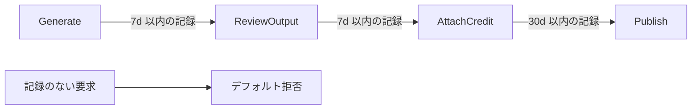

## はじめに

オープンウェイトの動画生成モデルを自前のパイプラインで動かすと、守るべき制約が急に増えます。モデルのライセンス、実行基盤の約款、そして自分で決めたコスト上限です。どれも「気をつける」で運用すると、忘れた時点で破られます。

本記事は、[MiniMax H3](https://huggingface.co/MiniMaxAI/MiniMax-H3)(オープンウェイトの動画生成モデル)をさくらの高火力 DOK 上の ComfyUI で動かす検証パイプラインに対して、遵守事項を AWS の時系列ポリシー言語 [Dogwood](https://github.com/dogwood-policy/dogwood) で記述し、`replay` で 16 シナリオを検証した記録です。ポリシーとイベントスキーマの全文、判定結果、そして検証中に見つかった時間窓の仕様も載せます。

- 想定読者: 生成 AI をパイプラインに組み込み、ライセンスや約款の遵守を運用ルールではなく仕組みで担保したい方
- 前提記事: 言語自体の比較は「Dogwood の時系列ポリシーを自作の状態遷移ガードと実測で比較する」(`030-dogwood-temporal-policy-vs-n8n-guard`)、設計方針は「AI エージェントではなく境界に枷をかける」(`033-constrain-the-boundary-not-the-agent`)で扱いました。本記事はその実装編です
- 実測環境: dogwood 1.0.0(`cargo build --release` でリポジトリからビルド、2026-09-02)、WSL2 上の Ubuntu

:::message
本記事の文章生成・編集には AI (Anthropic Claude) を活用しています。技術的事実については、筆者が公式ドキュメント・ライセンス原文・実行ログで検証しています。誤りや改善点があれば、コメント等でご指摘ください。
:::

## ライセンスが「技術的な保護措置」を要求している

出発点は、MiniMax H3 のライセンス原文です。第 V 節に、利用者側の実装義務が明記されています。

> you must, before making that product or service available and throughout its operation, implement, maintain, test, and periodically review reasonable and proportionate technical and organizational safeguards designed to prevent and mitigate access, uses, and Outputs that violate this Section V or Exhibit A
>
> — [MiniMax H3 Community License Agreement, Section V.5](https://huggingface.co/MiniMaxAI/MiniMax-H3/blob/main/LICENSE)(2026-09-09 取得)

「実装し、維持し、テストし、定期的に見直す」技術的・組織的な保護措置を求めています。ドキュメントに注意書きを書くことではなく、**動く仕組みを持つこと**が求められている、と読めます。ポリシーとして書けば、この 4 つの動詞のうち「実装」「テスト」は同時に満たせます。ポリシーファイルはそのまま仕様であり、`replay` は自動テストになるためです。

## 守る対象を 3 層に整理する

パイプラインに課される制約は、出どころの異なる 3 層に分かれていました。

| 層 | 出どころ | 具体的な制約 |
|---|---|---|
| モデルライセンス | [MiniMax H3 Community License](https://huggingface.co/MiniMaxAI/MiniMax-H3/blob/main/LICENSE) | 適用地域(§I.5)、商用製品での表示義務(§IV.2)、生成物による他モデルの学習禁止(§V.3)、地域外での利用・表示の禁止(§V.4) |
| 実行基盤の約款 | [高火力 DOK サービス約款](https://www.sakura.ad.jp/agreement/) 第 10 条 | 偽情報の蔓延・犯罪助長・差別・軍事目的での利用の禁止 |
| 自主的なコスト上限 | 自分で決めた運用ルール | 1 時間あたりの生成本数、24 時間あたりの生成本数(秒課金 GPU の暴走防止) |

ライセンス側の具体的な条文は次のとおりです。

- 適用地域は「全世界から Excluded Territories を除いたもの」で、Excluded Territories は **欧州連合・英国・韓国・米国**(§I.3、§I.5)
- 年間 2,000 万米ドルを超える収益がある商用製品・サービスは、事前の書面による許諾が必要(§IV.1)
- MiniMax H3 を使う商用製品・サービスの UI に「MiniMax H3」を目立つ形で表示すること(§IV.2)
- 生成物を他の AI モデルの改善に使ってはならない(§V.3)

一方で、生成物の権利については次のように明記されています。

> MiniMax claims no rights over the Outputs you generate. You and your users are entirely responsible for the Outputs and any subsequent use thereof.
>
> — 同ライセンス Section VI.4(2026-09-09 取得)

つまり守る対象は生成物の所有権ではなく、**利用の仕方**です。ガードレールも「誰が何をしてよいか」ではなく「どの順序で、どこへ向けて、どれだけ」を条件にすることになります。

## なぜ if 文ではなくポリシーに書くのか

同じ制限はアプリのコードでも書けます。それでもポリシーに出した理由は、`030` の実測で差が出たためです。「承認から 30 日以内か」の判定をアプリが計算してフラグで渡す実装では、そのフラグ計算にバグ(窓を 60 日と誤実装)があると、同じ履歴・同じ要求で判定が反転しました。判定材料を評価器側に置くと、アプリの不具合から独立します。

加えて、今回の制約には**行動の並び**が含まれます。「レビューを経てからクレジットを付け、そのクレジットから 30 日以内にのみ公開できる」は一時点の属性では表現できません。[Cedar](https://docs.cedarpolicy.com/) の認可は 1 リクエストに対する一時点の判定で、過去の呼び出し履歴を参照する構文を持ちません([Cedar の認可モデル](https://docs.cedarpolicy.com/auth/authorization.html))。Dogwood は Cedar の上位互換として `formerly`(過去に該当イベントがあったか)などの時系列演算子を追加しており([Introducing Dogwood](https://aws.amazon.com/blogs/opensource/introducing-dogwood-runtime-verification-for-ai-agents/))、この用途に合います。

## 設計: 順序の連鎖と、2 つの禁止

パイプラインの動作を 5 つのアクションに分けました。生成(Generate)、人間によるレビュー(ReviewOutput)、クレジット付与(AttachCredit)、公開(Publish)、学習(Train)です。

表示義務(§IV.2)は「クレジットを付けること」という単発の作業ではなく、**公開の前提条件**として構造に埋め込みます。



Cedar 系は許可ルールに合致しない要求をすべて拒否します(デフォルト拒否)。したがって「レビューを飛ばして公開」のような順序の飛び越しは、**拒否ルールを書かなくても落ちます**。明示的な `forbid` は、順序では表現できない 2 つだけです。

- 適用地域外(eu / uk / kr / us)への公開(§V.4)
- 生成物を学習データにする行為(§V.3)

## 実装

### イベントスキーマ

公開ガードが 30 日遡るため、時間窓の上限を引き上げます。既定は 24 時間で、超える窓を書くと検証時にエラーになります(`030` で実測済み)。ディレクティブはイベント宣言より前に置きます。

```text:event.dwschema
max_window = 30d

decision event <A>::request {
    ...inputs(A),
    callerPrincipal: principalType(A),
    callerResource:  resourceType(A),
    requestId:       String,
}

event <A>::response {
    ...inputs(A),
    ...outputs(A),
    callerPrincipal: principalType(A),
    callerResource:  resourceType(A),
    requestId:       String,
}
```

### ポリシー

全 6 本のうち、性格の異なる 3 本を抜粋します。まず、コスト上限と約款由来のフラグを条件にした生成の許可です。

```text:policy.dw
// 生成: フラグなしプロンプト + 暴走ブレーキ + 日次予算
@id("generate_unflagged_within_budget")
permit (
    principal,
    action == H3::Action::"Generate",
    resource
)
when { context.input.prompt_flagged == false }
when temporal {
    (count for (t: Timepoint). where (
        formerly within 1h (H3::Action::"Generate"::request{ input.asset: * } && tp(t))
    )) <= 3
    &&
    (count for (t: Timepoint). where (
        formerly within 24h (H3::Action::"Generate"::request{ input.asset: * } && tp(t))
    )) <= 6
};
```

`count for (t: Timepoint). where (... && tp(t))` は、条件に合う過去イベントを時点ごとに 1 行へまとめて数える書き方です(リポジトリ同梱の例 `alert_exactly_three_transfers` と同じ形)。`input.asset: *` のワイルドカードは「どの資産でもよい」を意味し、束縛はしません。

次に、表示義務を公開の前提にした許可です。相関条件 `input.asset: context.input.asset` が「**同じ資産についての**過去イベント」に限定します。

```text:policy.dw
// 公開: クレジット付与から 30 日以内のみ
@id("publish_requires_fresh_credit")
permit (
    principal,
    action == H3::Action::"Publish",
    resource
)
when temporal {
    formerly within 30d H3::Action::"AttachCredit"::response{
        input.asset: context.input.asset
    }
};
```

最後に、地域制限の禁止です。ここは履歴を見る必要がなく、Cedar の構文だけで書けます。

```text:policy.dw
// 適用地域外への公開は禁止(ライセンス §V.4)
@id("forbid_excluded_territories")
forbid (
    principal,
    action == H3::Action::"Publish",
    resource
)
when { ["eu", "uk", "kr", "us"].contains(context.input.target_region) };
```

検証は通りました。

```bash
$ dogwood validate policy.dw --policy-schema schema.cedarschema \
    --event-schema event.dwschema
OK: validation passed with no errors or warnings.
```

## 検証: 16 シナリオの replay

イベントトレースに 6 シナリオ・16 件の判定対象を並べ、`replay` にかけました。結果は次のとおりです(実測)。

```bash
$ dogwood replay policy.dw --policy-schema schema.cedarschema \
    --event-schema event.dwschema --trace trace.log
@0 (time point 0): ALLOW  [rules: 0]
@100 (time point 1): ALLOW  [rules: 1]
@200 (time point 2): ALLOW  [rules: 2]
@300 (time point 3): ALLOW  [rules: 3]
@400 (time point 4): DENY
@500 (time point 5): DENY  [rules: 4]
@600 (time point 6): DENY
@200000 (time point 7): ALLOW  [rules: 0]
@200060 (time point 8): ALLOW  [rules: 0]
@200120 (time point 9): ALLOW  [rules: 0]
@200180 (time point 10): DENY
@204000 (time point 11): ALLOW  [rules: 0]
@205800 (time point 12): ALLOW  [rules: 0]
@207600 (time point 13): DENY
@209400 (time point 14): DENY
@400000 (time point 15): DENY  [rules: 5]
```

期待した判定と突き合わせると次のようになります。

| # | 要求 | 判定 | 効いた制約 |
|---|---|---|---|
| 1〜4 | 生成 → レビュー → クレジット → 公開(正順) | ALLOW | 各段の `formerly` が満たされる |
| 5 | クレジット記録のない資産を公開 | DENY | デフォルト拒否(順序の飛び越し) |
| 6 | 同じ資産を適用地域外へ公開 | DENY | `forbid_excluded_territories` |
| 7 | フラグ付きプロンプトで生成 | DENY | `prompt_flagged == false` を満たさない |
| 8〜11 | 1 時間内に生成を 4 本 | 3 本目まで ALLOW / 4 本目 DENY | 1h 窓のカウント |
| 12〜15 | 24 時間内に生成を 7 本 | 6 本目まで ALLOW / 7 本目以降 DENY | 24h 窓のカウント |
| 16 | 生成物を学習データにする | DENY | `forbid_training_on_outputs` |

**16 件すべてが期待どおりの判定になりました。** 拒否のうち 3 件(#5、#8 系の超過、#12 系の超過)は明示的な拒否ルールではなく、許可条件を満たさなかった結果です。

## 実測で判明したこと: 時間窓は現在時点を含む

初回の `replay` は 16 件中 14 件しか一致しませんでした。ずれたのは生成本数の上限に関わる 2 件です。

原因は、`formerly within` の窓が**判定中の要求自身を含む**ことでした。ガードされるアクションと、数える対象のイベント種別が同じ場合(今回はどちらも `Generate::request`)、いま評価している要求もカウントに入ります。「過去 1 時間に 3 本未満」のつもりで `< 3` と書くと、実際には 3 本目の要求時点でカウントが 3 になり拒否されます。

閾値を「自分自身を含めて N 本まで」の意味に読み替え、`< 3` を `<= 3`、`< 6` を `<= 6` に直したところ、16 件すべてが一致しました。ドキュメントを読むより先に `replay` で境界を確かめるほうが速い、という一例です。

## ポリシーは判定器であって、強制ではない

ここまでで「実装」と「テスト」は満たせますが、これだけでは制約は効きません。Dogwood のリポジトリは Rust の言語実装と CLI(`validate` / `lower` / `replay`)を含む単体の OSS で、**評価に必要なイベント履歴の保持と、強制ポイントの用意はアプリケーション側の責務**です([リポジトリ README](https://github.com/dogwood-policy/dogwood))。

したがって運用に載せるには、最低でも次の 2 つが要ります。

1. **強制ポイント**: 生成ジョブの投入前と公開前に評価を挟み、拒否されたら実行しない配線
2. **追記型のイベント履歴**: 判定の材料になるトレースを、アプリが落ちても消えない場所に残すこと

この 2 つを用意して初めて、`033` で書いた「エージェントの外側にあるゲート」になります。ポリシーファイル単体は、仕様書と自動テストを兼ねた状態にすぎません。逆に言えば、その状態でも「何を守っているか」がファイル 1 枚で読める価値はあります。ライセンスの条文と、ポリシーの `@id` が 1 対 1 で対応するためです。

## まとめ

- MiniMax H3 のライセンスは、利用者に「技術的・組織的な保護措置」の実装・維持・テスト・定期見直しを求めています(§V.5)。注意書きではなく動く仕組みが要求されています
- 守る対象はモデルライセンス・実行基盤の約款・自主的なコスト上限の 3 層に分かれ、それぞれ別の出どころを持ちます
- 表示義務のような「作業」は、単独のチェックではなく**公開の前提条件**として順序に埋め込むと、忘れても公開できない構造になります
- Cedar 系はデフォルト拒否のため、順序の飛び越しは拒否ルールを書かずに落ちます。明示的な `forbid` は順序で表現できない条件(地域制限・学習禁止)だけで済みました
- `formerly within` の時間窓は判定中の要求自身を含みます。閾値は「自身込み」で設計します(実測、dogwood 1.0.0)
- ポリシーは判定器です。強制ポイントと耐久性のある履歴ストアを別に用意しない限り、制約は効きません

## 参考

- [MiniMax H3 Community License Agreement](https://huggingface.co/MiniMaxAI/MiniMax-H3/blob/main/LICENSE) / [MiniMax H3 モデルカード](https://huggingface.co/MiniMaxAI/MiniMax-H3)
- [Dogwood(GitHub リポジトリ)](https://github.com/dogwood-policy/dogwood) / [Introducing Dogwood(AWS Open Source Blog)](https://aws.amazon.com/blogs/opensource/introducing-dogwood-runtime-verification-for-ai-agents/)
- [Cedar 公式ドキュメント](https://docs.cedarpolicy.com/) / [Cedar の認可モデル](https://docs.cedarpolicy.com/auth/authorization.html)
- [さくらインターネット 約款一覧(高火力 DOK サービス約款)](https://www.sakura.ad.jp/agreement/) / [高火力 DOK マニュアル](https://manual.sakura.ad.jp/cloud/manual-koukaryoku-container.html)
