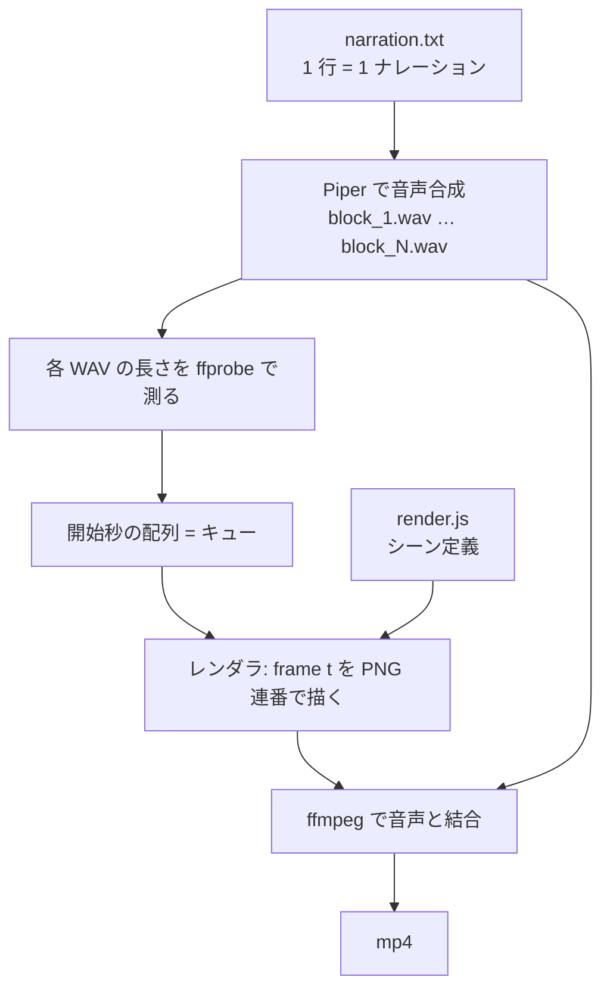

## はじめに

技術解説を動画にするとき、編集ソフトで 1 本ずつ作ると、内容の修正のたびにタイムラインを引き直すことになります。生成 AI の動画サービスを使う手もありますが、図解の数値やラベルを正確に出す用途には向きません。

そこで、**ナレーション音声・アニメーション・結合のすべてを OSS とコードで組み、`git diff` で差分が追える動画パイプライン**を作りました。追加の課金は発生しません。本記事はその構成と、実際に 11 本作る間に起きた 4 つの失敗の記録です。「動いた」だけでなく、失敗した実行ログと、修正前後の実測値も載せます。

- 想定読者: 技術解説の動画を継続的に作りたい方、図解の内容をコードで管理したい方
- 構成: [Piper](https://github.com/rhasspy/piper)(音声合成)+ [@napi-rs/canvas](https://github.com/Brooooooklyn/canvas)(フレーム描画)+ [ffmpeg](https://ffmpeg.org/ffmpeg.html)(結合)
- 実測はすべて筆者環境(2026-08〜09、WSL2 上の Ubuntu、Node.js + Rust 製バインディング)

:::message
本記事の文章生成・編集には AI (Anthropic Claude) を活用しています。技術的事実については、筆者が公式ドキュメントまたは自分の実行ログで検証しています。誤りや改善点があれば、コメント等でご指摘ください。
:::

## 全体構成

パイプラインは 3 段です。入力は台本のテキストファイル 1 枚と、シーンを定義した JavaScript です。



要点は、**シーンを「時刻 t を受け取って 1 フレームを描く関数」として書く**ことです。静止画の切り替えではなくアニメーションになり、なおかつ内容はコードなので、数値を直せば図が直ります。

```javascript
// シーンは frame(t) の関数。t はそのシーンの先頭からの秒数
function scenePacket(x, t, d) {
  bg(x); topbar(x, 'cross-cloud pod-to-pod');
  const cycle = (t - 0.8 + 7) % 7;          // 7 秒で 1 往復
  if (cycle >= 0 && cycle < 2.5) {
    packet(x, x0, laneY, x1, laneY, cycle / 2.5, C.teal);
  }
}
```

## ナレーションと図を同期させる

動画で読みにくくなる最大の原因は、**説明している内容と画面に出ている内容がずれる**ことです。手で秒数を指定すると、台本を 1 語直すたびに全部ずれます。

解決策は、秒数を書かずに**測る**ことです。合成した WAV の長さを `ffprobe` で測り、「ナレーション i 行目が始まる秒」の配列を作ってレンダラへ JSON で渡します。レンダラ側は絶対秒ではなく「何行目の話をしているか」で表示を切り替えます。

```bash
# 各行の音声を作り、長さを累積してキュー配列を組み立てる
d=$($FP -v error -show_entries format=duration -of csv=p=0 "$OUT/block_$i.wav")
CUES="$CUES$sep$SCENE_DUR"
SCENE_DUR=$(node -e "console.log((($SCENE_DUR)+($d)+($GAP)).toFixed(6))")
```

```javascript
// CUES[i] = そのシーン内で i 行目の読み上げが始まる秒(assembler が測って渡す)
let CUES = [];
const cueAt = (t, i, dur = 0.6) => ramp(t, (CUES[i] ?? (i * 7)) + 0.15, dur);

// 「4 つ目の失敗」を読み上げ始めた瞬間に、4 つ目のカードが点灯する
const lit = cueAt(t, 3, 0.7);
```

台本を書き換えても、音声の長さが変われば表示のタイミングが自動で追随します。**タイムラインを人が管理しない**のが、このパイプラインで一番効いた設計です。

## 失敗 1: フレームごとの canvas 生成でメモリが尽きる

最初の実装は素直に「1 フレームごとに新しい canvas を作る」でした。1050 フレームのシーンで、毎回同じ位置(840/1050 付近)でプロセスが消えました。

```text
scripts/assemble16x9.sh: line 97: 3679641 Killed  node "$RENDERER" ...
```

原因は、canvas の実体が JavaScript ヒープの外(ネイティブ側)にあることです。[@napi-rs/canvas](https://github.com/Brooooooklyn/canvas) は Rust 実装の Skia バインディングで、1920×1080 の canvas 1 枚あたり約 8MB がネイティブ確保されます。V8 から見ると小さなオブジェクトなので GC が急がず、解放が追いつかないまま OOM killer に殺されていました。

対処は 2 つです。**canvas を 1 枚だけ作って使い回す**ことと、定期的に GC を促すことです。

```javascript
// 1 枚を再利用する。各シーン関数は先頭で bg() が全面を塗り直すので安全。
// save/restore で毎フレーム ctx の状態を初期化する。
const { cv, x } = newCtx(S);
x.save();
for (let i = 0; i < n; i++) {
  x.restore(); x.save();
  SCENES[name].fn(x, i / fps, dur);
  fs.writeFileSync(path.join(outDir, `f_${String(i+1).padStart(5,'0')}.png`),
                   cv.toBuffer('image/png'));
  if (i % 60 === 0 && global.gc) global.gc();  // node --expose-gc で有効化
}
```

`global.gc()` は Node.js を [`--expose-gc`](https://nodejs.org/api/cli.html#--expose-gc) 付きで起動したときだけ使えます。修正後、同じ 1050 フレームのシーンは 77 秒で完走しました。

## 失敗 2: フォントに無い文字が「豆腐」になる

図の中に `✓`(チェックマーク)や `→`(矢印)を書いたところ、レンダリング結果では白い四角(いわゆる豆腐)になっていました。ブラウザで同じ HTML を表示すると正しく出るため、気づきにくい類の不具合です。

差はフォントのフォールバック処理です。ブラウザはグリフを持たないフォントに出会うと別のフォントを探しますが、Skia に直接描かせる構成では**登録したフォントに無い文字はそのまま豆腐**になります。今回は Ubuntu フォントだけを登録していたため、記号類が全滅しました。

```javascript
// 登録したフォント以外は使われない = ここに無い文字は豆腐になる
GlobalFonts.registerFromPath(`${FD}/ubuntu/Ubuntu-B.ttf`, 'UbB');
GlobalFonts.registerFromPath(`${FD}/ubuntu/UbuntuMono-R.ttf`, 'MoR');
```

対処は、記号を ASCII に置き換える(`✓` → `OK`、`→` → `->`)か、日本語や記号を使う回では Noto フォントを登録することです。日本語の動画を作った回では、次の登録で豆腐がゼロになりました。

```javascript
GlobalFonts.registerFromPath('/usr/share/fonts/opentype/noto/NotoSansCJK-Regular.ttc', 'NotoR');
GlobalFonts.registerFromPath('/usr/share/fonts/opentype/noto/NotoSansCJK-Bold.ttc', 'NotoB');
```

再発防止として、新しいシーンを書いたら描画前に危険なグリフを grep する手順を入れました。

```bash
grep -o '[✓✕⏱→▶●✅❌]' render_ep*.js   # 出力が空であること
```

## 失敗 3: ループ内の ffmpeg が標準入力を食う

シーンを 1 つずつ処理するために、`while read ... done < scenes.txt` の形でシェルループを書いていました。ある日、6 シーンあるはずの動画が 27 秒で完成し、**エラーは 1 件も出ませんでした**。

```text
FINAL: episodes/ep06-multicloud-k3s-flows/out/ep06-multicloud-k3s-flows.mp4  dur=27.022000s
```

ログを遡ると、ffmpeg の対話用プロンプト `Enter command:` が唯一の痕跡でした。ffmpeg は既定で標準入力から対話コマンドを受け付けるため、ループの標準入力(= 残りのシーン行)を読み切ってしまい、ループが 1 周で終わっていたのです。

対処は、ループ内で呼ぶすべての ffmpeg に [`-nostdin`](https://ffmpeg.org/ffmpeg.html) を付けることです。

```bash
# -nostdin が無いと、この 1 行が残りのシーン行を飲み込む
$FF -nostdin -y -loglevel error -framerate $FPS -i "$WD/frames/$sname/f_%05d.png" ...
```

修正後、同じ台本で 181.6 秒(全 6 シーン)になりました。**「成功した」という出力は、成果物が正しい証拠にはならない**という一般則の実例です。以来、完成時に必ず尺と解像度を機械的に検証しています。

## 失敗 4: スーパーサンプリングは「縮小」とセットでないと効かない

文字を滑らかにする目的で、2 倍の解像度で描いてから縮小する(スーパーサンプリング)実装を入れました。ところが縮小フィルタを指定し忘れており、出来上がったのは単に 4K の動画でした。ファイルサイズが 4 倍になっただけです。

そこで、素の 1920×1080 と、2 倍で描いて縮小したものを同じフレームで比べました。**目視では区別が付きませんでした**。Skia が最終解像度の時点で十分にアンチエイリアスをかけているためと考えられます(※原因の断定は未検証)。レンダリング時間は約 6 倍、ディスクは 4 倍かかるため、既定を等倍に戻しました。

```bash
# 既定は等倍。2 倍にするなら scale=W:H の縮小と必ずセットで
SCALE=${SCALE:-1}
```

## 効果の実測

このパイプラインで、3 分程度の解説動画と 60 秒の概念アニメを合わせて 11 本作りました。1 本あたりの制作は、台本を書いてからレンダリングまで含めて数十分です(60 秒の縦型で約 1,450 フレーム、レンダリング 3 分前後 + 結合)。

公開したうち、同じ形式で作った 60 秒の概念アニメ 2 本は、公開後の 1 日あたり再生数が従来の回より高く出ました(筆者チャンネルの実測、2026-09-09 時点)。

| 動画 | 公開日 | 経過 | 再生 |
|---|---|---|---|
| 従来形式(静止画スライド)の回 2 本 | 2026-08-06 | 34 日 | 22 / 35 |
| 概念アニメ「What is eBPF?」 | 2026-09-05 | 4 日 | 131 |
| 概念アニメ「What is the Kernel?」 | 2026-09-05 | 4 日 | 103 |

1 日あたりに直すと、従来形式が約 1 に対して概念アニメは 26〜33 でした。

ただし総再生数が 3 桁の規模であり、公開時期や題材の違いも混ざっています。**形式の差だけが要因だと結論づけられるデータではありません**。少なくとも「アニメーションにしたことで数字が落ちてはいない」ことと、1 本あたりの制作コストが上がらなかったことは言えます。

## まとめ

- ナレーションの秒数は書かずに測ります。WAV の長さから開始秒の配列を作ってレンダラへ渡すと、台本を直しても図の同期が自動で追随します
- canvas はフレームごとに作らず 1 枚を使い回します。ネイティブ確保は V8 の GC から見えにくく、そのままでは長いシーンで OOM になります(実測: 1050 フレームで停止)
- Skia に直接描かせる構成では、登録フォントに無いグリフは豆腐になります。ブラウザでの見え方は当てになりません
- シェルループ内の ffmpeg には `-nostdin` を付けます。付け忘れると、エラーを出さずに途中までの動画が完成します
- スーパーサンプリングは縮小フィルタとセットでのみ意味を持ちます。今回の題材では等倍と目視で区別が付かず、コストだけが増えました
- 「成功した」という出力は成果物が正しい証拠にはなりません。完成物の尺・解像度・フレームは毎回機械的に検証します

## 参考

- [Piper(音声合成)](https://github.com/rhasspy/piper)
- [@napi-rs/canvas(Rust 製 Skia バインディング)](https://github.com/Brooooooklyn/canvas) / [Skia 公式](https://skia.org/)
- [ffmpeg ドキュメント(`-nostdin` を含む)](https://ffmpeg.org/ffmpeg.html)
- [Node.js CLI オプション `--expose-gc`](https://nodejs.org/api/cli.html#--expose-gc)
